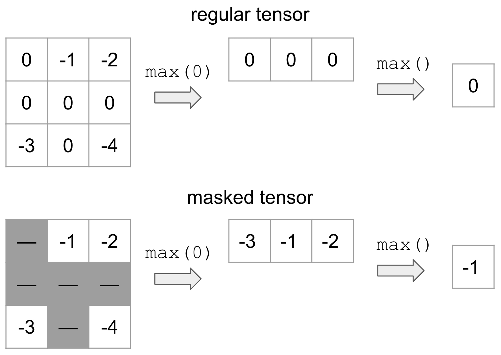

# torch.masked

## Introduction

### Motivation

Warning

The PyTorch API of masked tensors is in the prototype stage and may or may not change in the future.

MaskedTensor serves as an extension to [`torch.Tensor`](tensors.html#torch.Tensor) that provides the user with the ability to:

- use any masked semantics (e.g. variable length tensors, nan* operators, etc.)
- differentiate between 0 and NaN gradients
- various sparse applications (see tutorial below)

"Specified" and "unspecified" have a long history in PyTorch without formal semantics and certainly without
consistency; indeed, MaskedTensor was born out of a build up of issues that the vanilla [`torch.Tensor`](tensors.html#torch.Tensor)
class could not properly address. Thus, a primary goal of MaskedTensor is to become the source of truth for
said "specified" and "unspecified" values in PyTorch where they are a first class citizen instead of an afterthought.
In turn, this should further unlock [sparsity's](https://pytorch.org/docs/stable/sparse.html) potential,
enable safer and more consistent operators, and provide a smoother and more intuitive experience
for users and developers alike.

### What is a MaskedTensor?

A MaskedTensor is a tensor subclass that consists of 1) an input (data), and 2) a mask. The mask tells us
which entries from the input should be included or ignored.

By way of example, suppose that we wanted to mask out all values that are equal to 0 (represented by the gray)
and take the max:

[](_images/tensor_comparison.jpg)

On top is the vanilla tensor example while the bottom is MaskedTensor where all the 0's are masked out.
This clearly yields a different result depending on whether we have the mask, but this flexible structure
allows the user to systematically ignore any elements they'd like during computation.

There are already a number of existing tutorials that we've written to help users onboard, such as:

- [Overview - the place to start for new users, discusses how to use MaskedTensors and why they're useful](https://docs.pytorch.org/tutorials/unstable/maskedtensor_overview)
- [Sparsity - MaskedTensor supports sparse COO and CSR data and mask Tensors](https://docs.pytorch.org/tutorials/unstable/maskedtensor_sparsity)
- [Adagrad sparse semantics - a practical example of how MaskedTensor can simplify sparse semantics and implementations](https://docs.pytorch.org/tutorials/unstable/maskedtensor_adagrad)
- [Advanced semantics - discussion on why certain decisions were made (e.g. requiring masks to match for binary/reduction operations), differences with NumPy's MaskedArray, and reduction semantics](https://docs.pytorch.org/tutorials/unstable/maskedtensor_advanced_semantics)

## Supported Operators

### Unary Operators

Unary operators are operators that only contain only a single input.
Applying them to MaskedTensors is relatively straightforward: if the data is masked out at a given index,
we apply the operator, otherwise we'll continue to mask out the data.

The available unary operators are:

| [`abs`](generated/torch.abs.html#torch.abs) | Computes the absolute value of each element in `input`. |
| --- | --- |
| [`absolute`](generated/torch.absolute.html#torch.absolute) | Alias for [`torch.abs()`](generated/torch.abs.html#torch.abs) |
| [`acos`](generated/torch.acos.html#torch.acos) | Returns a new tensor with the arccosine (in radians) of each element in `input`. |
| [`arccos`](generated/torch.arccos.html#torch.arccos) | Alias for [`torch.acos()`](generated/torch.acos.html#torch.acos). |
| [`acosh`](generated/torch.acosh.html#torch.acosh) | Returns a new tensor with the inverse hyperbolic cosine of the elements of `input`. |
| [`arccosh`](generated/torch.arccosh.html#torch.arccosh) | Alias for [`torch.acosh()`](generated/torch.acosh.html#torch.acosh). |
| [`angle`](generated/torch.angle.html#torch.angle) | Computes the element-wise angle (in radians) of the given `input` tensor. |
| [`asin`](generated/torch.asin.html#torch.asin) | Returns a new tensor with the arcsine of the elements (in radians) in the `input` tensor. |
| [`arcsin`](generated/torch.arcsin.html#torch.arcsin) | Alias for [`torch.asin()`](generated/torch.asin.html#torch.asin). |
| [`asinh`](generated/torch.asinh.html#torch.asinh) | Returns a new tensor with the inverse hyperbolic sine of the elements of `input`. |
| [`arcsinh`](generated/torch.arcsinh.html#torch.arcsinh) | Alias for [`torch.asinh()`](generated/torch.asinh.html#torch.asinh). |
| [`atan`](generated/torch.atan.html#torch.atan) | Returns a new tensor with the arctangent of the elements (in radians) in the `input` tensor. |
| [`arctan`](generated/torch.arctan.html#torch.arctan) | Alias for [`torch.atan()`](generated/torch.atan.html#torch.atan). |
| [`atanh`](generated/torch.atanh.html#torch.atanh) | Returns a new tensor with the inverse hyperbolic tangent of the elements of `input`. |
| [`arctanh`](generated/torch.arctanh.html#torch.arctanh) | Alias for [`torch.atanh()`](generated/torch.atanh.html#torch.atanh). |
| [`bitwise_not`](generated/torch.bitwise_not.html#torch.bitwise_not) | Computes the bitwise NOT of the given input tensor. |
| [`ceil`](generated/torch.ceil.html#torch.ceil) | Returns a new tensor with the ceil of the elements of `input`, the smallest integer greater than or equal to each element. |
| [`clamp`](generated/torch.clamp.html#torch.clamp) | Clamps all elements in `input` into the range [ [`min`](generated/torch.min.html#torch.min), [`max`](generated/torch.max.html#torch.max) ]. |
| [`clip`](generated/torch.clip.html#torch.clip) | Alias for [`torch.clamp()`](generated/torch.clamp.html#torch.clamp). |
| [`conj_physical`](generated/torch.conj_physical.html#torch.conj_physical) | Computes the element-wise conjugate of the given `input` tensor. |
| [`cos`](generated/torch.cos.html#torch.cos) | Returns a new tensor with the cosine of the elements of `input` given in radians. |
| [`cosh`](generated/torch.cosh.html#torch.cosh) | Returns a new tensor with the hyperbolic cosine of the elements of `input`. |
| [`deg2rad`](generated/torch.deg2rad.html#torch.deg2rad) | Returns a new tensor with each of the elements of `input` converted from angles in degrees to radians. |
| [`digamma`](generated/torch.digamma.html#torch.digamma) | Alias for [`torch.special.digamma()`](special.html#torch.special.digamma). |
| [`erf`](generated/torch.erf.html#torch.erf) | Alias for [`torch.special.erf()`](special.html#torch.special.erf). |
| [`erfc`](generated/torch.erfc.html#torch.erfc) | Alias for [`torch.special.erfc()`](special.html#torch.special.erfc). |
| [`erfinv`](generated/torch.erfinv.html#torch.erfinv) | Alias for [`torch.special.erfinv()`](special.html#torch.special.erfinv). |
| [`exp`](generated/torch.exp.html#torch.exp) | Returns a new tensor with the exponential of the elements of the input tensor `input`. |
| [`exp2`](generated/torch.exp2.html#torch.exp2) | Alias for [`torch.special.exp2()`](special.html#torch.special.exp2). |
| [`expm1`](generated/torch.expm1.html#torch.expm1) | Alias for [`torch.special.expm1()`](special.html#torch.special.expm1). |
| [`fix`](generated/torch.fix.html#torch.fix) | Alias for [`torch.trunc()`](generated/torch.trunc.html#torch.trunc) |
| [`floor`](generated/torch.floor.html#torch.floor) | Returns a new tensor with the floor of the elements of `input`, the largest integer less than or equal to each element. |
| [`frac`](generated/torch.frac.html#torch.frac) | Computes the fractional portion of each element in `input`. |
| [`lgamma`](generated/torch.lgamma.html#torch.lgamma) | Computes the natural logarithm of the absolute value of the gamma function on `input`. |
| [`log`](generated/torch.log.html#torch.log) | Returns a new tensor with the natural logarithm of the elements of `input`. |
| [`log10`](generated/torch.log10.html#torch.log10) | Returns a new tensor with the logarithm to the base 10 of the elements of `input`. |
| [`log1p`](generated/torch.log1p.html#torch.log1p) | Returns a new tensor with the natural logarithm of (1 + `input`). |
| [`log2`](generated/torch.log2.html#torch.log2) | Returns a new tensor with the logarithm to the base 2 of the elements of `input`. |
| [`logit`](generated/torch.logit.html#torch.logit) | Alias for [`torch.special.logit()`](special.html#torch.special.logit). |
| [`i0`](generated/torch.i0.html#torch.i0) | Alias for [`torch.special.i0()`](special.html#torch.special.i0). |
| [`isnan`](generated/torch.isnan.html#torch.isnan) | Returns a new tensor with boolean elements representing if each element of `input` is NaN or not. |
| [`nan_to_num`](generated/torch.nan_to_num.html#torch.nan_to_num) | Replaces `NaN`, positive infinity, and negative infinity values in `input` with the values specified by `nan`, `posinf`, and `neginf`, respectively. |
| [`neg`](generated/torch.neg.html#torch.neg) | Returns a new tensor with the negative of the elements of `input`. |
| [`negative`](generated/torch.negative.html#torch.negative) | Alias for [`torch.neg()`](generated/torch.neg.html#torch.neg) |
| [`positive`](generated/torch.positive.html#torch.positive) | Returns `input`. |
| [`pow`](generated/torch.pow.html#torch.pow) | Takes the power of each element in `input` with `exponent` and returns a tensor with the result. |
| [`rad2deg`](generated/torch.rad2deg.html#torch.rad2deg) | Returns a new tensor with each of the elements of `input` converted from angles in radians to degrees. |
| [`reciprocal`](generated/torch.reciprocal.html#torch.reciprocal) | Returns a new tensor with the reciprocal of the elements of `input` |
| [`round`](generated/torch.round.html#torch.round) | Rounds elements of `input` to the nearest integer. |
| [`rsqrt`](generated/torch.rsqrt.html#torch.rsqrt) | Returns a new tensor with the reciprocal of the square-root of each of the elements of `input`. |
| [`sigmoid`](generated/torch.sigmoid.html#torch.sigmoid) | Alias for [`torch.special.expit()`](special.html#torch.special.expit). |
| [`sign`](generated/torch.sign.html#torch.sign) | Returns a new tensor with the signs of the elements of `input`. |
| [`sgn`](generated/torch.sgn.html#torch.sgn) | This function is an extension of torch.sign() to complex tensors. |
| [`signbit`](generated/torch.signbit.html#torch.signbit) | Tests if each element of `input` has its sign bit set or not. |
| [`sin`](generated/torch.sin.html#torch.sin) | Returns a new tensor with the sine of the elements in the `input` tensor, where each value in this input tensor is in radians. |
| [`sinc`](generated/torch.sinc.html#torch.sinc) | Alias for [`torch.special.sinc()`](special.html#torch.special.sinc). |
| [`sinh`](generated/torch.sinh.html#torch.sinh) | Returns a new tensor with the hyperbolic sine of the elements of `input`. |
| [`sqrt`](generated/torch.sqrt.html#torch.sqrt) | Returns a new tensor with the square-root of the elements of `input`. |
| [`square`](generated/torch.square.html#torch.square) | Returns a new tensor with the square of the elements of `input`. |
| [`tan`](generated/torch.tan.html#torch.tan) | Returns a new tensor with the tangent of the elements in the `input` tensor, where each value in this input tensor is in radians. |
| [`tanh`](generated/torch.tanh.html#torch.tanh) | Returns a new tensor with the hyperbolic tangent of the elements of `input`. |
| [`trunc`](generated/torch.trunc.html#torch.trunc) | Returns a new tensor with the truncated integer values of the elements of `input`. |

The available inplace unary operators are all of the above **except**:

| [`angle`](generated/torch.angle.html#torch.angle) | Computes the element-wise angle (in radians) of the given `input` tensor. |
| --- | --- |
| [`positive`](generated/torch.positive.html#torch.positive) | Returns `input`. |
| [`signbit`](generated/torch.signbit.html#torch.signbit) | Tests if each element of `input` has its sign bit set or not. |
| [`isnan`](generated/torch.isnan.html#torch.isnan) | Returns a new tensor with boolean elements representing if each element of `input` is NaN or not. |

### Binary Operators

As you may have seen in the tutorial, `MaskedTensor` also has binary operations implemented with the caveat
that the masks in the two MaskedTensors must match or else an error will be raised. As noted in the error, if you
need support for a particular operator or have proposed semantics for how they should behave instead, please open
an issue on GitHub. For now, we have decided to go with the most conservative implementation to ensure that users
know exactly what is going on and are being intentional about their decisions with masked semantics.

The available binary operators are:

| [`add`](generated/torch.add.html#torch.add) | Adds `other`, scaled by `alpha`, to `input`. |
| --- | --- |
| [`atan2`](generated/torch.atan2.html#torch.atan2) | Element-wise arctangent of inputi/otheri\text{input}_{i} / \text{other}_{i}inputi​/otheri​ with consideration of the quadrant. |
| [`arctan2`](generated/torch.arctan2.html#torch.arctan2) | Alias for [`torch.atan2()`](generated/torch.atan2.html#torch.atan2). |
| [`bitwise_and`](generated/torch.bitwise_and.html#torch.bitwise_and) | Computes the bitwise AND of `input` and `other`. |
| [`bitwise_or`](generated/torch.bitwise_or.html#torch.bitwise_or) | Computes the bitwise OR of `input` and `other`. |
| [`bitwise_xor`](generated/torch.bitwise_xor.html#torch.bitwise_xor) | Computes the bitwise XOR of `input` and `other`. |
| [`bitwise_left_shift`](generated/torch.bitwise_left_shift.html#torch.bitwise_left_shift) | Computes the left arithmetic shift of `input` by `other` bits. |
| [`bitwise_right_shift`](generated/torch.bitwise_right_shift.html#torch.bitwise_right_shift) | Computes the right arithmetic shift of `input` by `other` bits. |
| [`div`](generated/torch.div.html#torch.div) | Divides each element of the input `input` by the corresponding element of `other`. |
| [`divide`](generated/torch.divide.html#torch.divide) | Alias for [`torch.div()`](generated/torch.div.html#torch.div). |
| [`floor_divide`](generated/torch.floor_divide.html#torch.floor_divide) | |
| [`fmod`](generated/torch.fmod.html#torch.fmod) | Applies C++'s [std::fmod](https://en.cppreference.com/w/cpp/numeric/math/fmod) entrywise. |
| [`logaddexp`](generated/torch.logaddexp.html#torch.logaddexp) | Logarithm of the sum of exponentiations of the inputs. |
| [`logaddexp2`](generated/torch.logaddexp2.html#torch.logaddexp2) | Logarithm of the sum of exponentiations of the inputs in base-2. |
| [`mul`](generated/torch.mul.html#torch.mul) | Multiplies `input` by `other`. |
| [`multiply`](generated/torch.multiply.html#torch.multiply) | Alias for [`torch.mul()`](generated/torch.mul.html#torch.mul). |
| [`nextafter`](generated/torch.nextafter.html#torch.nextafter) | Return the next floating-point value after `input` towards `other`, elementwise. |
| [`remainder`](generated/torch.remainder.html#torch.remainder) | Computes [Python's modulus operation](https://docs.python.org/3/reference/expressions.html#binary-arithmetic-operations) entrywise. |
| [`sub`](generated/torch.sub.html#torch.sub) | Subtracts `other`, scaled by `alpha`, from `input`. |
| [`subtract`](generated/torch.subtract.html#torch.subtract) | Alias for [`torch.sub()`](generated/torch.sub.html#torch.sub). |
| [`true_divide`](generated/torch.true_divide.html#torch.true_divide) | Alias for [`torch.div()`](generated/torch.div.html#torch.div) with `rounding_mode=None`. |
| [`eq`](generated/torch.eq.html#torch.eq) | Computes element-wise equality |
| [`ne`](generated/torch.ne.html#torch.ne) | Computes input≠other\text{input} \neq \text{other}input=other element-wise. |
| [`le`](generated/torch.le.html#torch.le) | Computes input≤other\text{input} \leq \text{other}input≤other element-wise. |
| [`ge`](generated/torch.ge.html#torch.ge) | Computes input≥other\text{input} \geq \text{other}input≥other element-wise. |
| [`greater`](generated/torch.greater.html#torch.greater) | Alias for [`torch.gt()`](generated/torch.gt.html#torch.gt). |
| [`greater_equal`](generated/torch.greater_equal.html#torch.greater_equal) | Alias for [`torch.ge()`](generated/torch.ge.html#torch.ge). |
| [`gt`](generated/torch.gt.html#torch.gt) | Computes input>other\text{input} > \text{other}input>other element-wise. |
| [`less_equal`](generated/torch.less_equal.html#torch.less_equal) | Alias for [`torch.le()`](generated/torch.le.html#torch.le). |
| [`lt`](generated/torch.lt.html#torch.lt) | Computes input<other\text{input} < \text{other}input<other element-wise. |
| [`less`](generated/torch.less.html#torch.less) | Alias for [`torch.lt()`](generated/torch.lt.html#torch.lt). |
| [`maximum`](generated/torch.maximum.html#torch.maximum) | Computes the element-wise maximum of `input` and `other`. |
| [`minimum`](generated/torch.minimum.html#torch.minimum) | Computes the element-wise minimum of `input` and `other`. |
| [`fmax`](generated/torch.fmax.html#torch.fmax) | Computes the element-wise maximum of `input` and `other`. |
| [`fmin`](generated/torch.fmin.html#torch.fmin) | Computes the element-wise minimum of `input` and `other`. |
| [`not_equal`](generated/torch.not_equal.html#torch.not_equal) | Alias for [`torch.ne()`](generated/torch.ne.html#torch.ne). |

The available inplace binary operators are all of the above **except**:

| [`logaddexp`](generated/torch.logaddexp.html#torch.logaddexp) | Logarithm of the sum of exponentiations of the inputs. |
| --- | --- |
| [`logaddexp2`](generated/torch.logaddexp2.html#torch.logaddexp2) | Logarithm of the sum of exponentiations of the inputs in base-2. |
| [`equal`](generated/torch.equal.html#torch.equal) | `True` if two tensors have the same size and elements, `False` otherwise. |
| [`fmin`](generated/torch.fmin.html#torch.fmin) | Computes the element-wise minimum of `input` and `other`. |
| [`minimum`](generated/torch.minimum.html#torch.minimum) | Computes the element-wise minimum of `input` and `other`. |
| [`fmax`](generated/torch.fmax.html#torch.fmax) | Computes the element-wise maximum of `input` and `other`. |

### Reductions

The following reductions are available (with autograd support). For more information, the
[Overview](https://pytorch.org/tutorials/unstable/maskedtensor_overview.html) tutorial
details some examples of reductions, while the
[Advanced semantics](https://pytorch.org/tutorials/unstable/maskedtensor_advanced_semantics.html) tutorial
has some further in-depth discussions about how we decided on certain reduction semantics.

| [`sum`](generated/torch.sum.html#torch.sum) | Returns the sum of all elements in the `input` tensor. |
| --- | --- |
| [`mean`](generated/torch.mean.html#torch.mean) | |
| [`amin`](generated/torch.amin.html#torch.amin) | Returns the minimum value of each slice of the `input` tensor in the given dimension(s) `dim`. |
| [`amax`](generated/torch.amax.html#torch.amax) | Returns the maximum value of each slice of the `input` tensor in the given dimension(s) `dim`. |
| [`argmin`](generated/torch.argmin.html#torch.argmin) | Returns the indices of the minimum value(s) of the flattened tensor or along a dimension |
| [`argmax`](generated/torch.argmax.html#torch.argmax) | Returns the indices of the maximum value of all elements in the `input` tensor. |
| [`prod`](generated/torch.prod.html#torch.prod) | Returns the product of all elements in the `input` tensor. |
| [`all`](generated/torch.all.html#torch.all) | Tests if all elements in `input` evaluate to True. |
| [`norm`](generated/torch.norm.html#torch.norm) | Returns the matrix norm or vector norm of a given tensor. |
| [`var`](generated/torch.var.html#torch.var) | Calculates the variance over the dimensions specified by `dim`. |
| [`std`](generated/torch.std.html#torch.std) | Calculates the standard deviation over the dimensions specified by `dim`. |

### View and select functions

We've included a number of view and select functions as well; intuitively, these operators will apply to
both the data and the mask and then wrap the result in a `MaskedTensor`. For a quick example,
consider [`select()`](generated/torch.select.html#torch.select):

```
>>> data = torch.arange(12, dtype=torch.float).reshape(3, 4)
 >>> data
 tensor([[ 0., 1., 2., 3.],
 [ 4., 5., 6., 7.],
 [ 8., 9., 10., 11.]])
 >>> mask = torch.tensor([[True, False, False, True], [False, True, False, False], [True, True, True, True]])
 >>> mt = masked_tensor(data, mask)
 >>> data.select(0, 1)
 tensor([4., 5., 6., 7.])
 >>> mask.select(0, 1)
 tensor([False, True, False, False])
 >>> mt.select(0, 1)
 MaskedTensor(
 [ --, 5.0000, --, --]
 )
```

The following ops are currently supported:

| [`atleast_1d`](generated/torch.atleast_1d.html#torch.atleast_1d) | Returns a 1-dimensional view of each input tensor with zero dimensions. |
| --- | --- |
| [`broadcast_tensors`](generated/torch.broadcast_tensors.html#torch.broadcast_tensors) | Broadcasts the given tensors according to [Broadcasting semantics](notes/broadcasting.html#broadcasting-semantics). |
| [`broadcast_to`](generated/torch.broadcast_to.html#torch.broadcast_to) | Broadcasts `input` to the shape `shape`. |
| [`cat`](generated/torch.cat.html#torch.cat) | Concatenates the given sequence of tensors in `tensors` in the given dimension. |
| [`chunk`](generated/torch.chunk.html#torch.chunk) | Attempts to split a tensor into the specified number of chunks. |
| [`column_stack`](generated/torch.column_stack.html#torch.column_stack) | Creates a new tensor by horizontally stacking the tensors in `tensors`. |
| [`dsplit`](generated/torch.dsplit.html#torch.dsplit) | Splits `input`, a tensor with three or more dimensions, into multiple tensors depthwise according to `indices_or_sections`. |
| [`flatten`](generated/torch.flatten.html#torch.flatten) | Flattens `input` by reshaping it into a one-dimensional tensor. |
| [`hsplit`](generated/torch.hsplit.html#torch.hsplit) | Splits `input`, a tensor with one or more dimensions, into multiple tensors horizontally according to `indices_or_sections`. |
| [`hstack`](generated/torch.hstack.html#torch.hstack) | Stack tensors in sequence horizontally (column wise). |
| [`kron`](generated/torch.kron.html#torch.kron) | Computes the Kronecker product, denoted by ⊗\otimes⊗, of `input` and `other`. |
| [`meshgrid`](generated/torch.meshgrid.html#torch.meshgrid) | Creates grids of coordinates specified by the 1D inputs in attr:tensors. |
| [`narrow`](generated/torch.narrow.html#torch.narrow) | Returns a new tensor that is a narrowed version of `input` tensor. |
| [`nn.functional.unfold`](generated/torch.nn.functional.unfold.html#torch.nn.functional.unfold) | Extract sliding local blocks from a batched input tensor. |
| [`ravel`](generated/torch.ravel.html#torch.ravel) | Return a contiguous flattened tensor. |
| [`select`](generated/torch.select.html#torch.select) | Slices the `input` tensor along the selected dimension at the given index. |
| [`split`](generated/torch.split.html#torch.split) | Splits the tensor into chunks. |
| [`stack`](generated/torch.stack.html#torch.stack) | Concatenates a sequence of tensors along a new dimension. |
| [`t`](generated/torch.t.html#torch.t) | Expects `input` to be <= 2-D tensor and transposes dimensions 0 and 1. |
| [`transpose`](generated/torch.transpose.html#torch.transpose) | Returns a tensor that is a transposed version of `input`. |
| [`vsplit`](generated/torch.vsplit.html#torch.vsplit) | Splits `input`, a tensor with two or more dimensions, into multiple tensors vertically according to `indices_or_sections`. |
| [`vstack`](generated/torch.vstack.html#torch.vstack) | Stack tensors in sequence vertically (row wise). |
| [`Tensor.expand`](generated/torch.Tensor.expand.html#torch.Tensor.expand) | Returns a new view of the `self` tensor with singleton dimensions expanded to a larger size. |
| [`Tensor.expand_as`](generated/torch.Tensor.expand_as.html#torch.Tensor.expand_as) | Expand this tensor to the same size as `other`. |
| [`Tensor.reshape`](generated/torch.Tensor.reshape.html#torch.Tensor.reshape) | Returns a tensor with the same data and number of elements as `self` but with the specified shape. |
| [`Tensor.reshape_as`](generated/torch.Tensor.reshape_as.html#torch.Tensor.reshape_as) | Returns this tensor as the same shape as `other`. |
| [`Tensor.unfold`](generated/torch.Tensor.unfold.html#torch.Tensor.unfold) | Returns a view of the original tensor which contains all slices of size `size` from `self` tensor in the dimension `dimension`. |
| [`Tensor.view`](generated/torch.Tensor.view.html#torch.Tensor.view) | Returns a new tensor with the same data as the `self` tensor but of a different `shape`. |

## torch.masked.maskedtensor.core

| [`is_masked_tensor`](generated/torch.masked.maskedtensor.core.is_masked_tensor.html#torch.masked.maskedtensor.core.is_masked_tensor) | Returns True if the input is a MaskedTensor, else False |
| --- | --- |