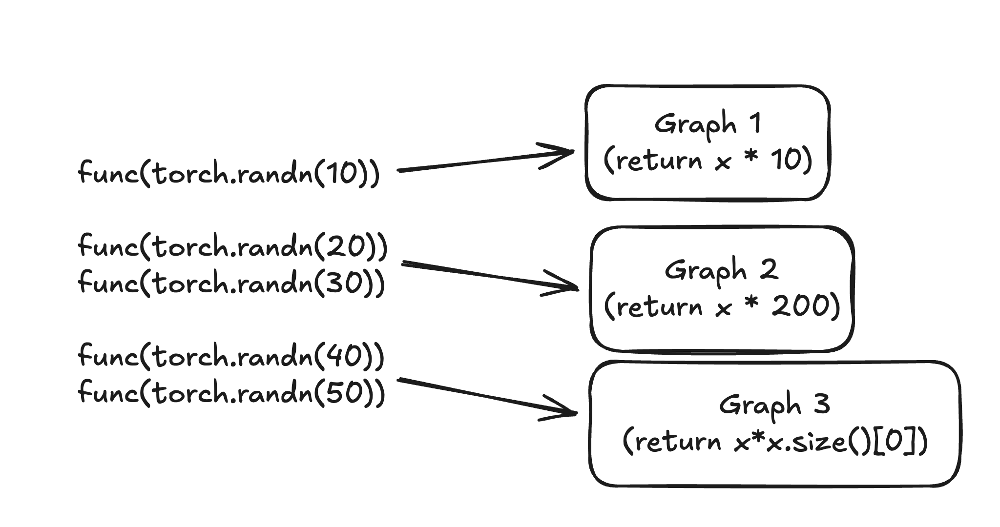

# Dynamic Shapes

This section explains how to work with dynamic shapes in PyTorch, including how
to debug and fix common errors, implement support for dynamic shapes in
operators, and understand the underlying mechanisms.

Dynamic shapes allow PyTorch models to handle inputs with varying dimensions
without recompilation. This enables more flexible models that can process
different batch sizes, sequence lengths, or image dimensions in a single
compiled artifact. Dynamic shapes work by symbolically tracing tensor
dimensions rather than using concrete values, creating a computation
graph that adapts to different input shapes at runtime. By default,
PyTorch assumes all input shapes to be static.

Typically, deep learning compilers only support static shapes, requiring
recompilation for input shape changes. While this approach covers many use cases,
there are situations where this is insufficient:

- **Variable Dimensions** - Batch sizes or sequence lengths vary, such as in
adaptive batching.
- **Data-Dependent Outputs** - Models produce outputs based on input data,
like variable bounding boxes in detection models.
- **Sparse Representations** - Processing depends on data-varying sparse structures,
such as in sparse tensors, jagged tensors, and graph neural networks.

Dynamic shapes do not support dynamic rank programs, programs which input tensors
change in dimensionality, as this is uncommon and unnecessarily complex.

## What does it mean for a size/integer to be dynamic?

Dynamic shapes allow avoiding recompilations by making certain dimensions or integers
dynamic. For example, if a function `f(x)` is compiled with a static size, it will need
recompilation for different sizes:

Note

For simplicity, this example uses `@torch.compile(dynamic=True)`. Note, that
this option is not recommended due to it being error prone.
For a recommended way of enabling dynamic shapes, see Enabling Dynamic Behavior.

```
import torch
@torch.compile(dynamic=False)
def f(x):
 return x* x.size()[0]

f(torch.rand(10))
f(torch.rand(20))
f(torch.rand(30))
f(torch.rand(40))
```

In the produced output, you can see that four graphs were generated.
See the corresponding [tlparse output](../../_static/img/dynamic_shapes/tlparse1_dynamic_shapes_false.png)

By making the size dynamic, the function can handle various sizes without recompilation:

```
import torch
@torch.compile(dynamic=True)
def f(x):
 return x* x.size()[0]

f(torch.rand(10))
f(torch.rand(20))
f(torch.rand(30))
f(torch.rand(40))
```

With dynamic shapes enabled, only one graph is created. See the
corresponding [tlparse output](../../_static/img/dynamic_shapes/tlparse2_dynamic_shapes_true.png).

While compilation time differences
are minimal for this small example, more complex use cases would show significant
performance improvements.

## What is a specialization?

**Specialization** refers to optimizing a computational graph for specific input shapes
by examining shape conditions during control flow. If a branch is taken based on a
shape condition, the graph is tailored for that condition. If a new input doesn't meet
this condition, the system will recompile the graph.

Specialization allows you to create optimized computational graphs for specific input
shapes, which can significantly improve execution speed.

```
import torch
@torch.compile(dynamic=True)
def f(x):
 if x.size()[0] == 10:
 return x * 10

 if x.size()[0] <= 30:
 return x*200

 return x*x.size()[0]

f(torch.rand(10))
f(torch.rand(20))
f(torch.rand(30))
f(torch.rand(40))
f(torch.rand(50))
```

In the code above, we specialize that the graph requires an input size of 10, in which
case it will return `x * 10`. If the input size is less than 30, it will return `x * 200`.
In the output, you can see that this creates three graphs.

See the corresponding [tlparse output](../../_static/img/dynamic_shapes/tlparse3_specialization.png)

This is how graphs created for the above function:



## Enabling Dynamic Behavior

There are the following ways to make things dynamic:

- Automatic dynamic
- User Annotations (preferred)
- torch.compile (dynamic=true) (Not recommended) (for testing only)
- [Advanced Options to Control Dynamic Behavior](compile/dynamic_shapes_advanced_control_options.html#dynamic-shapes-advanced-control-options) (for advanced use cases)

Read below about each of this options.

### Automatic dynamic

**Automatic dynamic** is the default behavior where [`torch.compile()`](../../generated/torch.compile.html#torch.compile) performs
the initial compilation assuming static shapes are used, while tracking the
input sizes from that first compilation. When a recompile is triggered, it
uses this information to identify which dimensions have changed and marks
those as dynamic for the second compilation.

### User Annotations

Several APIs allow users to explicitly mark specific inputs
by name or code as dynamic. This is useful for avoiding initial compilations that
would eventually become dynamic with the previous tools. It is also used to mark
elements that do not automatically get marked as dynamic, such as neural network
module parameters, and so on. User annotations are the preferred way to enable
dynamic shapes.

#### `mark_dynamic(tensor, dim, min=min, max=max)`

> ⚠️ **Warning**
> 
> 
> 
> 
> `torch._dynamo.mark_dynamic()` must not be called inside any function
> that is being compiled by `torch.compile()` (for example, a model's
> `forward()` method or any function it calls).
> 
> 
> 
> 
> This function is a *tracing-time API*. If it is invoked from within
> compiled code, Dynamo will raise an error such as:
> 
> 
> 
> 
> ```
> AssertionError: Attempt to trace forbidden callable
> ```
> 
> 
> 
> 
> 
> **Correct usage** is to call `mark_dynamic` on input tensors *before*
> invoking `torch.compile`, for example:
> 
> 
> 
> 
> ```
> torch._dynamo.mark_dynamic(x, 0)
> compiled_model = torch.compile(model)
> ```

The `torch._dynamo.mark_dynamic()` function marks a tensor dimension as dynamic and will fail if it
gets specialized. It does not work for integers. Use this function only if you know
all graphs in the frame using this input converge to a single dynamic graph.
Otherwise, you may encounter a misleading constraint violation error.
In such cases, consider using `torch._dynamo.maybe_mark_dynamic()`. Currently,
`torch._dynamo.mark_dynamic()`
does not have precedence over `force_parameter_static_shapes = True` or `force_nn_module_property_static_shapes = True`.

If you know in advance that a particular dimension will be dynamic, you
can avoid the initial recompilation by using `torch._dynamo.mark_dynamic(tensor, dim)()`.
Additionally, if you already know the minimum and maximum possible
values for this dimension, you can specify them with
`torch._dynamo.mark_dynamic(tensor, dim, min=min, max=max)()`.

Here is a quick example:

```
import torch

@torch.compile
def f(x):
 return x * x.size()[0]

x = torch.randn(10)
torch._dynamo.mark_dynamic(x, 0)

# first invocation we give it is a tensor marked as dynamic
f(x)
# rest of these invocations will use dynamically compiled code
f(torch.randn(20))
f(torch.randn(30))
f(torch.randn(40))
```

#### `maybe_mark_dynamic(tensor, dim)`

The `torch._dynamo.maybe_mark_dynamic()` function shares all properties
with `torch._dynamo.mark_dynamic()`
but does not fail if the size gets specialized. Use it for inputs shared by
multiple graphs or if the number of graphs does not converge to one for a specific
frame. For instance, in the example above, use `torch._dynamo.maybe_mark_dynamic()` because graphs
with sizes 0 and 1 will specialize. However, you can use `torch._dynamo.mark_dynamic()` to ensure
you never specialize.

#### `mark_unbacked(tensor, dim)`

The `torch._dynamo.decorators.mark_unbacked()` function marks a tensor dimension as unbacked. It is unlikely
to be the tool you need, but it could be useful if the specialization occurs inside
a condition `guard_size_oblivious(x)`, and if using it removes the specialization.
Ensure it fixes the specialization and does not introduce a data-dependent error
that converts to a graph break at or before the specialization location
you are trying to avoid. It might be better to use the next option.

#### Dynamic Allow List (`DYNAMIC_SOURCES`)

Use the evnironmental variable `TORCH_COMPILE_DYNAMIC_SOURCES` to pass a configuration
list of source names to be marked as dynamic. For example:
`TORCH_COMPILE_DYNAMIC_SOURCES=L['x'],L['y']`
It's easiest to find these dynamic source names using the PGO artifact in `tlparse`.
You can copy and paste the dynamic source names from the PGO artifact. This method works
for integers and tensor sizes and has the highest precedence over all other flags
that force static shapes. It will not throw an error if what is marked dynamic
gets specialized or if the provided input does not exist.

Here is an example:

```
import torch

@torch.compile()
def f(x):
 return x * x.size()[0]

with torch.compiler.config.patch(dynamic_sources="L['x']"):
 f(torch.rand(10))
f(torch.rand(20))
f(torch.rand(30))
f(torch.rand(40))
```

#### `torch.compiler.set_stance ("eager_then_compile")`

At times, identifying the appropriate inputs to mark as dynamic can
be challenging. If you are willing to accept a performance cost for
the first batch, another convenient option is to use the
`eager_then_compile` stances, which automatically determine dynamic
inputs for you. For more information, see [`torch.compiler.set_stance()`](../../generated/torch.compiler.set_stance.html#torch.compiler.set_stance) and [Dynamic Compilation Control with torch.compiler.set_stance](https://docs.pytorch.org/tutorials/recipes/torch_compiler_set_stance_tutorial.html).

### `torch.compile (dynamic=true)` (Not recommended)

This setting forces all sizes and integers to be dynamic, increasing the
chance of encountering dynamic shape bugs. Setting this option is not
recommended due to it being error prone.
It would make every input size dynamic which may result it performance
regressions and ultimately increase compilation time.

PyTorch also provides advanced control options for dynamic shapes, see:
[Advanced Options to Control Dynamic Behavior](compile/dynamic_shapes_advanced_control_options.html#dynamic-shapes-advanced-control-options).

## Where Do I Go From Here?

If you encounter a framework code bug or an issue with specialization,
file an issue so it can be reviewed and potentially improved. If the issue
is within your user code, consider whether you are willing to rewrite your
code to avoid it. Determine if it affects correctness or if it's a redundant
check. If the issue involves a Triton custom kernel with a `constexpr`
argument, evaluate whether you can rewrite it to address the problem.

- [Dynamic Shapes Core Concepts](compile/dynamic_shapes_core_concepts.html)
- [Troubleshooting Dynamic Shapes](compile/dynamic_shapes_troubleshooting.html)
- [Advanced Options to Control Dynamic Behavior](compile/dynamic_shapes_advanced_control_options.html)
- [Beyond the Basics](compile/dynamic_shapes_beyond_the_basics.html)

See also

- [tlparse documentation](https://github.com/pytorch/tlparse)
- [The dynamic shapes manual](https://docs.google.com/document/d/1GgvOe7C8_NVOMLOCwDaYV1mXXyHMXY7ExoewHqooxrs/edit?tab=t.0#heading=h.fh8zzonyw8ng)