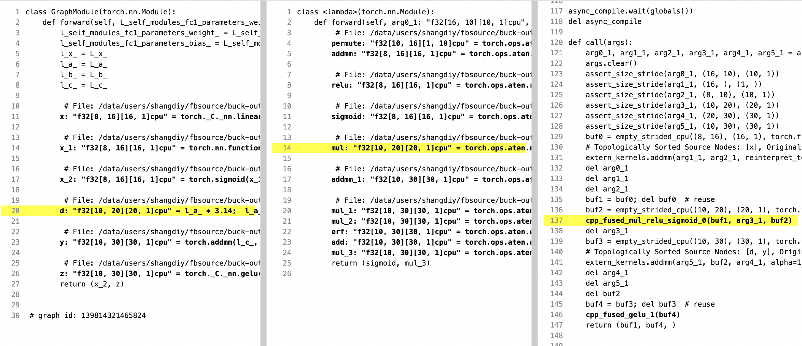
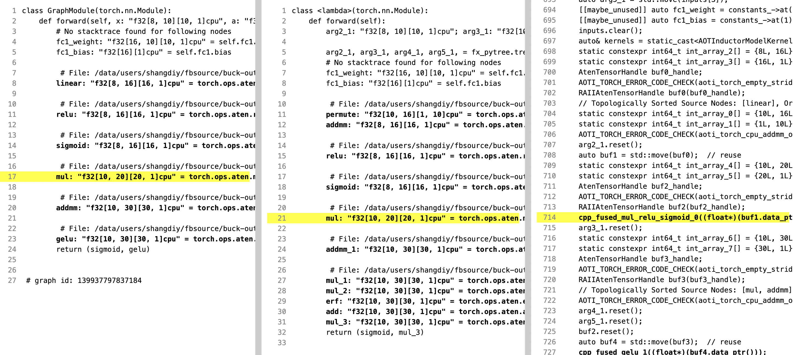
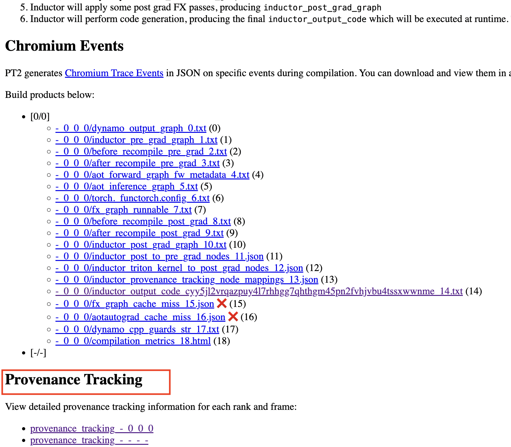
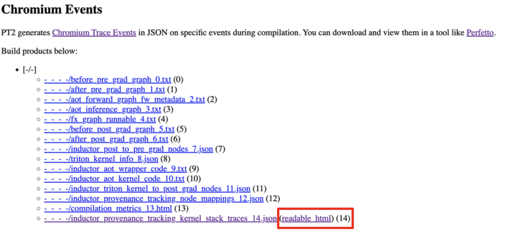
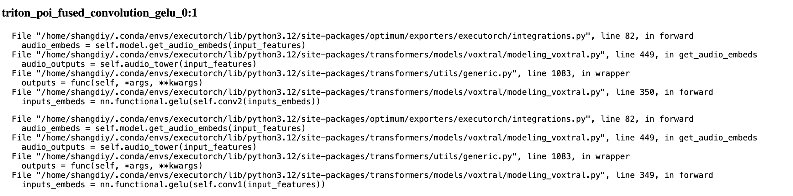
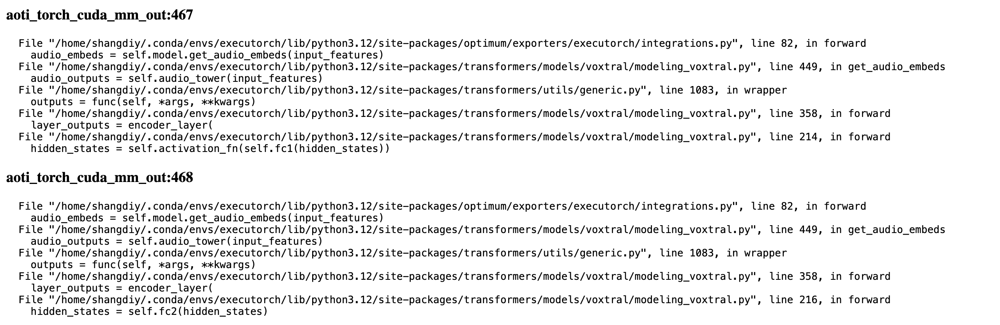
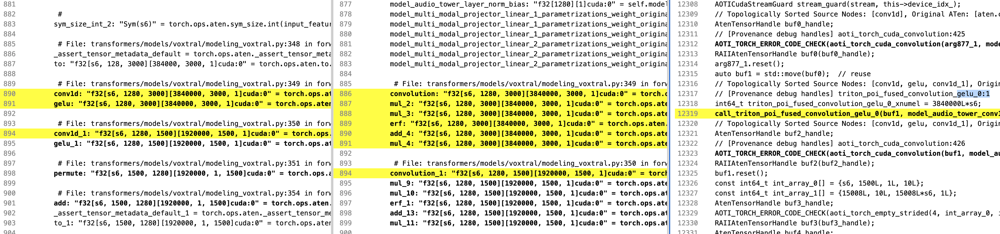

# TorchInductor and AOTInductor Provenance Tracking

This section describes how to use the provenance tracking feature for TorchInductor and AOTInductor in `tlparse`.
Provenance tracking helps you visualize the relationships between the input GraphModule to (AOT)Inductor and the optimized code generated. This feature allows you to trace how your original operations are transformed during compilation.

Some example screenshots of the provenance tracking tool are shown below.
The tool visualizes the mapping between nodes in the input graph (panel 1), the post grad graph (panel 2), and the Inductor generated code (panel 3).

The **bolded** lines represent nodes/kernels covered by the current provenance tracing functionality.
We currently cover triton kernels, cpp kernels, and combo kernels.
The yellow highlighting shows the provenance of the nodes/kernels.

Example screenshot of the provenance tracking tool for TorchInductor:

Example screenshot of the provenance tracking tool for AOTInductor:

## Using the Provenance Tracking Highlighter

Follow these steps to enable and use provenance tracking in your PyTorch project:

1. Install `tlparse` by `cargo install tlparse`. If you don't have `cargo`, see [The Cargo Book](https://doc.rust-lang.org/cargo/getting-started/installation.html) for instructions to install.
2. Run your program with required flags:

```
TORCH_TRACE=~/my_trace_log_dir INDUCTOR_PROVENANCE=1 python your_program.py
```

This will generate a log file in `~/my_trace_log_dir`. The log file will be used by tlparse to generate the provenance tracking highlighter.
3. Run `tlparse` on the log with `--inductor-provenance` flag. For example:

```
tlparse log_file_name.log --inductor-provenance
```

- Even if you don't add the `--inductor-provenance` flag, you should be able to see the mapping in json format in the `inductor_provenance_tracking_node_mappings_<number>.json` file in the `index.html` tlparse output.
- Run `tlpare` directly on the log file. It might not work if you run "tlparse parse <folder_name> -inductor-provenance".
- The `tlparse` artifacts used by the provenance tracking highlighter are:

> - `before_pre_grad_graph.txt`
> - `after_post_grad_graph.txt`
> - `inductor_aot_wrapper_code.txt`
> - `inductor_output_code.txt`
> - `inductor_provenance_tracking_node_mappings.json`

After running `tlparse <file_name> --inductor-provenance`, you should see an additional "Provenance Tracking" section in the tlparse output. Clicking into the link(s) to access the provenance tracking tool.
For a demo, see: [pytorch/tlparse#93](https://github.com/pytorch/tlparse/pull/93)

> 

## Source code corresponding to each Inductor kernel

With `INDUCTOR_PROVENANCE=1`, you can also view the source code corresponding to each Inductor kernel in tlparse. To access it, click the "readable_html" link next to "inductor_provenance_tracking_kernel_stack_traces.json" in the tlparse output.

> 

Below are some example screenshots. The `:1` and `:467` suffixes at the end of the kernel names are used to distinguish different calls to the same kernel. We refer to these suffixes as debug handles.

> 
> 

You can also find the debug handle in the comments within the kernel source code.

> 

## See Also

`tlparse` is a tool written in Rust.

- Link to the tlparse GitHub repo: [pytorch/tlparse](https://github.com/pytorch/tlparse)
- Learn more about `tlparse` at [torch.compile Troubleshooting](torch.compiler_troubleshooting.html#torch-compiler-troubleshooting)