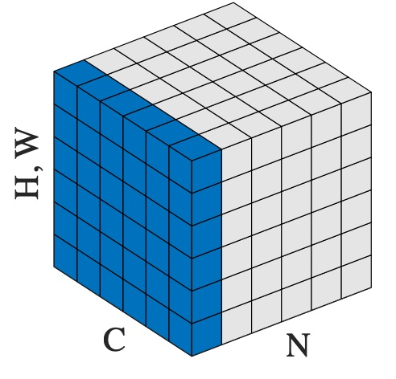

# LayerNorm

*class*torch.nn.LayerNorm(*normalized_shape*, *eps=1e-05*, *elementwise_affine=True*, *bias=True*, *device=None*, *dtype=None*)[[source]](https://github.com/pytorch/pytorch/blob/v2.14.0/torch/nn/modules/normalization.py#L105)

Applies Layer Normalization over a mini-batch of inputs.

This layer implements the operation as described in
the paper [Layer Normalization](https://arxiv.org/abs/1607.06450)

y=x−E[x]Var[x]+ϵ∗γ+βy = \frac{x - \mathrm{E}[x]}{ \sqrt{\mathrm{Var}[x] + \epsilon}} * \gamma + \beta

y=Var[x]+ϵ​x−E[x]​∗γ+β

The mean and standard-deviation are calculated over the last D dimensions, where D
is the dimension of `normalized_shape`. For example, if `normalized_shape`
is `(3, 5)` (a 2-dimensional shape), the mean and standard-deviation are computed over
the last 2 dimensions of the input (i.e. `input.mean((-2, -1))`).
γ\gammaγ and β\betaβ are learnable affine transform parameters of
`normalized_shape` if `elementwise_affine` is `True`.
The variance is calculated via the biased estimator, equivalent to
torch.var(input, correction=0).

Note

Unlike Batch Normalization and Instance Normalization, which applies
scalar scale and bias for each entire channel/plane with the
`affine` option, Layer Normalization applies per-element scale and
bias with `elementwise_affine`.

This layer uses statistics computed from input data in both training and
evaluation modes.

Parameters:

- **normalized_shape** ([*int*](https://docs.python.org/3/library/functions.html#int)*or*[*list*](https://docs.python.org/3/library/stdtypes.html#list)*or*[*torch.Size*](../size.html#torch.Size)) -

input shape from an expected input
of size

[∗×normalized_shape[0]×normalized_shape[1]×...×normalized_shape[−1]][* \times \text{normalized\_shape}[0] \times \text{normalized\_shape}[1]
 \times \ldots \times \text{normalized\_shape}[-1]]

[∗×normalized_shape[0]×normalized_shape[1]×...×normalized_shape[−1]]

If a single integer is used, it is treated as a singleton list, and this module will
normalize over the last dimension which is expected to be of that specific size.
- **eps** ([*float*](https://docs.python.org/3/library/functions.html#float)) - a value added to the denominator for numerical stability. Default: 1e-5
- **elementwise_affine** ([*bool*](https://docs.python.org/3/library/functions.html#bool)) - a boolean value that when set to `True`, this module
has learnable per-element affine parameters initialized to ones (for weights)
and zeros (for biases). Default: `True`
- **bias** ([*bool*](https://docs.python.org/3/library/functions.html#bool)) - If set to `False`, the layer will not learn an additive bias (only relevant if
`elementwise_affine` is `True`). Default: `True`

Variables:

- **weight** - the learnable weights of the module of shape
normalized_shape\text{normalized\_shape}normalized_shape when `elementwise_affine` is set to `True`.
The values are initialized to 1.
- **bias** - the learnable bias of the module of shape
normalized_shape\text{normalized\_shape}normalized_shape when `elementwise_affine` is set to `True`.
The values are initialized to 0.

Shape:

- Input: (N,∗)(N, *)(N,∗)
- Output: (N,∗)(N, *)(N,∗) (same shape as input)

Examples:

```
>>> # NLP Example
>>> batch, sentence_length, embedding_dim = 20, 5, 10
>>> embedding = torch.randn(batch, sentence_length, embedding_dim)
>>> layer_norm = nn.LayerNorm(embedding_dim)
>>> # Activate module
>>> layer_norm(embedding)
>>>
>>> # Image Example
>>> N, C, H, W = 20, 5, 10, 10
>>> input = torch.randn(N, C, H, W)
>>> # Normalize over the last three dimensions (i.e. the channel and spatial dimensions)
>>> # as shown in the image below
>>> layer_norm = nn.LayerNorm([C, H, W])
>>> output = layer_norm(input)
```

[](../_images/layer_norm.jpg)