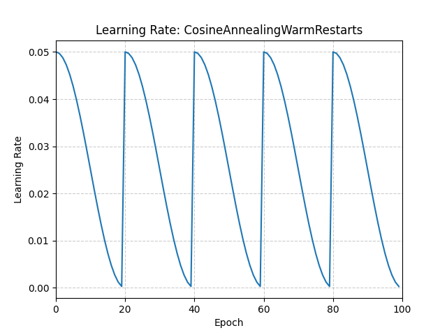

# CosineAnnealingWarmRestarts

*class*torch.optim.lr_scheduler.CosineAnnealingWarmRestarts(*optimizer*, *T_0*, *T_mult=1*, *eta_min=0.0*, *last_epoch=-1*)[[source]](https://github.com/pytorch/pytorch/blob/v2.14.0/torch/optim/lr_scheduler.py#L2105)

Set the learning rate of each parameter group using a cosine annealing schedule.

The ηmax\eta_{max}ηmax​ is set to the initial lr, TcurT_{cur}Tcur​
is the number of epochs since the last restart and TiT_{i}Ti​ is the number
of epochs between two warm restarts in SGDR:

ηt=ηmin+12(ηmax−ηmin)(1+cos⁡(TcurTiπ))\eta_t = \eta_{min} + \frac{1}{2}(\eta_{max} - \eta_{min})\left(1 +
\cos\left(\frac{T_{cur}}{T_{i}}\pi\right)\right)

ηt​=ηmin​+21​(ηmax​−ηmin​)(1+cos(Ti​Tcur​​π))

When Tcur=TiT_{cur}=T_{i}Tcur​=Ti​, set ηt=ηmin\eta_t = \eta_{min}ηt​=ηmin​.
When Tcur=0T_{cur}=0Tcur​=0 after restart, set ηt=ηmax\eta_t=\eta_{max}ηt​=ηmax​.

It has been proposed in
[SGDR: Stochastic Gradient Descent with Warm Restarts](https://arxiv.org/abs/1608.03983).

Parameters:

- **optimizer** ([*Optimizer*](../optim.html#torch.optim.Optimizer)) - Wrapped optimizer.
- **T_0** ([*int*](https://docs.python.org/3/library/functions.html#int)) - Number of iterations until the first restart.
- **T_mult** ([*int*](https://docs.python.org/3/library/functions.html#int)*,**optional*) - A factor by which TiT_{i}Ti​ increases after a restart. Default: 1.
- **eta_min** ([*float*](https://docs.python.org/3/library/functions.html#float)*,**optional*) - Minimum learning rate. Default: 0.
- **last_epoch** ([*int*](https://docs.python.org/3/library/functions.html#int)*,**optional*) - The index of the last epoch. Default: -1.

Example

```
>>> optimizer = torch.optim.SGD(model.parameters(), lr=0.05)
>>> scheduler = torch.optim.lr_scheduler.CosineAnnealingWarmRestarts(
... optimizer, T_0=20
... )
>>> for epoch in range(100):
>>> train(...)
>>> validate(...)
>>> scheduler.step()
```



get_last_lr()[[source]](https://github.com/pytorch/pytorch/blob/v2.14.0/torch/optim/lr_scheduler.py#L201)

Get the most recent learning rates computed by this scheduler.

Returns:

A [`list`](https://docs.python.org/3/library/stdtypes.html#list) of learning rates with entries
for each of the optimizer's
`param_groups`, with the same types as
their `group["lr"]`s.

Return type:

[list](https://docs.python.org/3/library/stdtypes.html#list)[[float](https://docs.python.org/3/library/functions.html#float) | [Tensor](../tensors.html#torch.Tensor)]

Note

The returned [`Tensor`](../tensors.html#torch.Tensor)s are copies, and never alias
the optimizer's `group["lr"]`s.

get_lr()[[source]](https://github.com/pytorch/pytorch/blob/v2.14.0/torch/optim/lr_scheduler.py#L2169)

Compute the next learning rate for each of the optimizer's
`param_groups`.

Computes learning rates for the optimizer's
`param_groups` following:

eta_min+12(base_lr−eta_min)(1+cos⁡(π⋅T_curT_i))\texttt{eta\_min} + \frac{1}{2}(\texttt{base\_lr} -
\texttt{eta\_min})\left(1 + \cos\left(\pi \cdot
\frac{\texttt{T\_cur}}{\texttt{T\_i}}\right)\right)

eta_min+21​(base_lr−eta_min)(1+cos(π⋅T_iT_cur​))

Where `T_cur` is the number of epochs since the last restart and
`T_i` is the number of epochs between two restarts. Both
`T_cur` and `T_i` are updated in `step()`, and
`T_i` becomes `T_mult` times larger after each restart.

Returns:

A [`list`](https://docs.python.org/3/library/stdtypes.html#list) of learning rates for each of
the optimizer's `param_groups` with the
same types as their current `group["lr"]`s.

Return type:

[list](https://docs.python.org/3/library/stdtypes.html#list)[[float](https://docs.python.org/3/library/functions.html#float) | [Tensor](../tensors.html#torch.Tensor)]

Note

If you're trying to inspect the most recent learning rate, use
`get_last_lr()` instead.

Note

The returned [`Tensor`](../tensors.html#torch.Tensor)s are copies, and never alias
the optimizer's `group["lr"]`s.

load_state_dict(*state_dict*)[[source]](https://github.com/pytorch/pytorch/blob/v2.14.0/torch/optim/lr_scheduler.py#L192)

Load the scheduler's state.

Parameters:

**state_dict** ([*dict*](https://docs.python.org/3/library/stdtypes.html#dict)) - scheduler state. Should be an object returned
from a call to `state_dict()`.

state_dict()[[source]](https://github.com/pytorch/pytorch/blob/v2.14.0/torch/optim/lr_scheduler.py#L182)

Return the state of the scheduler as a [`dict`](https://docs.python.org/3/library/stdtypes.html#dict).

It contains an entry for every variable in `self.__dict__` which
is not the optimizer.

Return type:

[dict](https://docs.python.org/3/library/stdtypes.html#dict)[[str](https://docs.python.org/3/library/stdtypes.html#str), [*Any*](https://docs.python.org/3/library/typing.html#typing.Any)]

step(*epoch=None*)[[source]](https://github.com/pytorch/pytorch/blob/v2.14.0/torch/optim/lr_scheduler.py#L2210)

Step could be called after every batch update.

Example

```
>>> scheduler = CosineAnnealingWarmRestarts(optimizer, T_0, T_mult)
>>> iters = len(dataloader)
>>> for epoch in range(20):
>>> for i, sample in enumerate(dataloader):
>>> inputs, labels = sample['inputs'], sample['labels']
>>> optimizer.zero_grad()
>>> outputs = net(inputs)
>>> loss = criterion(outputs, labels)
>>> loss.backward()
>>> optimizer.step()
>>> scheduler.step(epoch + i / iters)
```

This function can be called in an interleaved way.

Example

```
>>> scheduler = CosineAnnealingWarmRestarts(optimizer, T_0, T_mult)
>>> for epoch in range(20):
>>> scheduler.step()
>>> scheduler.step(26)
>>> scheduler.step() # scheduler.step(27), instead of scheduler(20)
```