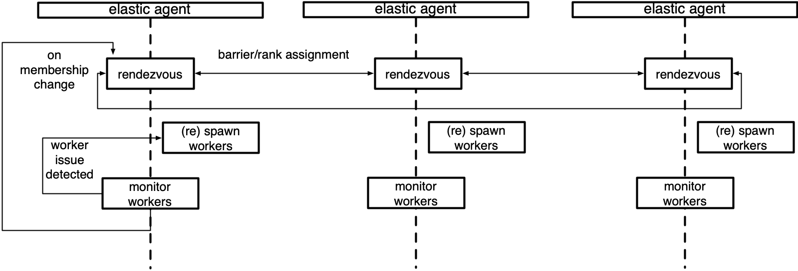

# Elastic Agent

## Server

The elastic agent is the control plane of torchelastic.

It is a process that launches and manages underlying worker processes.
The agent is responsible for:

1. Working with distributed torch: the workers are started with all the
necessary information to successfully and trivially call
`torch.distributed.init_process_group()`.
2. Fault tolerance: monitors workers and upon detecting worker failures
or unhealthiness, tears down all workers and restarts everyone.
3. Elasticity: Reacts to membership changes and restarts workers with the new
members.

The simplest agents are deployed per node and work with local processes.
A more advanced agent can launch and manage workers remotely. Agents can
be completely decentralized, making decisions based on the workers it manages.
Or can be coordinated, communicating to other agents (that manage workers
in the same job) to make a collective decision.

Below is a diagram of an agent that manages a local group of workers.



## Concepts

This section describes the high-level classes and concepts that
are relevant to understanding the role of the `agent` in torchelastic.

*class*torch.distributed.elastic.agent.server.ElasticAgent[[source]](https://github.com/pytorch/pytorch/blob/e7003ce301964b7a4ef5d2d4777331489745a93c/torch/distributed/elastic/agent/server/api.py#L393)

An agent process responsible for managing one or more worker processes.

The worker processes are assumed to be regular distributed PyTorch scripts.
When the worker process is created by the agent, the agent provides the
necessary information for the worker processes to properly initialize
a torch process group.

The exact deployment topology and ratio of agent-to-worker is dependent
on the specific implementation of the agent and the user's job placement
preferences. For instance, to run a distributed training job on GPU with
8 trainers (one per GPU) one can:

1. Use 8 x single GPU instances, place an agent per instance, managing
1 worker per agent.
2. Use 4 x double GPU instances, place an agent per instance, managing
2 workers per agent.
3. Use 2 x quad GPU instances, place an agent per instance, managing
4 workers per agent.
4. Use 1 x 8 GPU instance, place an agent per instance, managing
8 workers per agent.

Usage

```
group_result = agent.run()
 if group_result.is_failed():
 # workers failed
 failure = group_result.failures[0]
 logger.exception("worker 0 failed with exit code : %s", failure.exit_code)
 else:
 return group_result.return_values[0] # return rank 0's results
```

*abstract*get_worker_group(*role='default'*)[[source]](https://github.com/pytorch/pytorch/blob/e7003ce301964b7a4ef5d2d4777331489745a93c/torch/distributed/elastic/agent/server/api.py#L443)

Return the `WorkerGroup` for the given `role`.

Note that the worker group is a mutable object and hence in a
multi-threaded/process environment it may change state.
Implementers are encouraged (but not required) to return
a defensive read-only copy.

Return type:

*WorkerGroup*

*abstract*run(*role='default'*)[[source]](https://github.com/pytorch/pytorch/blob/e7003ce301964b7a4ef5d2d4777331489745a93c/torch/distributed/elastic/agent/server/api.py#L428)

Run the agent.

Supports retrying the worker group on failures up to `max_restarts`.

Returns:

The result of the execution, containing the return values or
failure details for each worker mapped by the worker's global rank.

Raises:

**Exception - any other failures NOT related to worker process** -

Return type:

*RunResult*

*class*torch.distributed.elastic.agent.server.WorkerSpec(*role*, *local_world_size*, *rdzv_handler*, *fn=None*, *entrypoint=None*, *args=()*, *max_restarts=3*, *monitor_interval=0.1*, *master_port=None*, *master_addr=None*, *local_addr=None*, *event_log_handler='null'*, *numa_options=None*, *duplicate_stdout_filters=None*, *duplicate_stderr_filters=None*, *virtual_local_rank=False*)[[source]](https://github.com/pytorch/pytorch/blob/e7003ce301964b7a4ef5d2d4777331489745a93c/torch/distributed/elastic/agent/server/api.py#L49)

Blueprint information about a particular type of worker.

For a given role, there must only exist a single worker spec.
Worker spec is expected to be homogeneous across all nodes (machine),
that is each node runs the same number of workers for a particular spec.

Parameters:

- **role** ([*str*](https://docs.python.org/3/library/stdtypes.html#str)) - user-defined role for the workers with this spec
- **local_world_size** ([*int*](https://docs.python.org/3/library/functions.html#int)) - number local workers to run
- **fn** ([*Callable*](https://docs.python.org/3/library/collections.abc.html#collections.abc.Callable)*|**None*) - (deprecated use entrypoint instead)
- **entrypoint** ([*Callable*](https://docs.python.org/3/library/collections.abc.html#collections.abc.Callable)*|*[*str*](https://docs.python.org/3/library/stdtypes.html#str)*|**None*) - worker function or command
- **args** ([*tuple*](https://docs.python.org/3/library/stdtypes.html#tuple)) - arguments to pass to `entrypoint`
- **rdzv_handler** ([*RendezvousHandler*](rendezvous.html#torch.distributed.elastic.rendezvous.RendezvousHandler)) - handles rdzv for this set of workers
- **max_restarts** ([*int*](https://docs.python.org/3/library/functions.html#int)) - number of max retries for the workers
- **monitor_interval** ([*float*](https://docs.python.org/3/library/functions.html#float)) - monitor status of workers every `n` seconds
- **master_port** ([*int*](https://docs.python.org/3/library/functions.html#int)*|**None*) - fixed port to run the c10d store on rank 0
if not specified then will choose a random free port
- **master_addr** ([*str*](https://docs.python.org/3/library/stdtypes.html#str)*|**None*) - fixed master_addr to run the c10d store on rank 0
if not specified then will choose hostname on agent rank 0
- **redirects** - redirect std streams to a file,
selectively redirect for a particular
local rank by passing a map
- **tee** - tees the specified std stream(s) to console + file,
selectively tee for a particular local rank by passing a map,
takes precedence over `redirects` settings.
- **event_log_handler** ([*str*](https://docs.python.org/3/library/stdtypes.html#str)) - name of the event logging handler as registered in
[elastic/events/handlers.py](https://docs.pytorch.org/docs/stable/elastic/events.html).
- **duplicate_stdout_filters** ([*list*](https://docs.python.org/3/library/stdtypes.html#list)*[*[*str*](https://docs.python.org/3/library/stdtypes.html#str)*]**|**None*) - If non-empty, duplicates stdout to a file containing only lines
that match _any_ of the filter strings.
- **duplicate_stderr_filters** ([*list*](https://docs.python.org/3/library/stdtypes.html#list)*[*[*str*](https://docs.python.org/3/library/stdtypes.html#str)*]**|**None*) - If non-empty, duplicates stderr to a file containing only lines
that match _any_ of the filter strings.
- **virtual_local_rank** ([*bool*](https://docs.python.org/3/library/functions.html#bool)) - Enable virtual local rank mode for workers (defaults to False).
When enabled, LOCAL_RANK is set to 0 for all workers and
CUDA_VISIBLE_DEVICES is adjusted so each worker accesses its
assigned GPU at device index 0.

get_entrypoint_name()[[source]](https://github.com/pytorch/pytorch/blob/e7003ce301964b7a4ef5d2d4777331489745a93c/torch/distributed/elastic/agent/server/api.py#L124)

Get the entry point name.

If the entrypoint is a function (e.g. `Callable`) returns its `__qualname__`
else if the entrypoint is a binary (e.g. `str`), returns the binary name.

*class*torch.distributed.elastic.agent.server.WorkerState(*value*)[[source]](https://github.com/pytorch/pytorch/blob/e7003ce301964b7a4ef5d2d4777331489745a93c/torch/distributed/elastic/agent/server/api.py#L212)

A state of the `WorkerGroup`.

Workers in a worker group change state as a unit. If a single worker
in a worker group fails the entire set is considered failed:

```
UNKNOWN - agent lost track of worker group state, unrecoverable
INIT - worker group object created not yet started
HEALTHY - workers running and healthy
UNHEALTHY - workers running and unhealthy
STOPPED - workers stopped (interrupted) by the agent
SUCCEEDED - workers finished running (exit 0)
FAILED - workers failed to successfully finish (exit !0)
```

A worker group starts from an initial `INIT` state,
then progresses to `HEALTHY` or `UNHEALTHY` states,
and finally reaches a terminal `SUCCEEDED` or `FAILED` state.

Worker groups can be interrupted and temporarily put into `STOPPED` state
by the agent. Workers in `STOPPED` state are scheduled to be restarted
in the near future by the agent. Some examples of workers being put into
`STOPPED` state are:

1. Worker group failure|unhealthy observed
2. Membership change detected

When actions (start, stop, rdzv, retry, etc) on worker group fail
and results in the action being partially applied to the worker group
the state will be `UNKNOWN`. Typically this happens on uncaught/unhandled
exceptions during state change events on the agent. The agent is not
expected to recover worker groups in `UNKNOWN` state and is better off
self terminating and allowing the job manager to retry the node.

*static*is_running(*state*)[[source]](https://github.com/pytorch/pytorch/blob/e7003ce301964b7a4ef5d2d4777331489745a93c/torch/distributed/elastic/agent/server/api.py#L255)

Return the state of the Worker.

Returns:

True if the worker state represents workers still running
(e.g. that the process exists but not necessarily healthy).

Return type:

[bool](https://docs.python.org/3/library/functions.html#bool)

*class*torch.distributed.elastic.agent.server.Worker(*local_rank*, *global_rank=-1*, *role_rank=-1*, *world_size=-1*, *role_world_size=-1*)[[source]](https://github.com/pytorch/pytorch/blob/e7003ce301964b7a4ef5d2d4777331489745a93c/torch/distributed/elastic/agent/server/api.py#L138)

A worker instance.

Contrast this with `WorkerSpec` that represents the specifications of a
worker. A `Worker` is created from a `WorkerSpec`. A `Worker` is to
a `WorkerSpec` as an object is to a class.

The `id` of the worker is interpreted
by the specific implementation of `ElasticAgent`. For a local
agent, it could be the `pid (int)` of the worker, for a remote
agent it could be encoded as `host:port (string)`.

Parameters:

- **id** (*Any*) - uniquely identifies a worker (interpreted by the agent)
- **local_rank** ([*int*](https://docs.python.org/3/library/functions.html#int)) - local rank of the worker
- **global_rank** ([*int*](https://docs.python.org/3/library/functions.html#int)) - global rank of the worker
- **role_rank** ([*int*](https://docs.python.org/3/library/functions.html#int)) - rank of the worker across all workers that have the same role
- **world_size** ([*int*](https://docs.python.org/3/library/functions.html#int)) - number of workers (globally)
- **role_world_size** ([*int*](https://docs.python.org/3/library/functions.html#int)) - number of workers that have the same role

*class*torch.distributed.elastic.agent.server.WorkerGroup(*spec*)[[source]](https://github.com/pytorch/pytorch/blob/e7003ce301964b7a4ef5d2d4777331489745a93c/torch/distributed/elastic/agent/server/api.py#L266)

A set of `Worker` instances.

The class defines a set of `Worker` instances for the given `WorkerSpec` managed by `ElasticAgent`. Whether the worker
group contains cross instance workers or not depends on the implementation of the agent.

## Implementations

Below are the agent implementations provided by torchelastic.

*class*torch.distributed.elastic.agent.server.local_elastic_agent.LocalElasticAgent(*spec*, *logs_specs*, *start_method='spawn'*, *exit_barrier_timeout=300*, *log_line_prefix_template=None*, *shutdown_timeout=30*, *health_check_server=None*, *uninterruptible_state_timeout=None*)[[source]](https://github.com/pytorch/pytorch/blob/e7003ce301964b7a4ef5d2d4777331489745a93c/torch/distributed/elastic/agent/server/local_elastic_agent.py#L118)

An implementation of `torchelastic.agent.server.ElasticAgent` that handles host-local workers.

This agent is deployed per host and is configured to spawn `n` workers.
When using GPUs, `n` maps to the number of GPUs available on the host.

The local agent does not communicate to other local agents deployed on
other hosts, even if the workers may communicate inter-host. The worker id
is interpreted to be a local process. The agent starts and stops all worker
processes as a single unit.

The worker function and argument passed to the worker function must be
python multiprocessing compatible. To pass multiprocessing data structures
to the workers you may create the data structure in the same multiprocessing
context as the specified `start_method` and pass it as a function argument.

The `exit_barrier_timeout` specifies the amount of time (in seconds) to wait
for other agents to finish. This acts as a safety net to handle cases where
workers finish at different times, to prevent agents from viewing workers
that finished early as a scale-down event. It is strongly advised that the
user code deal with ensuring that workers are terminated in a synchronous
manner rather than relying on the exit_barrier_timeout.

A named pipe based watchdog can be enabled in `LocalElasticAgent` if an
environment variable `TORCHELASTIC_ENABLE_FILE_TIMER` with value 1 has
been defined in the `LocalElasticAgent` process.
Optionally, another environment variable `TORCHELASTIC_TIMER_FILE`
can be set with a unique file name for the named pipe. If the environment
variable `TORCHELASTIC_TIMER_FILE` is not set, `LocalElasticAgent`
will internally create a unique file name and set it to the environment
variable `TORCHELASTIC_TIMER_FILE`, and this environment variable will
be propagated to the worker processes to allow them to connect to the same
named pipe that `LocalElasticAgent` uses.

Logs are written to the specified log directory. Each log line will be by default
prefixed by `[${role_name}${local_rank}]:` (e.g. `[trainer0]: foobar`).
Log prefixes can be customized by passing a [template string](https://docs.python.org/3/library/string.html#template-strings) as the
`log_line_prefix_template` argument.
The following macros (identifiers) are substituted at runtime:
`${role_name}, ${local_rank}, ${rank}`. For example, to prefix each log line with
global rank instead of the local rank, set `log_line_prefix_template = "[${rank}]:`.

Example launching function

```
def trainer(args) -> str:
 return "do train"

def main():
 start_method="spawn"
 shared_queue= multiprocessing.get_context(start_method).Queue()
 spec = WorkerSpec(
 role="trainer",
 local_world_size=nproc_per_process,
 entrypoint=trainer,
 args=("foobar",),
 ...<OTHER_PARAMS...>)
 agent = LocalElasticAgent(spec, start_method)
 results = agent.run()

 if results.is_failed():
 print("trainer failed")
 else:
 print(f"rank 0 return value: {results.return_values[0]}")
 # prints -> rank 0 return value: do train
```

Example launching binary

```
def main():
 spec = WorkerSpec(
 role="trainer",
 local_world_size=nproc_per_process,
 entrypoint="/usr/local/bin/trainer",
 args=("--trainer-args", "foobar"),
 ...<OTHER_PARAMS...>)
 agent = LocalElasticAgent(spec)
 results = agent.run()

 if not results.is_failed():
 print("binary launches do not have return values")
```

## Extending the Agent

To extend the agent you can implement `ElasticAgent` directly, however
we recommend you extend `SimpleElasticAgent` instead, which provides
most of the scaffolding and leaves you with a few specific abstract methods
to implement.

*class*torch.distributed.elastic.agent.server.SimpleElasticAgent(*spec*, *exit_barrier_timeout=300*, *shutdown_timeout=30*)[[source]](https://github.com/pytorch/pytorch/blob/e7003ce301964b7a4ef5d2d4777331489745a93c/torch/distributed/elastic/agent/server/api.py#L455)

An `ElasticAgent` that manages one particular type of worker role.

An `ElasticAgent` that manages workers (`WorkerGroup`) for a single `WorkerSpec`
such as one particular type of worker role.

_assign_worker_ranks(*store*, *group_rank*, *group_world_size*, *spec*)[[source]](https://github.com/pytorch/pytorch/blob/e7003ce301964b7a4ef5d2d4777331489745a93c/torch/distributed/elastic/agent/server/api.py#L584)

Determine proper ranks for worker processes.

Fast Path: when all workers have the same role and world size. We calculate
the global rank to be group_rank * group_world_size + local_rank. And the
role_world_size is the same as global_world_size. No TCP store is used in
this case. This is only enabled when users set the environment variable
TORCH_ELASTIC_WORKER_IDENTICAL to 1.

Time complexity: each worker O(1), overall O(1)

Slow Path: when workers have different roles and world sizes. We use the
following algorithm:

1. Each agent writes its configuration(group_rank, group_world_size
, num_workers) to the common store.
2. The rank 0 agent reads all the role_info from the store and
determines each agents worker ranks.
3. Determine the global rank: the global rank of the workers is computed
by cumulative sum of the local_world_size for all workers in front of it.
For efficiency reasons each worker is assigned a base global rank
such that its workers are in the range [base_global_rank,
base_global_rank + local_world_size).
4. Determine the role rank: The role rank is determined using the algorithms
in the point 3 with the exception that the ranks are calculated with
respect to the role name.
5. The rank 0 agent writes the assigned ranks to the store.
6. Each agent reads the assigned ranks from the store.

Time complexity: each worker O(1), rank0 O(n), overall O(n)

Return type:

[list](https://docs.python.org/3/library/stdtypes.html#list)[*Worker*]

_exit_barrier()[[source]](https://github.com/pytorch/pytorch/blob/e7003ce301964b7a4ef5d2d4777331489745a93c/torch/distributed/elastic/agent/server/api.py#L976)

Define a barrier that keeps the agent process alive until all workers finish.

Wait for `exit_barrier_timeout` seconds for all agents to finish
executing their local workers (either successfully or not). This
acts as a safety guard against user scripts that terminate at different
times.

_initialize_workers(*worker_group*)[[source]](https://github.com/pytorch/pytorch/blob/e7003ce301964b7a4ef5d2d4777331489745a93c/torch/distributed/elastic/agent/server/api.py#L694)

Start a fresh set of workers for the worker_group.

Essentially, a rendezvous followed by a `start_workers`.
The caller should first call `_stop_workers()` to stop running workers
prior to calling this method.

Optimistically sets the state of the worker group that
just started as `HEALTHY` and delegates the actual monitoring
of state to `_monitor_workers()` method

*abstract*_monitor_workers(*worker_group*)[[source]](https://github.com/pytorch/pytorch/blob/e7003ce301964b7a4ef5d2d4777331489745a93c/torch/distributed/elastic/agent/server/api.py#L498)

Check on the workers for the `worker_group`.

This function also returns the new state of the worker group.

Return type:

*RunResult*

_rendezvous(*worker_group*)[[source]](https://github.com/pytorch/pytorch/blob/e7003ce301964b7a4ef5d2d4777331489745a93c/torch/distributed/elastic/agent/server/api.py#L518)

Run rendezvous for the workers specified by the worker spec.

Assigns workers a new global rank and world size.
Updates the rendezvous store for the worker group.

_restart_workers(*worker_group*)[[source]](https://github.com/pytorch/pytorch/blob/e7003ce301964b7a4ef5d2d4777331489745a93c/torch/distributed/elastic/agent/server/api.py#L729)

Restart (stops, rendezvous, starts) all local workers in the group.

*abstract*_shutdown(*death_sig=Signals.SIGTERM*, *timeout=30*)[[source]](https://github.com/pytorch/pytorch/blob/e7003ce301964b7a4ef5d2d4777331489745a93c/torch/distributed/elastic/agent/server/api.py#L506)

Clean up any resources that were allocated during the agent's work.

Parameters:

- **death_sig** ([*Signals*](https://docs.python.org/3/library/signal.html#signal.Signals)) - Signal to send to the child process, SIGTERM is default
- **timeout** ([*int*](https://docs.python.org/3/library/functions.html#int)) - Time to wait for graceful shutdown before sending SIGKILL

*abstract*_start_workers(*worker_group*)[[source]](https://github.com/pytorch/pytorch/blob/e7003ce301964b7a4ef5d2d4777331489745a93c/torch/distributed/elastic/agent/server/api.py#L479)

Start `worker_group.spec.local_world_size` number of workers.

This is according to worker spec for the worker group .
Returns a map of `local_rank` to worker `id`.

Return type:

[dict](https://docs.python.org/3/library/stdtypes.html#dict)[[int](https://docs.python.org/3/library/functions.html#int), [*Any*](https://docs.python.org/3/library/typing.html#typing.Any)]

*abstract*_stop_workers(*worker_group*)[[source]](https://github.com/pytorch/pytorch/blob/e7003ce301964b7a4ef5d2d4777331489745a93c/torch/distributed/elastic/agent/server/api.py#L488)

Stop all workers in the given worker group.

Implementers must deal with workers in all states defined by
`WorkerState`. That is, it must gracefully handle stopping
non-existent workers, unhealthy (stuck) workers, etc.

*class*torch.distributed.elastic.agent.server.api.RunResult(*state*, *return_values=<factory>*, *failures=<factory>*)[[source]](https://github.com/pytorch/pytorch/blob/e7003ce301964b7a4ef5d2d4777331489745a93c/torch/distributed/elastic/agent/server/api.py#L355)

Return results of the worker executions.

Run results follow an "all-or-nothing" policy where the run is successful if and
only if ALL local workers managed by this agent complete successfully.

If the result is successful (e.g. `is_failed() = False`) then the `return_values`
field contains the outputs (return values) of the workers managed by THIS agent mapped
by their GLOBAL ranks. That is `result.return_values[0]` is the return value of
global rank 0.

Note

`return_values` are only meaningful for when the worker entrypoint
is a function. Workers specified as a binary entrypoint do not canonically
have a return value and the `return_values` field is meaningless and
may be empty.

If `is_failed()` returns `True` then the `failures` field contains the
failure information, again, mapped by the GLOBAL rank of the worker that failed.

The keys in `return_values` and `failures` are mutually exclusive, that is,
a worker's final state can only be one of: succeeded, failed. Workers intentionally
terminated by the agent according to the agent's restart policy, are not represented
in either `return_values` nor `failures`.

## Watchdog in the Agent

A named pipe based watchdog can be enabled in `LocalElasticAgent` if an
environment variable `TORCHELASTIC_ENABLE_FILE_TIMER` with value 1 has
been defined in the `LocalElasticAgent` process.
Optionally, another environment variable `TORCHELASTIC_TIMER_FILE`
can be set with a unique file name for the named pipe. If the environment
variable `TORCHELASTIC_TIMER_FILE` is not set, `LocalElasticAgent`
will internally create a unique file name and set it to the environment
variable `TORCHELASTIC_TIMER_FILE`, and this environment variable will
be propagated to the worker processes to allow them to connect to the same
named pipe that `LocalElasticAgent` uses.

## Health Check Server

A health check monitoring server can be enabled in `LocalElasticAgent`
if an environment variable `TORCHELASTIC_HEALTH_CHECK_PORT` has been defined
in the `LocalElasticAgent` process.
Adding interface for health check server which can be extended by starting tcp/http
server on the specified port number.
Additionally, health check server will have callback to check watchdog is alive.

*class*torch.distributed.elastic.agent.server.health_check_server.HealthCheckServer(*alive_callback*, *port*, *timeout*)[[source]](https://github.com/pytorch/pytorch/blob/e7003ce301964b7a4ef5d2d4777331489745a93c/torch/distributed/elastic/agent/server/health_check_server.py#L19)

Interface for health check monitoring server, which can be extended
by starting tcp/http server on the specified port.

Parameters:

- **alive_callback** ([*Callable*](https://docs.python.org/3/library/collections.abc.html#collections.abc.Callable)*[**[**]**,*[*int*](https://docs.python.org/3/library/functions.html#int)*]*) - Callable[[], int], callback to last progress time of agent
- **port** ([*int*](https://docs.python.org/3/library/functions.html#int)) - int, port number to start tcp/http server
- **timeout** ([*int*](https://docs.python.org/3/library/functions.html#int)) - int, timeout seconds to decide agent is alive/dead

start()[[source]](https://github.com/pytorch/pytorch/blob/e7003ce301964b7a4ef5d2d4777331489745a93c/torch/distributed/elastic/agent/server/health_check_server.py#L44)

Unsupported functionality for PyTorch, doesn't start any health check server

stop()[[source]](https://github.com/pytorch/pytorch/blob/e7003ce301964b7a4ef5d2d4777331489745a93c/torch/distributed/elastic/agent/server/health_check_server.py#L50)

Function to stop health check server

torch.distributed.elastic.agent.server.health_check_server.create_healthcheck_server(*alive_callback*, *port*, *timeout*)[[source]](https://github.com/pytorch/pytorch/blob/e7003ce301964b7a4ef5d2d4777331489745a93c/torch/distributed/elastic/agent/server/health_check_server.py#L61)

creates health check server object

Return type:

*HealthCheckServer*