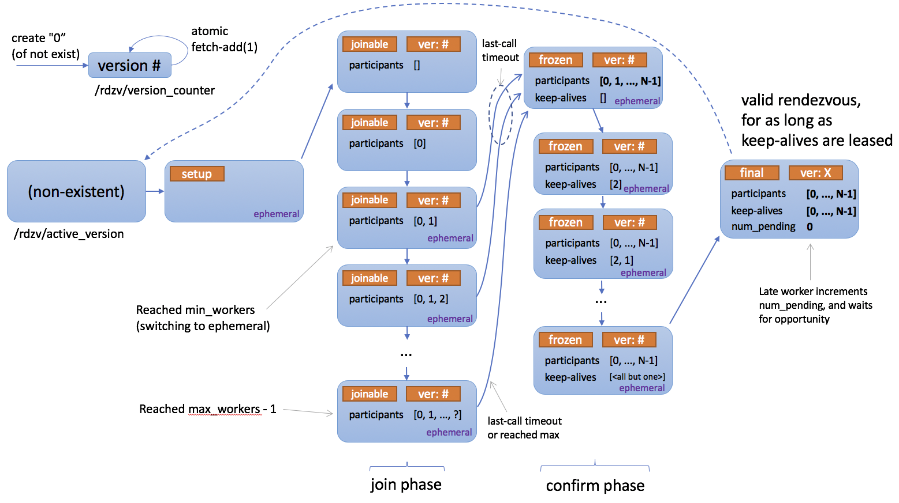

# Rendezvous

In the context of Torch Distributed Elastic we use the term *rendezvous* to
refer to a particular functionality that combines a **distributed
synchronization** primitive with **peer discovery**.

It is used by Torch Distributed Elastic to gather participants of a training
job (i.e. nodes) such that they all agree on the same list of participants and
everyone's roles, as well as make a consistent collective decision on when
training can begin/resume.

Torch Distributed Elastic rendezvous provides the following critical
functionalities:

**Barrier**:

Nodes performing rendezvous will all block until the rendezvous is considered
complete - this happens when at least `min` total number of nodes have joined
the rendezvous barrier (for the same job). This also implies the barrier is not
necessarily of fixed size.

There's an additional small waiting time after reaching `min` number of
nodes - this is used to ensure the rendezvous is not completed "too quickly"
(which could potentially exclude additional nodes attempting to join at
approximately the same time).

If `max` number of nodes is gathered at the barrier, the rendezvous is
completed immediately.

There's also an overall timeout which causes the rendezvous to fail if `min`
number of nodes is never reached - this is meant to be a simple fail-safe to
help release partially allocated job resources, in case there's a problem with
the resource manager, and is meant to be interpreted as non-retryable.

**Exclusivity**:

A simple distributed barrier would not be sufficient, as we also need to ensure
that only one group of nodes exists at any given time (for a given job). In
other words, new nodes (i.e. joining late) should not be able to form a parallel
independent group of workers for the same job.

Torch Distributed Elastic rendezvous ensures that if a group of nodes has
already completed a rendezvous (and hence might already be training), then
additional "late" nodes attempting to rendezvous will only announce themselves
as waiting, and will have to wait until the (previously completed) existing
rendezvous is destroyed first.

**Consistency**:

When a rendezvous is completed, all its members will agree on the job membership
and everyone's role in it. This role is represented using an integer, called
rank, that is between 0 and world size.

Note that ranks are *not stable*, in the sense that the same node can be
assigned a different rank in the next (re-)rendezvous.

**Fault-tolerance**:

Torch Distributed Elastic rendezvous is designed to tolerate node failures
during the rendezvous process. Should a process crash (or lose network
connectivity, etc), between joining the rendezvous and it being completed, then
a re-rendezvous with remaining healthy nodes will happen automatically.

A node can also fail *after* it has completed (or *has been observed* by other
nodes to have completed) the rendezvous - this scenario will be handled by the
Torch Distributed Elastic `train_loop` instead (where it will also trigger a
re-rendezvous).

**Shared key-value store**:

When the rendezvous is completed, a shared key-value store is created and
returned. This store implements a `torch.distributed.Store` API (see
[distributed communication docs](https://pytorch.org/docs/stable/distributed.html)).

This store is only shared by the members of the completed rendezvous. It
is intended to be used by Torch Distributed Elastic to exchange information
necessary to initialize job control and data-planes.

**Waiting workers and rendezvous closing**:

Torch Distributed Elastic rendezvous handler object provides additional
functionalities, which are technically not part of the rendezvous process:

1. Querying how many workers arrived late at the barrier, who can participate in
*next* rendezvous.
2. Setting the rendezvous *closed* to signal all nodes not to participate in
next rendezvous.

**DynamicRendezvousHandler**:

Torch Distributed Elastic comes with the `DynamicRendezvousHandler`
class that implements the rendezvous mechanism described above. It is a backend-
agnostic type that expects a particular `RendezvousBackend` instance
to be specified during construction.

Torch distributed users can either implement their own backend type or use one
of the following implementations that come with PyTorch:

- `C10dRendezvousBackend`: Uses a C10d store (by default
`TCPStore`) as the rendezvous backend. The main advantage of using a C10d
store is that it requires no 3rd-party dependency (such as etcd) to establish
a rendezvous.
- `EtcdRendezvousBackend`: Supersedes the legacy
`EtcdRendezvousHandler` class. Passing an
`EtcdRendezvousBackend` instance to
`DynamicRendezvousHandler` is functionally equivalent to
instantiating an `EtcdRendezvousHandler`.

```
store = TCPStore("localhost")

backend = C10dRendezvousBackend(store, "my_run_id")

rdzv_handler = DynamicRendezvousHandler.from_backend(
 run_id="my_run_id", store=store, backend=backend, min_nodes=2, max_nodes=4
)
```

Below is a state diagram describing how rendezvous works.



## Registry

*class*torch.distributed.elastic.rendezvous.RendezvousParameters(*backend*, *endpoint*, *run_id*, *min_nodes*, *max_nodes*, *local_addr=None*, ***kwargs*)[[source]](https://github.com/pytorch/pytorch/blob/fd6d216e3e8bf07c470716dfbf022d82fadd521d/torch/distributed/elastic/rendezvous/api.py#L241)

Hold the parameters to construct a `RendezvousHandler`.

Parameters:

- **backend** ([*str*](https://docs.python.org/3/library/stdtypes.html#str)) - The name of the backend to use to handle the rendezvous.
- **endpoint** ([*str*](https://docs.python.org/3/library/stdtypes.html#str)) - The endpoint of the rendezvous, usually in form <hostname>[:<port>].
- **run_id** ([*str*](https://docs.python.org/3/library/stdtypes.html#str)) - The id of the rendezvous.
- **min_nodes** ([*int*](https://docs.python.org/3/library/functions.html#int)) - The minimum number of nodes to admit to the rendezvous.
- **max_nodes** ([*int*](https://docs.python.org/3/library/functions.html#int)) - The maximum number of nodes to admit to the rendezvous.
- **local_addr** ([*str*](https://docs.python.org/3/library/stdtypes.html#str)*|**None*) - The address of the local node.
- ****kwargs** - Additional parameters for the specified backend.

get(*key*, *default=None*)[[source]](https://github.com/pytorch/pytorch/blob/fd6d216e3e8bf07c470716dfbf022d82fadd521d/torch/distributed/elastic/rendezvous/api.py#L292)

Return the value for `key` if `key` exists, else `default`.

Return type:

[*Any*](https://docs.python.org/3/library/typing.html#typing.Any)

get_as_bool(*key*, *default=None*)[[source]](https://github.com/pytorch/pytorch/blob/fd6d216e3e8bf07c470716dfbf022d82fadd521d/torch/distributed/elastic/rendezvous/api.py#L296)

Return the value for `key` as a `bool`.

Return type:

[bool](https://docs.python.org/3/library/functions.html#bool) | None

get_as_int(*key*, *default=None*)[[source]](https://github.com/pytorch/pytorch/blob/fd6d216e3e8bf07c470716dfbf022d82fadd521d/torch/distributed/elastic/rendezvous/api.py#L315)

Return the value for `key` as an `int`.

Return type:

[int](https://docs.python.org/3/library/functions.html#int) | None

*class*torch.distributed.elastic.rendezvous.RendezvousHandlerRegistry[[source]](https://github.com/pytorch/pytorch/blob/fd6d216e3e8bf07c470716dfbf022d82fadd521d/torch/distributed/elastic/rendezvous/api.py#L332)

Represent a registry of `RendezvousHandler` backends.

torch.distributed.elastic.rendezvous.registry.get_rendezvous_handler(*params*)[[source]](https://github.com/pytorch/pytorch/blob/fd6d216e3e8bf07c470716dfbf022d82fadd521d/torch/distributed/elastic/rendezvous/registry.py#L74)

Obtain a reference to a :py:class`RendezvousHandler`.

Custom rendezvous handlers can be registered by

```
from torch.distributed.elastic.rendezvous import rendezvous_handler_registry
from torch.distributed.elastic.rendezvous.registry import get_rendezvous_handler

def create_my_rdzv(params: RendezvousParameters):
 return MyCustomRdzv(params)

rendezvous_handler_registry.register("my_rdzv_backend_name", create_my_rdzv)

my_rdzv_handler = get_rendezvous_handler(
 "my_rdzv_backend_name", RendezvousParameters
)
```

Return type:

*RendezvousHandler*

## Handler

*class*torch.distributed.elastic.rendezvous.RendezvousHandler[[source]](https://github.com/pytorch/pytorch/blob/fd6d216e3e8bf07c470716dfbf022d82fadd521d/torch/distributed/elastic/rendezvous/api.py#L145)

Main rendezvous interface.

Note

Distributed Torch users normally **do not** need to implement their own
`RendezvousHandler`. An implementation based on C10d Store is already
provided, and is recommended for most users.

*abstract*get_backend()[[source]](https://github.com/pytorch/pytorch/blob/fd6d216e3e8bf07c470716dfbf022d82fadd521d/torch/distributed/elastic/rendezvous/api.py#L154)

Return the name of the rendezvous backend.

Return type:

[str](https://docs.python.org/3/library/stdtypes.html#str)

*abstract*get_run_id()[[source]](https://github.com/pytorch/pytorch/blob/fd6d216e3e8bf07c470716dfbf022d82fadd521d/torch/distributed/elastic/rendezvous/api.py#L218)

Return the run id of the rendezvous.

The run id is a user-defined id that uniquely identifies an instance of
a distributed application. It typically maps to a job id and is used to
allow nodes to join the correct distributed application.

Return type:

[str](https://docs.python.org/3/library/stdtypes.html#str)

*abstract*is_closed()[[source]](https://github.com/pytorch/pytorch/blob/fd6d216e3e8bf07c470716dfbf022d82fadd521d/torch/distributed/elastic/rendezvous/api.py#L190)

Check whether the rendezvous has been closed.

A closed rendezvous means all future attempts to re-rendezvous within
same job will fail.

`is_closed()` and `set_closed()` have semantics of eventual
propagation and should not be used for synchronization. The intention is
that if at least one node decides the job is finished, it will close the
rendezvous, and other nodes will soon observe this and stop running as
well.

Return type:

[bool](https://docs.python.org/3/library/functions.html#bool)

*abstract*next_rendezvous()[[source]](https://github.com/pytorch/pytorch/blob/fd6d216e3e8bf07c470716dfbf022d82fadd521d/torch/distributed/elastic/rendezvous/api.py#L168)

Main entry-point into the rendezvous barrier.

Blocks until the rendezvous is complete and the current process is
included in the formed worker group, or a timeout occurs, or the
rendezvous was marked closed.

Returns:

Instance of `RendezvousInfo`.

Raises:

- **RendezvousClosedError** - The rendezvous is closed.
- **RendezvousConnectionError** - The connection to the rendezvous backend has failed.
- **RendezvousStateError** - The rendezvous state is corrupt.
- **RendezvousTimeoutError** - The rendezvous did not complete on time.

Return type:

*RendezvousInfo*

*abstract*num_nodes_waiting()[[source]](https://github.com/pytorch/pytorch/blob/fd6d216e3e8bf07c470716dfbf022d82fadd521d/torch/distributed/elastic/rendezvous/api.py#L208)

Return the number of nodes who arrived late at the rendezvous
barrier, hence were not included in the current worker group.

Callers should periodically call this method to check whether new
nodes are waiting to join the job and if so admit them by calling
`next_rendezvous()` (re-rendezvous).

Return type:

[int](https://docs.python.org/3/library/functions.html#int)

*abstract*set_closed()[[source]](https://github.com/pytorch/pytorch/blob/fd6d216e3e8bf07c470716dfbf022d82fadd521d/torch/distributed/elastic/rendezvous/api.py#L204)

Mark the rendezvous as closed.

*abstract*shutdown()[[source]](https://github.com/pytorch/pytorch/blob/fd6d216e3e8bf07c470716dfbf022d82fadd521d/torch/distributed/elastic/rendezvous/api.py#L227)

Close all resources that were open for the rendezvous.

Example:

```
rdzv_handler = ...
try:
 store, rank, world_size = rdzv_handler.next_rendezvous()
finally:
 rdzv_handler.shutdown()
```

Return type:

[bool](https://docs.python.org/3/library/functions.html#bool)

*property*use_agent_store*: [bool](https://docs.python.org/3/library/functions.html#bool)*

Indicates that store reference returned by `next_rendezvous()` can be shared with user
applications and will be available during application lifecycle.

Rendezvous handler impl will share store details as instance of `RendezvousStoreInfo`.
Applications as a convention use MASTER_ADDR/MASTER_PORT env variables to lookup the store.

## Dataclasses

*class*torch.distributed.elastic.rendezvous.RendezvousInfo(*store*, *rank*, *world_size*, *bootstrap_store_info*)[[source]](https://github.com/pytorch/pytorch/blob/fd6d216e3e8bf07c470716dfbf022d82fadd521d/torch/distributed/elastic/rendezvous/api.py#L109)

Holds the information about the rendezvous.

*class*torch.distributed.elastic.rendezvous.api.RendezvousStoreInfo(*master_addr*, *master_port*)[[source]](https://github.com/pytorch/pytorch/blob/fd6d216e3e8bf07c470716dfbf022d82fadd521d/torch/distributed/elastic/rendezvous/api.py#L62)

Store address and port that can be used to bootstrap trainer distributed comms

*static*build(*rank*, *store*)[[source]](https://github.com/pytorch/pytorch/blob/fd6d216e3e8bf07c470716dfbf022d82fadd521d/torch/distributed/elastic/rendezvous/api.py#L71)

Factory method, finds unused new port on rank0 host and addr/port info with all ranks.

If master_addr/master_port is knowns (useful when sharing existing tcp store server) use the constructor.

Parameters:

- **rank** ([*int*](https://docs.python.org/3/library/functions.html#int)) - rank of the current node
- **store** ([*Store*](../distributed.html#torch.distributed.Store)) - store to use for rendezvous
- **local_addr** ([*str*](https://docs.python.org/3/library/stdtypes.html#str)*|**None*) - address of the current node, if not provided will be resolved from hostname
- **server_port** ([*int*](https://docs.python.org/3/library/functions.html#int)*|**None*) - port of the TCPStore server, when the TCPStore is shared.

Return type:

*RendezvousStoreInfo*

## Exceptions

*class*torch.distributed.elastic.rendezvous.api.RendezvousError[[source]](https://github.com/pytorch/pytorch/blob/fd6d216e3e8bf07c470716dfbf022d82fadd521d/torch/distributed/elastic/rendezvous/api.py#L35)

Represents the base type for rendezvous errors.

*class*torch.distributed.elastic.rendezvous.api.RendezvousClosedError[[source]](https://github.com/pytorch/pytorch/blob/fd6d216e3e8bf07c470716dfbf022d82fadd521d/torch/distributed/elastic/rendezvous/api.py#L39)

Raised when a rendezvous is closed.

*class*torch.distributed.elastic.rendezvous.api.RendezvousTimeoutError[[source]](https://github.com/pytorch/pytorch/blob/fd6d216e3e8bf07c470716dfbf022d82fadd521d/torch/distributed/elastic/rendezvous/api.py#L43)

Raised when a rendezvous did not complete on time.

*class*torch.distributed.elastic.rendezvous.api.RendezvousConnectionError[[source]](https://github.com/pytorch/pytorch/blob/fd6d216e3e8bf07c470716dfbf022d82fadd521d/torch/distributed/elastic/rendezvous/api.py#L47)

Raised when the connection to a rendezvous backend has failed.

*class*torch.distributed.elastic.rendezvous.api.RendezvousStateError[[source]](https://github.com/pytorch/pytorch/blob/fd6d216e3e8bf07c470716dfbf022d82fadd521d/torch/distributed/elastic/rendezvous/api.py#L51)

Raised when the state of a rendezvous is corrupt.

*class*torch.distributed.elastic.rendezvous.api.RendezvousGracefulExitError[[source]](https://github.com/pytorch/pytorch/blob/fd6d216e3e8bf07c470716dfbf022d82fadd521d/torch/distributed/elastic/rendezvous/api.py#L55)

Raised when node wasn't included in rendezvous and gracefully exits.

Exception is a mechanism to exit the stack, however does not mean a failure.

## Implementations

### Dynamic Rendezvous

torch.distributed.elastic.rendezvous.dynamic_rendezvous.create_handler(*store*, *backend*, *params*)[[source]](https://github.com/pytorch/pytorch/blob/fd6d216e3e8bf07c470716dfbf022d82fadd521d/torch/distributed/elastic/rendezvous/dynamic_rendezvous.py#L1391)

Create a new `DynamicRendezvousHandler` from the specified parameters.

Parameters:

- **store** ([*Store*](../distributed.html#torch.distributed.Store)) - The C10d store to return as part of the rendezvous.
- **backend** (*RendezvousBackend*) - The backend to use to hold the rendezvous state.

Return type:

*DynamicRendezvousHandler*

| Parameter | Description |
| --- | --- |
| join_timeout | The total time, in seconds, within which the rendezvous is expected to complete. Defaults to 600 seconds. |
| last_call_timeout | An additional wait amount, in seconds, before completing the rendezvous once the minimum number of nodes has been reached. Defaults to 30 seconds. |
| close_timeout | The time, in seconds, within which the rendezvous is expected to close after a call to `RendezvousHandler.set_closed()` or `RendezvousHandler.shutdown()`. Defaults to 30 seconds. |
| heartbeat | The time, in seconds, within which a keep-alive heartbeat is expected to complete |

*class*torch.distributed.elastic.rendezvous.dynamic_rendezvous.DynamicRendezvousHandler[[source]](https://github.com/pytorch/pytorch/blob/fd6d216e3e8bf07c470716dfbf022d82fadd521d/torch/distributed/elastic/rendezvous/dynamic_rendezvous.py#L996)

Represent a handler that sets up a rendezvous among a set of nodes.

*classmethod*from_backend(*run_id*, *store*, *backend*, *min_nodes*, *max_nodes*, *local_addr=None*, *timeout=None*, *keep_alive_interval=5*, *keep_alive_max_attempt=3*)[[source]](https://github.com/pytorch/pytorch/blob/fd6d216e3e8bf07c470716dfbf022d82fadd521d/torch/distributed/elastic/rendezvous/dynamic_rendezvous.py#L1011)

Create a new `DynamicRendezvousHandler`.

Parameters:

- **run_id** ([*str*](https://docs.python.org/3/library/stdtypes.html#str)) - The run id of the rendezvous.
- **store** ([*Store*](../distributed.html#torch.distributed.Store)) - The C10d store to return as part of the rendezvous.
- **backend** (*RendezvousBackend*) - The backend to use to hold the rendezvous state.
- **min_nodes** ([*int*](https://docs.python.org/3/library/functions.html#int)) - The minimum number of nodes to admit to the rendezvous.
- **max_nodes** ([*int*](https://docs.python.org/3/library/functions.html#int)) - The maximum number of nodes to admit to the rendezvous.
- **local_addr** ([*str*](https://docs.python.org/3/library/stdtypes.html#str)*|**None*) - The local node address.
- **timeout** (*RendezvousTimeout**|**None*) - The timeout configuration of the rendezvous.
- **keep_alive_interval** ([*int*](https://docs.python.org/3/library/functions.html#int)) - The amount of time a node waits before sending a heartbeat to keep
it alive in the rendezvous.
- **keep_alive_max_attempt** ([*int*](https://docs.python.org/3/library/functions.html#int)) - The maximum number of failed heartbeat attempts after which a node
is considered dead.

*class*torch.distributed.elastic.rendezvous.dynamic_rendezvous.RendezvousBackend[[source]](https://github.com/pytorch/pytorch/blob/fd6d216e3e8bf07c470716dfbf022d82fadd521d/torch/distributed/elastic/rendezvous/dynamic_rendezvous.py#L62)

Represent a backend that holds the rendezvous state.

*abstract*get_state()[[source]](https://github.com/pytorch/pytorch/blob/fd6d216e3e8bf07c470716dfbf022d82fadd521d/torch/distributed/elastic/rendezvous/dynamic_rendezvous.py#L70)

Get the rendezvous state.

Returns:

A tuple of the encoded rendezvous state and its fencing token or
`None` if no state is found in the backend.

Raises:

- **RendezvousConnectionError** - The connection to the backend has failed.
- **RendezvousStateError** - The rendezvous state is corrupt.

Return type:

[tuple](https://docs.python.org/3/library/stdtypes.html#tuple)[[bytes](https://docs.python.org/3/library/stdtypes.html#bytes), [*Any*](https://docs.python.org/3/library/typing.html#typing.Any)] | None

*abstract property*name*: [str](https://docs.python.org/3/library/stdtypes.html#str)*

Get the name of the backend.

*abstract*set_state(*state*, *token=None*)[[source]](https://github.com/pytorch/pytorch/blob/fd6d216e3e8bf07c470716dfbf022d82fadd521d/torch/distributed/elastic/rendezvous/dynamic_rendezvous.py#L85)

Set the rendezvous state.

The new rendezvous state is set conditionally:

> - If the specified `token` matches the fencing token stored in the
> backend, the state will be updated. The new state will be returned
> to the caller along with its fencing token.
> - If the specified `token` does not match the fencing token stored
> in the backend, the state won't be updated; instead the existing
> state along with its fencing token will be returned to the caller.
> - If the specified `token` is `None`, the new state will be set
> only if there is no existing state in the backend. Either the new
> state or the existing state along with its fencing token will be
> returned to the caller.

Parameters:

- **state** ([*bytes*](https://docs.python.org/3/library/stdtypes.html#bytes)) - The encoded rendezvous state.
- **token** ([*Any*](https://docs.python.org/3/library/typing.html#typing.Any)*|**None*) - An optional fencing token that was retrieved by a previous call
to `get_state()` or `set_state()`.

Returns:

A tuple of the serialized rendezvous state, its fencing token, and
a boolean value indicating whether our set attempt succeeded.

Raises:

- **RendezvousConnectionError** - The connection to the backend has failed.
- **RendezvousStateError** - The rendezvous state is corrupt.

Return type:

[tuple](https://docs.python.org/3/library/stdtypes.html#tuple)[[bytes](https://docs.python.org/3/library/stdtypes.html#bytes), [*Any*](https://docs.python.org/3/library/typing.html#typing.Any), [bool](https://docs.python.org/3/library/functions.html#bool)] | None

*class*torch.distributed.elastic.rendezvous.dynamic_rendezvous.RendezvousTimeout(*join=None*, *last_call=None*, *close=None*, *heartbeat=None*)[[source]](https://github.com/pytorch/pytorch/blob/fd6d216e3e8bf07c470716dfbf022d82fadd521d/torch/distributed/elastic/rendezvous/dynamic_rendezvous.py#L123)

Hold the timeout configuration of a rendezvous.

Parameters:

- **join** ([*timedelta*](https://docs.python.org/3/library/datetime.html#datetime.timedelta)*|**None*) - The time within which the rendezvous is expected to complete.
- **last_call** ([*timedelta*](https://docs.python.org/3/library/datetime.html#datetime.timedelta)*|**None*) - An additional wait amount before completing the rendezvous once the
rendezvous has the minimum number of required participants.
- **close** ([*timedelta*](https://docs.python.org/3/library/datetime.html#datetime.timedelta)*|**None*) - The time within which the rendezvous is expected to close after a
call to `RendezvousHandler.set_closed()` or
`RendezvousHandler.shutdown()`.
- **heartbeat** ([*timedelta*](https://docs.python.org/3/library/datetime.html#datetime.timedelta)*|**None*) - The time within which a keep-alive heartbeat is expected to
complete.

*property*close*: [timedelta](https://docs.python.org/3/library/datetime.html#datetime.timedelta)*

Get the close timeout.

*property*heartbeat*: [timedelta](https://docs.python.org/3/library/datetime.html#datetime.timedelta)*

Get the keep-alive heartbeat timeout.

*property*join*: [timedelta](https://docs.python.org/3/library/datetime.html#datetime.timedelta)*

Get the join timeout.

*property*last_call*: [timedelta](https://docs.python.org/3/library/datetime.html#datetime.timedelta)*

Get the last call timeout.

#### C10d Backend

torch.distributed.elastic.rendezvous.c10d_rendezvous_backend.create_backend(*params*)[[source]](https://github.com/pytorch/pytorch/blob/fd6d216e3e8bf07c470716dfbf022d82fadd521d/torch/distributed/elastic/rendezvous/c10d_rendezvous_backend.py#L211)

Create a new `C10dRendezvousBackend` from the specified parameters.

| Parameter | Description |
| --- | --- |
| store_type | The type of the C10d store. The currently supported types are "tcp" and "file" which correspond to [`torch.distributed.TCPStore`](../distributed.html#torch.distributed.TCPStore) and [`torch.distributed.FileStore`](../distributed.html#torch.distributed.FileStore), respectively. Defaults to "tcp". |
| read_timeout | The read timeout, in seconds, for store operations. Defaults to 60 seconds. Note this only applies to [`torch.distributed.TCPStore`](../distributed.html#torch.distributed.TCPStore). It is not relevant to [`torch.distributed.FileStore`](../distributed.html#torch.distributed.FileStore) which does not take in timeout as a parameter. |
| is_host | A boolean value indicating whether this backend instance will host the C10d store. If not specified it will be inferred heuristically by matching the hostname or the IP address of this machine against the specified rendezvous endpoint. Defaults to `None`. Note that this configuration option only applies to [`torch.distributed.TCPStore`](../distributed.html#torch.distributed.TCPStore). In normal circumstances you can safely skip it; the only time when it is needed is if its value cannot be correctly determined (e.g. the rendezvous endpoint has a CNAME as the hostname or does not match the FQDN of the machine). |

Return type:

[tuple](https://docs.python.org/3/library/stdtypes.html#tuple)[*C10dRendezvousBackend*, [*Store*](../distributed.html#torch.distributed.Store)]

*class*torch.distributed.elastic.rendezvous.c10d_rendezvous_backend.C10dRendezvousBackend(*store*, *run_id*)[[source]](https://github.com/pytorch/pytorch/blob/fd6d216e3e8bf07c470716dfbf022d82fadd521d/torch/distributed/elastic/rendezvous/c10d_rendezvous_backend.py#L35)

Represents a C10d-backed rendezvous backend.

Parameters:

- **store** ([*Store*](../distributed.html#torch.distributed.Store)) - The [`torch.distributed.Store`](../distributed.html#torch.distributed.Store) instance to use to
communicate with the C10d store.
- **run_id** ([*str*](https://docs.python.org/3/library/stdtypes.html#str)) - The run id of the rendezvous.

get_state()[[source]](https://github.com/pytorch/pytorch/blob/fd6d216e3e8bf07c470716dfbf022d82fadd521d/torch/distributed/elastic/rendezvous/c10d_rendezvous_backend.py#L73)

See base class.

Return type:

[tuple](https://docs.python.org/3/library/stdtypes.html#tuple)[[bytes](https://docs.python.org/3/library/stdtypes.html#bytes), [*Any*](https://docs.python.org/3/library/typing.html#typing.Any)] | None

*property*name*: [str](https://docs.python.org/3/library/stdtypes.html#str)*

See base class.

set_state(*state*, *token=None*)[[source]](https://github.com/pytorch/pytorch/blob/fd6d216e3e8bf07c470716dfbf022d82fadd521d/torch/distributed/elastic/rendezvous/c10d_rendezvous_backend.py#L79)

See base class.

Return type:

[tuple](https://docs.python.org/3/library/stdtypes.html#tuple)[[bytes](https://docs.python.org/3/library/stdtypes.html#bytes), [*Any*](https://docs.python.org/3/library/typing.html#typing.Any), [bool](https://docs.python.org/3/library/functions.html#bool)] | None

#### Etcd Backend

torch.distributed.elastic.rendezvous.etcd_rendezvous_backend.create_backend(*params*)[[source]](https://github.com/pytorch/pytorch/blob/fd6d216e3e8bf07c470716dfbf022d82fadd521d/torch/distributed/elastic/rendezvous/etcd_rendezvous_backend.py#L184)

Create a new `EtcdRendezvousBackend` from the specified parameters.

| Parameter | Description |
| --- | --- |
| read_timeout | The read timeout, in seconds, for etcd operations. Defaults to 60 seconds. |
| protocol | The protocol to use to communicate with etcd. Valid values are "http" and "https". Defaults to "http". |
| ssl_cert | The path to the SSL client certificate to use along with HTTPS. Defaults to `None`. |
| ssl_cert_key | The path to the private key of the SSL client certificate to use along with HTTPS. Defaults to `None`. |
| ca_cert | The path to the rool SSL authority certificate. Defaults to `None`. |

Return type:

[tuple](https://docs.python.org/3/library/stdtypes.html#tuple)[*EtcdRendezvousBackend*, [*Store*](../distributed.html#torch.distributed.Store)]

*class*torch.distributed.elastic.rendezvous.etcd_rendezvous_backend.EtcdRendezvousBackend(*client*, *run_id*, *key_prefix=None*, *ttl=None*)[[source]](https://github.com/pytorch/pytorch/blob/fd6d216e3e8bf07c470716dfbf022d82fadd521d/torch/distributed/elastic/rendezvous/etcd_rendezvous_backend.py#L28)

Represents an etcd-based rendezvous backend.

Parameters:

- **client** (*Client*) - The `etcd.Client` instance to use to communicate with etcd.
- **run_id** ([*str*](https://docs.python.org/3/library/stdtypes.html#str)) - The run id of the rendezvous.
- **key_prefix** ([*str*](https://docs.python.org/3/library/stdtypes.html#str)*|**None*) - The path under which to store the rendezvous state in etcd.
- **ttl** ([*int*](https://docs.python.org/3/library/functions.html#int)*|**None*) - The TTL of the rendezvous state. If not specified, defaults to two hours.

get_state()[[source]](https://github.com/pytorch/pytorch/blob/fd6d216e3e8bf07c470716dfbf022d82fadd521d/torch/distributed/elastic/rendezvous/etcd_rendezvous_backend.py#L75)

See base class.

Return type:

[tuple](https://docs.python.org/3/library/stdtypes.html#tuple)[[bytes](https://docs.python.org/3/library/stdtypes.html#bytes), [*Any*](https://docs.python.org/3/library/typing.html#typing.Any)] | None

*property*name*: [str](https://docs.python.org/3/library/stdtypes.html#str)*

See base class.

set_state(*state*, *token=None*)[[source]](https://github.com/pytorch/pytorch/blob/fd6d216e3e8bf07c470716dfbf022d82fadd521d/torch/distributed/elastic/rendezvous/etcd_rendezvous_backend.py#L88)

See base class.

Return type:

[tuple](https://docs.python.org/3/library/stdtypes.html#tuple)[[bytes](https://docs.python.org/3/library/stdtypes.html#bytes), [*Any*](https://docs.python.org/3/library/typing.html#typing.Any), [bool](https://docs.python.org/3/library/functions.html#bool)] | None

### Etcd Rendezvous (Legacy)

Warning

The `DynamicRendezvousHandler` class supersedes the `EtcdRendezvousHandler`
class, and is recommended for most users. `EtcdRendezvousHandler` is in
maintenance mode and will be deprecated in the future.

*class*torch.distributed.elastic.rendezvous.etcd_rendezvous.EtcdRendezvousHandler(*rdzv_impl*, *local_addr*)[[source]](https://github.com/pytorch/pytorch/blob/fd6d216e3e8bf07c470716dfbf022d82fadd521d/torch/distributed/elastic/rendezvous/etcd_rendezvous.py#L91)

Implements a
`torch.distributed.elastic.rendezvous.RendezvousHandler` interface
backed by
`torch.distributed.elastic.rendezvous.etcd_rendezvous.EtcdRendezvous`.
`EtcdRendezvousHandler` uses a URL to configure the type of rendezvous to
use and to pass implementation specific configurations to the rendezvous
module. The basic etcd rendezvous configuration URL looks like the following

```
etcd://<etcd_address>:<port>/<job_id>?min_workers=<min_workers>&max_workers=<max_workers> # noqa: W605

-- example --

etcd://localhost:2379/1234?min_workers=1&max_workers=3
```

The URL above is interpreted as follows:

1. Use the rendezvous handler that is registered with the `etcd`
scheme
2. The `etcd` endpoint to use is `localhost:2379`
3. `job_id == 1234` is used as the prefix in etcd (this allows one to
share a common etcd server for multiple jobs so long as the
`job_ids` are guaranteed to be unique). Note that the job id can be
any string (e.g. does not need to be a number) as long as it is
unique.
4. `min_workers=1` and `max_workers=3` specifies a range for
membership size - Torch Distributed Elastic starts running the job as
long as the cluster size is greater than or equal to `min_workers`
and admits up to `max_workers` into the cluster.

Below are a full list of the parameters that can be passed to etcd
rendezvous:

| Parameter | Description |
| --- | --- |
| min_workers | minimum number of workers for the rendezvous to be valid |
| max_workers | maximum number of workers to admit |
| timeout | total timeout within which next_rendezvous is expected to succeed (default 600s) |
| last_call_timeout | additional wait amount ("last call") after min number of workers has been reached (defaults to 30s) |
| etcd_prefix | path prefix (from etcd root), inside which all etcd nodes will be created (defaults to `/torchelastic/p2p`) |

### Etcd Store

The `EtcdStore` is the C10d `Store` instance type returned by
`next_rendezvous()` when etcd is used as the rendezvous backend.

*class*torch.distributed.elastic.rendezvous.etcd_store.EtcdStore(*etcd_client*, *etcd_store_prefix*, *timeout=None*)[[source]](https://github.com/pytorch/pytorch/blob/fd6d216e3e8bf07c470716dfbf022d82fadd521d/torch/distributed/elastic/rendezvous/etcd_store.py#L30)

Implement a c10 Store interface by piggybacking on the rendezvous etcd instance.

This is the store object returned by `EtcdRendezvous`.

add(*key*, *num*)[[source]](https://github.com/pytorch/pytorch/blob/fd6d216e3e8bf07c470716dfbf022d82fadd521d/torch/distributed/elastic/rendezvous/etcd_store.py#L85)

Atomically increment a value by an integer amount.

The integer is represented as a string using base 10. If key is not present,
a default value of `0` will be assumed.

Returns:

the new (incremented) value

Return type:

[int](https://docs.python.org/3/library/functions.html#int)

check(*keys*)[[source]](https://github.com/pytorch/pytorch/blob/fd6d216e3e8bf07c470716dfbf022d82fadd521d/torch/distributed/elastic/rendezvous/etcd_store.py#L137)

Check if all of the keys are immediately present (without waiting).

Return type:

[bool](https://docs.python.org/3/library/functions.html#bool)

get(*key*)[[source]](https://github.com/pytorch/pytorch/blob/fd6d216e3e8bf07c470716dfbf022d82fadd521d/torch/distributed/elastic/rendezvous/etcd_store.py#L63)

Get a value by key, possibly doing a blocking wait.

If key is not immediately present, will do a blocking wait
for at most `timeout` duration or until the key is published.

Returns:

value `(bytes)`

Raises:

**LookupError - If key still not published after timeout** -

Return type:

[bytes](https://docs.python.org/3/library/stdtypes.html#bytes)

set(*key*, *value*)[[source]](https://github.com/pytorch/pytorch/blob/fd6d216e3e8bf07c470716dfbf022d82fadd521d/torch/distributed/elastic/rendezvous/etcd_store.py#L55)

Write a key/value pair into `EtcdStore`.

Both key and value may be either Python `str` or `bytes`.

wait(*keys*, *override_timeout=None*)[[source]](https://github.com/pytorch/pytorch/blob/fd6d216e3e8bf07c470716dfbf022d82fadd521d/torch/distributed/elastic/rendezvous/etcd_store.py#L124)

Wait until all of the keys are published, or until timeout.

Raises:

**LookupError - if timeout occurs** -

### Etcd Server

The `EtcdServer` is a convenience class that makes it easy for you to
start and stop an etcd server on a subprocess. This is useful for testing
or single-node (multi-worker) deployments where manually setting up an
etcd server on the side is cumbersome.

Warning

For production and multi-node deployments please consider properly deploying
a highly available etcd server as this is the single point of failure for your
distributed jobs.

*class*torch.distributed.elastic.rendezvous.etcd_server.EtcdServer(*data_dir=None*)[[source]](https://github.com/pytorch/pytorch/blob/fd6d216e3e8bf07c470716dfbf022d82fadd521d/torch/distributed/elastic/rendezvous/etcd_server.py#L78)

Note

tested on etcd server v3.4.3.

Starts and stops a local standalone etcd server on a random free
port. Useful for single node, multi-worker launches or testing,
where a sidecar etcd server is more convenient than having to
separately setup an etcd server.

This class registers a termination handler to shutdown the etcd
subprocess on exit. This termination handler is NOT a substitute for
calling the `stop()` method.

The following fallback mechanism is used to find the etcd binary:

1. Uses env var TORCHELASTIC_ETCD_BINARY_PATH
2. Uses `<this file root>/bin/etcd` if one exists
3. Uses `etcd` from `PATH`

Usage

```
server = EtcdServer("/usr/bin/etcd", 2379, "/tmp/default.etcd")
server.start()
client = server.get_client()
# use client
server.stop()
```

Parameters:

**etcd_binary_path** - path of etcd server binary (see above for fallback path)