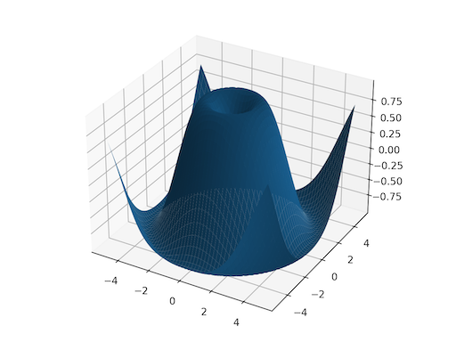

# torch.meshgrid

torch.meshgrid(**tensors*, *indexing=None*)[[source]](https://github.com/pytorch/pytorch/blob/6a231d0d3e1ccd63dd51479bcadc969d0a8de2b9/torch/functional.py#L395)

Creates grids of coordinates specified by the 1D inputs in attr:tensors.

This is helpful when you want to visualize data over some
range of inputs. See below for a plotting example.

Given NNN 1D tensors T0...TN−1T_0 \ldots T_{N-1}T0​...TN−1​ as
inputs with corresponding sizes S0...SN−1S_0 \ldots S_{N-1}S0​...SN−1​,
this creates NNN N-dimensional tensors G0...GN−1G_0 \ldots
G_{N-1}G0​...GN−1​, each with shape (S0,...,SN−1)(S_0, ..., S_{N-1})(S0​,...,SN−1​) where
the output GiG_iGi​ is constructed by expanding TiT_iTi​
to the result shape.

Note

0D inputs are treated equivalently to 1D inputs of a
single element.

Warning

torch.meshgrid(*tensors) currently has the same behavior
as calling numpy.meshgrid(*arrays, indexing='ij').

In the future torch.meshgrid will transition to
indexing='xy' as the default.

[pytorch/pytorch#50276](https://github.com/pytorch/pytorch/issues/50276) tracks
this issue with the goal of migrating to NumPy's behavior.

See also

[`torch.cartesian_prod()`](torch.cartesian_prod.html#torch.cartesian_prod) has the same effect but it
collects the data in a tensor of vectors.

Parameters:

- **tensors** ([*list*](https://docs.python.org/3/library/stdtypes.html#list)*of*[*Tensor*](../tensors.html#torch.Tensor)) - list of scalars or 1 dimensional tensors. Scalars will be
treated as tensors of size (1,)(1,)(1,) automatically
- **indexing** ([*str*](https://docs.python.org/3/library/stdtypes.html#str)*|**None*) -

(str, optional): the indexing mode, either "xy"
or "ij", defaults to "ij". See warning for future changes.

If "xy" is selected, the first dimension corresponds
to the cardinality of the second input and the second
dimension corresponds to the cardinality of the first
input.

If "ij" is selected, the dimensions are in the same
order as the cardinality of the inputs.

Returns:

If the input has NNN
tensors of size S0...SN−1'S_0 \ldots S_{N-1}`S0​...SN−1​', then the
output will also have NNN tensors, where each tensor
is of shape (S0,...,SN−1)(S_0, ..., S_{N-1})(S0​,...,SN−1​).

Return type:

seq (sequence of Tensors)

Example:

```
>>> x = torch.tensor([1, 2, 3])
>>> y = torch.tensor([4, 5, 6])

Observe the element-wise pairings across the grid, (1, 4),
(1, 5), ..., (3, 6). This is the same thing as the
cartesian product.
>>> grid_x, grid_y = torch.meshgrid(x, y, indexing='ij')
>>> grid_x
tensor([[1, 1, 1],
 [2, 2, 2],
 [3, 3, 3]])
>>> grid_y
tensor([[4, 5, 6],
 [4, 5, 6],
 [4, 5, 6]])

This correspondence can be seen when these grids are
stacked properly.
>>> torch.equal(torch.cat(tuple(torch.dstack([grid_x, grid_y]))),
... torch.cartesian_prod(x, y))
True

`torch.meshgrid` is commonly used to produce a grid for
plotting.
>>> import matplotlib.pyplot as plt
>>> xs = torch.linspace(-5, 5, steps=100)
>>> ys = torch.linspace(-5, 5, steps=100)
>>> x, y = torch.meshgrid(xs, ys, indexing='xy')
>>> z = torch.sin(torch.sqrt(x * x + y * y))
>>> ax = plt.axes(projection='3d')
>>> ax.plot_surface(x.numpy(), y.numpy(), z.numpy())
>>> plt.show()
```

[](../_images/meshgrid.png)