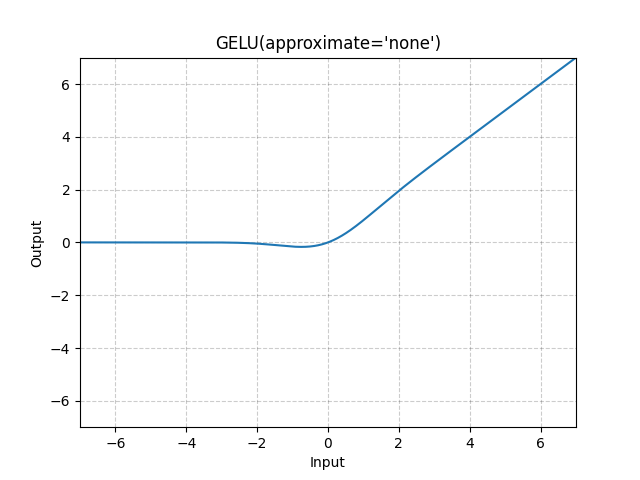

# GELU

*class*torch.nn.GELU(*approximate='none'*)[[source]](https://github.com/pytorch/pytorch/blob/5cd392bfe432d57e7beb9ab67037ddc0fcc01205/torch/nn/modules/activation.py#L777)

Applies the Gaussian Error Linear Units function.

GELU(x)=x∗Φ(x)\text{GELU}(x) = x * \Phi(x)

GELU(x)=x∗Φ(x)

where Φ(x)\Phi(x)Φ(x) is the Cumulative Distribution Function for Gaussian Distribution.

When the approximate argument is 'tanh', Gelu is estimated with:

GELU(x)=0.5∗x∗(1+Tanh(2/π∗(x+0.044715∗x3)))\text{GELU}(x) = 0.5 * x * (1 + \text{Tanh}(\sqrt{2 / \pi} * (x + 0.044715 * x^3)))

GELU(x)=0.5∗x∗(1+Tanh(2/π​∗(x+0.044715∗x3)))
Parameters:

**approximate** ([*str*](https://docs.python.org/3/library/stdtypes.html#str)*,**optional*) - the gelu approximation algorithm to use:
`'none'` | `'tanh'`. Default: `'none'`

Shape:

- Input: (∗)(*)(∗), where ∗*∗ means any number of dimensions.
- Output: (∗)(*)(∗), same shape as the input.



Examples:

```
>>> m = nn.GELU()
>>> input = torch.randn(2)
>>> output = m(input)
```

extra_repr()[[source]](https://github.com/pytorch/pytorch/blob/5cd392bfe432d57e7beb9ab67037ddc0fcc01205/torch/nn/modules/activation.py#L818)

Return the extra representation of the module.

Return type:

[str](https://docs.python.org/3/library/stdtypes.html#str)

forward(*input*)[[source]](https://github.com/pytorch/pytorch/blob/5cd392bfe432d57e7beb9ab67037ddc0fcc01205/torch/nn/modules/activation.py#L812)

Runs the forward pass.

Return type:

[*Tensor*](../tensors.html#torch.Tensor)