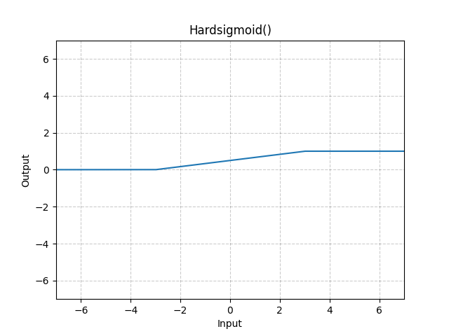

# Hardsigmoid

*class*torch.nn.Hardsigmoid(*inplace=False*)[[source]](https://github.com/pytorch/pytorch/blob/7a37a01092627acd59ddfcb9cefe5a578f5f6996/torch/nn/modules/activation.py#L364)

Applies the Hardsigmoid function element-wise.

Hardsigmoid is defined as:

Hardsigmoid(x)={0if x≤−3,1if x≥+3,x/6+1/2otherwise\text{Hardsigmoid}(x) = \begin{cases}
 0 & \text{if~} x \le -3, \\
 1 & \text{if~} x \ge +3, \\
 x / 6 + 1 / 2 & \text{otherwise}
\end{cases}

Hardsigmoid(x)=⎩⎨⎧​01x/6+1/2​if x≤−3,if x≥+3,otherwise​
Parameters:

**inplace** ([*bool*](https://docs.python.org/3/library/functions.html#bool)) - can optionally do the operation in-place. Default: `False`

Shape:

- Input: (∗)(*)(∗), where ∗*∗ means any number of dimensions.
- Output: (∗)(*)(∗), same shape as the input.



Examples:

```
>>> m = nn.Hardsigmoid()
>>> input = torch.randn(2)
>>> output = m(input)
```

forward(*input*)[[source]](https://github.com/pytorch/pytorch/blob/7a37a01092627acd59ddfcb9cefe5a578f5f6996/torch/nn/modules/activation.py#L400)

Runs the forward pass.

Return type:

[*Tensor*](../tensors.html#torch.Tensor)