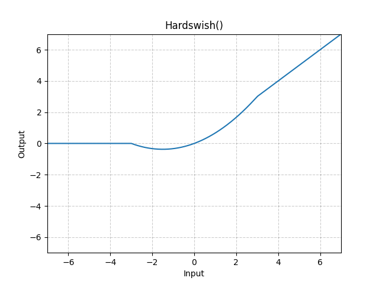

# Hardswish

*class*torch.nn.Hardswish(*inplace=False*)[[source]](https://github.com/pytorch/pytorch/blob/a471a58d241b08025dcb4ec69c2d30e5a49a757a/torch/nn/modules/activation.py#L531)

Applies the Hardswish function, element-wise.

Method described in the paper: [Searching for MobileNetV3](https://arxiv.org/abs/1905.02244).

Hardswish is defined as:

Hardswish(x)={0if x≤−3,xif x≥+3,x⋅(x+3)/6otherwise\text{Hardswish}(x) = \begin{cases}
 0 & \text{if~} x \le -3, \\
 x & \text{if~} x \ge +3, \\
 x \cdot (x + 3) /6 & \text{otherwise}
\end{cases}

Hardswish(x)=⎩⎨⎧​0xx⋅(x+3)/6​if x≤−3,if x≥+3,otherwise​
Parameters:

**inplace** ([*bool*](https://docs.python.org/3/library/functions.html#bool)) - can optionally do the operation in-place. Default: `False`

Shape:

- Input: (∗)(*)(∗), where ∗*∗ means any number of dimensions.
- Output: (∗)(*)(∗), same shape as the input.



Examples:

```
>>> m = nn.Hardswish()
>>> input = torch.randn(2)
>>> output = m(input)
```

forward(*input*)[[source]](https://github.com/pytorch/pytorch/blob/a471a58d241b08025dcb4ec69c2d30e5a49a757a/torch/nn/modules/activation.py#L569)

Runs the forward pass.

Return type:

[*Tensor*](../tensors.html#torch.Tensor)