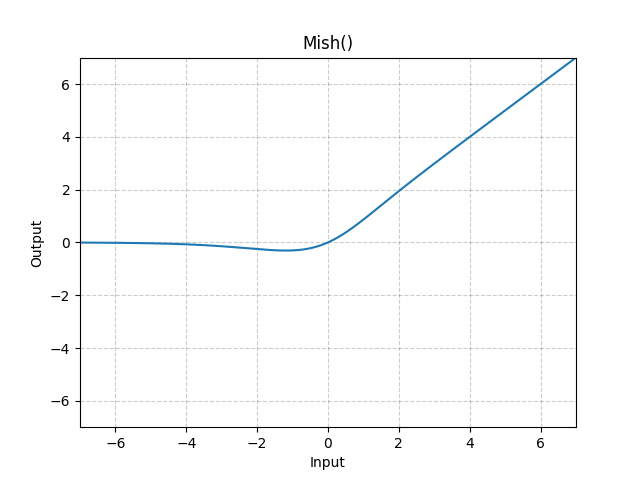

# Mish

*class*torch.nn.Mish(*inplace=False*)[[source]](https://github.com/pytorch/pytorch/blob/e74021214a802c9136769de0046dff0e7710d800/torch/nn/modules/activation.py#L486)

Applies the Mish function, element-wise.

Mish: A Self Regularized Non-Monotonic Neural Activation Function.

Mish(x)=x∗Tanh(Softplus(x))\text{Mish}(x) = x * \text{Tanh}(\text{Softplus}(x))

Mish(x)=x∗Tanh(Softplus(x))

Note

See [Mish: A Self Regularized Non-Monotonic Neural Activation Function](https://arxiv.org/abs/1908.08681)

Shape:

- Input: (∗)(*)(∗), where ∗*∗ means any number of dimensions.
- Output: (∗)(*)(∗), same shape as the input.



Examples:

```
>>> m = nn.Mish()
>>> input = torch.randn(2)
>>> output = m(input)
```

extra_repr()[[source]](https://github.com/pytorch/pytorch/blob/e74021214a802c9136769de0046dff0e7710d800/torch/nn/modules/activation.py#L523)

Return the extra representation of the module.

Return type:

[str](https://docs.python.org/3/library/stdtypes.html#str)

forward(*input*)[[source]](https://github.com/pytorch/pytorch/blob/e74021214a802c9136769de0046dff0e7710d800/torch/nn/modules/activation.py#L517)

Runs the forward pass.

Return type:

[*Tensor*](../tensors.html#torch.Tensor)