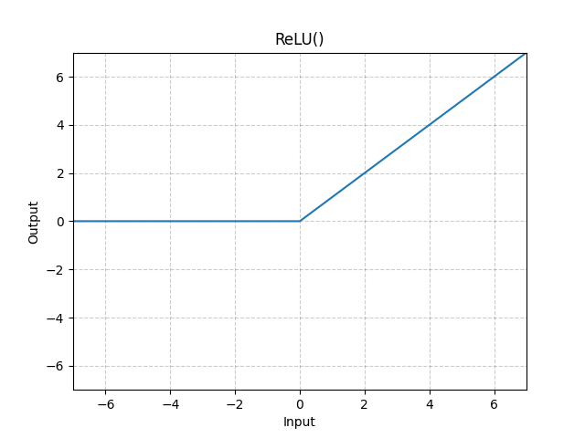

# ReLU

*class*torch.nn.ReLU(*inplace=False*)[[source]](https://github.com/pytorch/pytorch/blob/723eb3fb6c3ae1126d6b4104bb6a9c32b42e5f2e/torch/nn/modules/activation.py#L104)

Applies the rectified linear unit function element-wise.

ReLU(x)=(x)+=max⁡(0,x)\text{ReLU}(x) = (x)^+ = \max(0, x)ReLU(x)=(x)+=max(0,x)

Parameters:

**inplace** ([*bool*](https://docs.python.org/3/library/functions.html#bool)) - can optionally do the operation in-place. Default: `False`

Shape:

- Input: (∗)(*)(∗), where ∗*∗ means any number of dimensions.
- Output: (∗)(*)(∗), same shape as the input.



Examples:

```
>>> m = nn.ReLU()
 >>> input = torch.randn(2)
 >>> output = m(input)

An implementation of CReLU - https://arxiv.org/abs/1603.05201

 >>> m = nn.ReLU()
 >>> input = torch.randn(2).unsqueeze(0)
 >>> output = torch.cat((m(input), m(-input)))
```

extra_repr()[[source]](https://github.com/pytorch/pytorch/blob/723eb3fb6c3ae1126d6b4104bb6a9c32b42e5f2e/torch/nn/modules/activation.py#L145)

Return the extra representation of the module.

Return type:

[str](https://docs.python.org/3/library/stdtypes.html#str)

forward(*input*)[[source]](https://github.com/pytorch/pytorch/blob/723eb3fb6c3ae1126d6b4104bb6a9c32b42e5f2e/torch/nn/modules/activation.py#L139)

Runs the forward pass.

Return type:

[*Tensor*](../tensors.html#torch.Tensor)