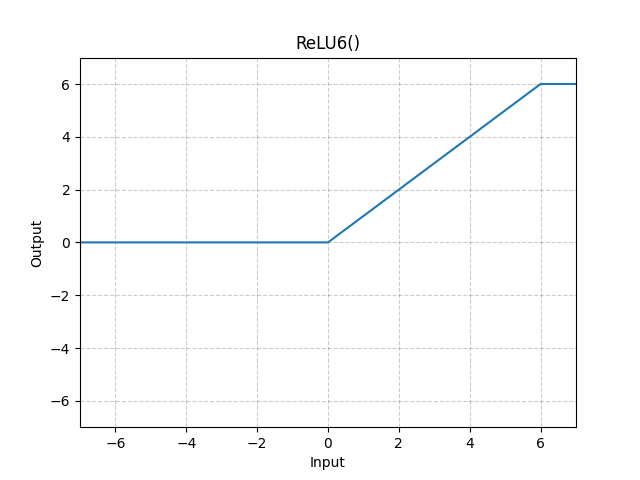

# ReLU6

*class*torch.nn.ReLU6(*inplace=False*)[[source]](https://github.com/pytorch/pytorch/blob/376d1c0177cbef050466ee028e0ef84f4e0d30e5/torch/nn/modules/activation.py#L304)

Applies the ReLU6 function element-wise.

ReLU6(x)=min⁡(max⁡(0,x),6)\text{ReLU6}(x) = \min(\max(0,x), 6)

ReLU6(x)=min(max(0,x),6)
Parameters:

**inplace** ([*bool*](https://docs.python.org/3/library/functions.html#bool)) - can optionally do the operation in-place. Default: `False`

Shape:

- Input: (∗)(*)(∗), where ∗*∗ means any number of dimensions.
- Output: (∗)(*)(∗), same shape as the input.



Examples:

```
>>> m = nn.ReLU6()
>>> input = torch.randn(2)
>>> output = m(input)
```

extra_repr()[[source]](https://github.com/pytorch/pytorch/blob/376d1c0177cbef050466ee028e0ef84f4e0d30e5/torch/nn/modules/activation.py#L329)

Return the extra representation of the module.

Return type:

[str](https://docs.python.org/3/library/stdtypes.html#str)