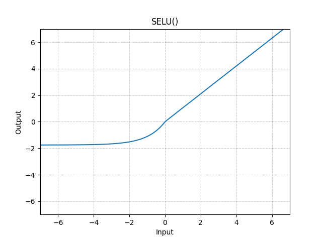

# SELU

*class*torch.nn.SELU(*inplace=False*)[[source]](https://github.com/pytorch/pytorch/blob/0f5932e5e82c3a4da21331c6cf7cddf6bce55cff/torch/nn/modules/activation.py#L681)

Applies the SELU function element-wise.

SELU(x)=scale∗(max⁡(0,x)+min⁡(0,α∗(exp⁡(x)−1)))\text{SELU}(x) = \text{scale} * (\max(0,x) + \min(0, \alpha * (\exp(x) - 1)))

SELU(x)=scale∗(max(0,x)+min(0,α∗(exp(x)−1)))

with α=1.6732632423543772848170429916717\alpha = 1.6732632423543772848170429916717α=1.6732632423543772848170429916717 and
scale=1.0507009873554804934193349852946\text{scale} = 1.0507009873554804934193349852946scale=1.0507009873554804934193349852946.

Warning

When using `kaiming_normal` or `kaiming_normal_` for initialisation,
`nonlinearity='linear'` should be used instead of `nonlinearity='selu'`
in order to get [Self-Normalizing Neural Networks](https://arxiv.org/abs/1706.02515).
See [`torch.nn.init.calculate_gain()`](../nn.init.html#torch.nn.init.calculate_gain) for more information.

More details can be found in the paper [Self-Normalizing Neural Networks](https://arxiv.org/abs/1706.02515) .

Parameters:

**inplace** ([*bool*](https://docs.python.org/3/library/functions.html#bool)*,**optional*) - can optionally do the operation in-place. Default: `False`

Shape:

- Input: (∗)(*)(∗), where ∗*∗ means any number of dimensions.
- Output: (∗)(*)(∗), same shape as the input.



Examples:

```
>>> m = nn.SELU()
>>> input = torch.randn(2)
>>> output = m(input)
```

extra_repr()[[source]](https://github.com/pytorch/pytorch/blob/0f5932e5e82c3a4da21331c6cf7cddf6bce55cff/torch/nn/modules/activation.py#L729)

Return the extra representation of the module.

Return type:

[str](https://docs.python.org/3/library/stdtypes.html#str)

forward(*input*)[[source]](https://github.com/pytorch/pytorch/blob/0f5932e5e82c3a4da21331c6cf7cddf6bce55cff/torch/nn/modules/activation.py#L723)

Runs the forward pass.

Return type:

[*Tensor*](../tensors.html#torch.Tensor)