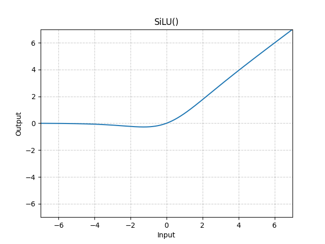

# SiLU

*class*torch.nn.SiLU(*inplace=False*)[[source]](https://github.com/pytorch/pytorch/blob/e01c6ae6acffaccede59e20d14af54437c5342d8/torch/nn/modules/activation.py#L436)

Applies the Sigmoid Linear Unit (SiLU) function, element-wise.

The SiLU function is also known as the swish function.

silu(x)=x∗σ(x),where σ(x) is the logistic sigmoid.\text{silu}(x) = x * \sigma(x), \text{where } \sigma(x) \text{ is the logistic sigmoid.}

silu(x)=x∗σ(x),where σ(x) is the logistic sigmoid.

Note

See [Gaussian Error Linear Units (GELUs)](https://arxiv.org/abs/1606.08415)
where the SiLU (Sigmoid Linear Unit) was originally coined, and see
[Sigmoid-Weighted Linear Units for Neural Network Function Approximation
in Reinforcement Learning](https://arxiv.org/abs/1702.03118) and [Swish:
a Self-Gated Activation Function](https://arxiv.org/abs/1710.05941v1)
where the SiLU was experimented with later.

Shape:

- Input: (∗)(*)(∗), where ∗*∗ means any number of dimensions.
- Output: (∗)(*)(∗), same shape as the input.



Examples:

```
>>> m = nn.SiLU()
>>> input = torch.randn(2)
>>> output = m(input)
```

extra_repr()[[source]](https://github.com/pytorch/pytorch/blob/e01c6ae6acffaccede59e20d14af54437c5342d8/torch/nn/modules/activation.py#L478)

Return the extra representation of the module.

Return type:

[str](https://docs.python.org/3/library/stdtypes.html#str)

forward(*input*)[[source]](https://github.com/pytorch/pytorch/blob/e01c6ae6acffaccede59e20d14af54437c5342d8/torch/nn/modules/activation.py#L472)

Runs the forward pass.

Return type:

[*Tensor*](../tensors.html#torch.Tensor)