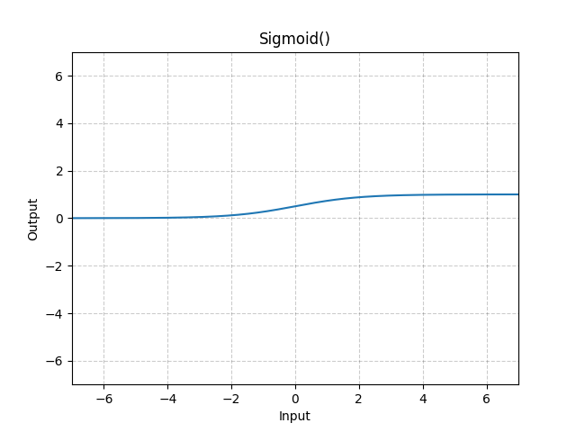

# Sigmoid

*class*torch.nn.Sigmoid(**args*, ***kwargs*)[[source]](https://github.com/pytorch/pytorch/blob/ab645165510131aa973a5b8880aa56f565e59c7b/torch/nn/modules/activation.py#L337)

Applies the Sigmoid function element-wise.

Sigmoid(x)=σ(x)=11+exp⁡(−x)\text{Sigmoid}(x) = \sigma(x) = \frac{1}{1 + \exp(-x)}

Sigmoid(x)=σ(x)=1+exp(−x)1​
Shape:

- Input: (∗)(*)(∗), where ∗*∗ means any number of dimensions.
- Output: (∗)(*)(∗), same shape as the input.



Examples:

```
>>> m = nn.Sigmoid()
>>> input = torch.randn(2)
>>> output = m(input)
```

forward(*input*)[[source]](https://github.com/pytorch/pytorch/blob/ab645165510131aa973a5b8880aa56f565e59c7b/torch/nn/modules/activation.py#L357)

Runs the forward pass.

Return type:

[*Tensor*](../tensors.html#torch.Tensor)