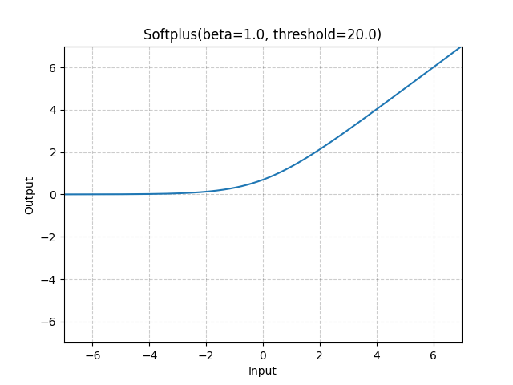

# Softplus

*class*torch.nn.Softplus(*beta=1.0*, *threshold=20.0*)[[source]](https://github.com/pytorch/pytorch/blob/95bac518a2d5467f21c9fc6906d33d1766a40e33/torch/nn/modules/activation.py#L958)

Applies the Softplus function element-wise.

Softplus(x)=1β∗log⁡(1+exp⁡(β∗x))\text{Softplus}(x) = \frac{1}{\beta} * \log(1 + \exp(\beta * x))

Softplus(x)=β1​∗log(1+exp(β∗x))

SoftPlus is a smooth approximation to the ReLU function and can be used
to constrain the output of a machine to always be positive.

For numerical stability the implementation reverts to the linear function
when input×β>thresholdinput \times \beta > thresholdinput×β>threshold.

Parameters:

- **beta** ([*float*](https://docs.python.org/3/library/functions.html#float)) - the β\betaβ value for the Softplus formulation. Default: 1
- **threshold** ([*float*](https://docs.python.org/3/library/functions.html#float)) - values above this revert to a linear function. Default: 20

Shape:

- Input: (∗)(*)(∗), where ∗*∗ means any number of dimensions.
- Output: (∗)(*)(∗), same shape as the input.



Examples:

```
>>> m = nn.Softplus()
>>> input = torch.randn(2)
>>> output = m(input)
```

extra_repr()[[source]](https://github.com/pytorch/pytorch/blob/95bac518a2d5467f21c9fc6906d33d1766a40e33/torch/nn/modules/activation.py#L1002)

Return the extra representation of the module.

Return type:

[str](https://docs.python.org/3/library/stdtypes.html#str)

forward(*input*)[[source]](https://github.com/pytorch/pytorch/blob/95bac518a2d5467f21c9fc6906d33d1766a40e33/torch/nn/modules/activation.py#L996)

Run forward pass.

Return type:

[*Tensor*](../tensors.html#torch.Tensor)