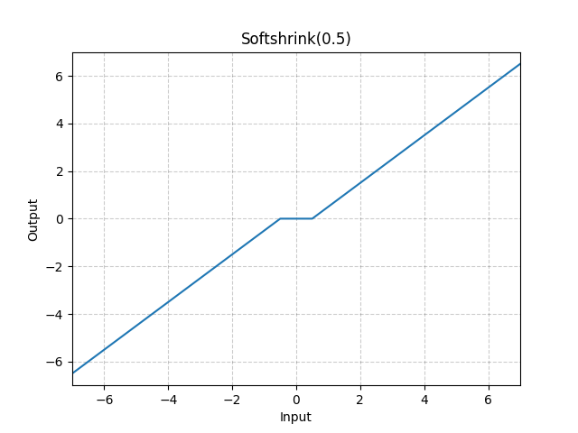

# Softshrink

*class*torch.nn.Softshrink(*lambd=0.5*)[[source]](https://github.com/pytorch/pytorch/blob/8aac66fb022576e2d13144ab636372f686f23cfa/torch/nn/modules/activation.py#L1010)

Applies the soft shrinkage function element-wise.

SoftShrinkage(x)={x−λ, if x>λx+λ, if x<−λ0, otherwise \text{SoftShrinkage}(x) =
\begin{cases}
x - \lambda, & \text{ if } x > \lambda \\
x + \lambda, & \text{ if } x < -\lambda \\
0, & \text{ otherwise }
\end{cases}

SoftShrinkage(x)=⎩⎨⎧​x−λ,x+λ,0,​ if x>λ if x<−λ otherwise ​
Parameters:

**lambd** ([*float*](https://docs.python.org/3/library/functions.html#float)) - the λ\lambdaλ (must be no less than zero) value for the Softshrink formulation. Default: 0.5

Shape:

- Input: (∗)(*)(∗), where ∗*∗ means any number of dimensions.
- Output: (∗)(*)(∗), same shape as the input.



Examples:

```
>>> m = nn.Softshrink()
>>> input = torch.randn(2)
>>> output = m(input)
```

extra_repr()[[source]](https://github.com/pytorch/pytorch/blob/8aac66fb022576e2d13144ab636372f686f23cfa/torch/nn/modules/activation.py#L1050)

Return the extra representation of the module.

Return type:

[str](https://docs.python.org/3/library/stdtypes.html#str)

forward(*input*)[[source]](https://github.com/pytorch/pytorch/blob/8aac66fb022576e2d13144ab636372f686f23cfa/torch/nn/modules/activation.py#L1044)

Run forward pass.

Return type:

[*Tensor*](../tensors.html#torch.Tensor)