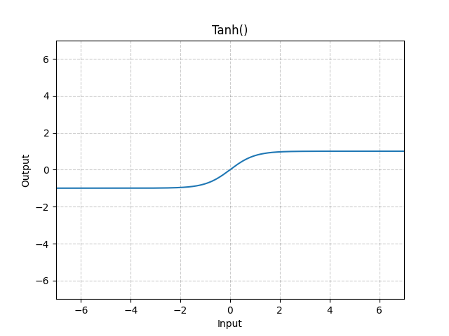

# Tanh

*class*torch.nn.Tanh(**args*, ***kwargs*)[[source]](https://github.com/pytorch/pytorch/blob/01eee25952cb32e0868ff00f26f080d46ef71e27/torch/nn/modules/activation.py#L407)

Applies the Hyperbolic Tangent (Tanh) function element-wise.

Tanh is defined as:

Tanh(x)=tanh⁡(x)=exp⁡(x)−exp⁡(−x)exp⁡(x)+exp⁡(−x)\text{Tanh}(x) = \tanh(x) = \frac{\exp(x) - \exp(-x)} {\exp(x) + \exp(-x)}

Tanh(x)=tanh(x)=exp(x)+exp(−x)exp(x)−exp(−x)​
Shape:

- Input: (∗)(*)(∗), where ∗*∗ means any number of dimensions.
- Output: (∗)(*)(∗), same shape as the input.



Examples:

```
>>> m = nn.Tanh()
>>> input = torch.tensor([-2.0, -0.5, 0.0, 0.5, 2.0])
>>> m(input)
tensor([-0.9640, -0.4621, 0.0000, 0.4621, 0.9640])
```

forward(*input*)[[source]](https://github.com/pytorch/pytorch/blob/01eee25952cb32e0868ff00f26f080d46ef71e27/torch/nn/modules/activation.py#L429)

Runs the forward pass.

Return type:

[*Tensor*](../tensors.html#torch.Tensor)