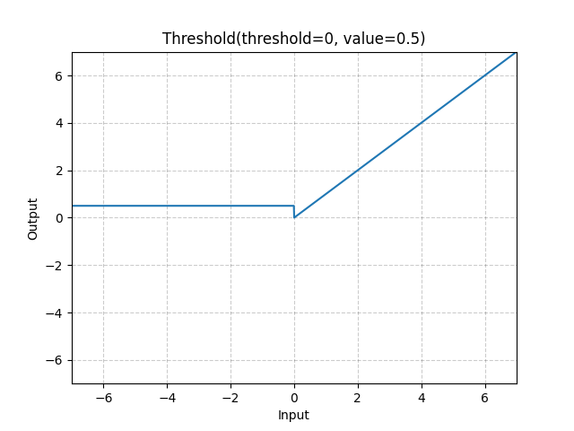

# Threshold

*class*torch.nn.Threshold(*threshold*, *value*, *inplace=False*)[[source]](https://github.com/pytorch/pytorch/blob/6a231d0d3e1ccd63dd51479bcadc969d0a8de2b9/torch/nn/modules/activation.py#L47)

Thresholds each element of the input Tensor.

Threshold is defined as:

y={x, if x>thresholdvalue, otherwise y =
\begin{cases}
x, &\text{ if } x > \text{threshold} \\
\text{value}, &\text{ otherwise }
\end{cases}

y={x,value,​ if x>threshold otherwise ​
Parameters:

- **threshold** ([*float*](https://docs.python.org/3/library/functions.html#float)) - The value to threshold at
- **value** ([*float*](https://docs.python.org/3/library/functions.html#float)) - The value to replace with
- **inplace** ([*bool*](https://docs.python.org/3/library/functions.html#bool)) - can optionally do the operation in-place. Default: `False`

Shape:

- Input: (∗)(*)(∗), where ∗*∗ means any number of dimensions.
- Output: (∗)(*)(∗), same shape as the input.



Examples:

```
>>> m = nn.Threshold(0, 0.5)
>>> input = torch.arange(-3, 3)
>>> output = m(input)
```

extra_repr()[[source]](https://github.com/pytorch/pytorch/blob/6a231d0d3e1ccd63dd51479bcadc969d0a8de2b9/torch/nn/modules/activation.py#L96)

Return the extra representation of the module.

Return type:

[str](https://docs.python.org/3/library/stdtypes.html#str)

forward(*input*)[[source]](https://github.com/pytorch/pytorch/blob/6a231d0d3e1ccd63dd51479bcadc969d0a8de2b9/torch/nn/modules/activation.py#L90)

Runs the forward pass.

Return type:

[*Tensor*](../tensors.html#torch.Tensor)