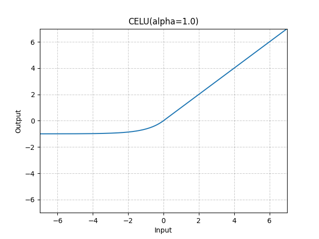

# CELU

*class*torch.nn.modules.activation.CELU(*alpha=1.0*, *inplace=False*)[[source]](https://github.com/pytorch/pytorch/blob/d1e2802e366c287c4773a50f4f0e8c35e8647bbb/torch/nn/modules/activation.py#L630)

Applies the CELU function element-wise.

CELU(x)=max⁡(0,x)+min⁡(0,α∗(exp⁡(x/α)−1))\text{CELU}(x) = \max(0,x) + \min(0, \alpha * (\exp(x/\alpha) - 1))

CELU(x)=max(0,x)+min(0,α∗(exp(x/α)−1))

More details can be found in the paper [Continuously Differentiable Exponential Linear Units](https://arxiv.org/abs/1704.07483) .

Parameters:

- **alpha** ([*float*](https://docs.python.org/3/library/functions.html#float)) - the α\alphaα value for the CELU formulation. Default: 1.0
- **inplace** ([*bool*](https://docs.python.org/3/library/functions.html#bool)) - can optionally do the operation in-place. Default: `False`

Shape:

- Input: (∗)(*)(∗), where ∗*∗ means any number of dimensions.
- Output: (∗)(*)(∗), same shape as the input.



Examples:

```
>>> m = nn.CELU()
>>> input = torch.randn(2)
>>> output = m(input)
```

extra_repr()[[source]](https://github.com/pytorch/pytorch/blob/d1e2802e366c287c4773a50f4f0e8c35e8647bbb/torch/nn/modules/activation.py#L673)

Return the extra representation of the module.

Return type:

[str](https://docs.python.org/3/library/stdtypes.html#str)

forward(*input*)[[source]](https://github.com/pytorch/pytorch/blob/d1e2802e366c287c4773a50f4f0e8c35e8647bbb/torch/nn/modules/activation.py#L667)

Runs the forward pass.

Return type:

[*Tensor*](../tensors.html#torch.Tensor)