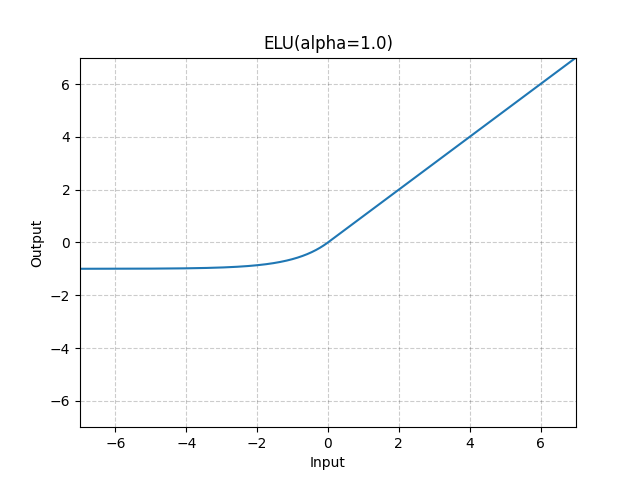

# ELU

*class*torch.nn.modules.activation.ELU(*alpha=1.0*, *inplace=False*)[[source]](https://github.com/pytorch/pytorch/blob/964b36dfdeb2262f10adc277503b2c3dda372818/torch/nn/modules/activation.py#L576)

Applies the Exponential Linear Unit (ELU) function, element-wise.

Method described in the paper: [Fast and Accurate Deep Network Learning by Exponential Linear
Units (ELUs)](https://arxiv.org/abs/1511.07289).

ELU is defined as:

ELU(x)={x, if x>0α∗(exp⁡(x)−1), if x≤0\text{ELU}(x) = \begin{cases}
x, & \text{ if } x > 0\\
\alpha * (\exp(x) - 1), & \text{ if } x \leq 0
\end{cases}

ELU(x)={x,α∗(exp(x)−1),​ if x>0 if x≤0​
Parameters:

- **alpha** ([*float*](https://docs.python.org/3/library/functions.html#float)) - the α\alphaα value for the ELU formulation. Default: 1.0
- **inplace** ([*bool*](https://docs.python.org/3/library/functions.html#bool)) - can optionally do the operation in-place. Default: `False`

Shape:

- Input: (∗)(*)(∗), where ∗*∗ means any number of dimensions.
- Output: (∗)(*)(∗), same shape as the input.



Examples:

```
>>> m = nn.ELU()
>>> input = torch.randn(2)
>>> output = m(input)
```

extra_repr()[[source]](https://github.com/pytorch/pytorch/blob/964b36dfdeb2262f10adc277503b2c3dda372818/torch/nn/modules/activation.py#L622)

Return the extra representation of the module.

Return type:

[str](https://docs.python.org/3/library/stdtypes.html#str)

forward(*input*)[[source]](https://github.com/pytorch/pytorch/blob/964b36dfdeb2262f10adc277503b2c3dda372818/torch/nn/modules/activation.py#L616)

Runs the forward pass.

Return type:

[*Tensor*](../tensors.html#torch.Tensor)