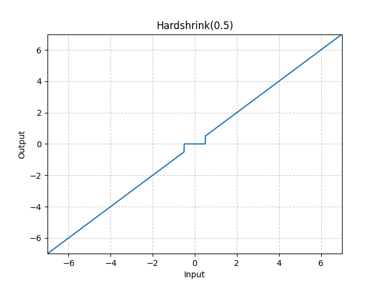

# Hardshrink

*class*torch.nn.modules.activation.Hardshrink(*lambd=0.5*)[[source]](https://github.com/pytorch/pytorch/blob/4ff2d1161191378e895e560774c1622dba40076d/torch/nn/modules/activation.py#L825)

Applies the Hard Shrinkage (Hardshrink) function element-wise.

Hardshrink is defined as:

HardShrink(x)={x, if x>λx, if x<−λ0, otherwise \text{HardShrink}(x) =
\begin{cases}
x, & \text{ if } x > \lambda \\
x, & \text{ if } x < -\lambda \\
0, & \text{ otherwise }
\end{cases}

HardShrink(x)=⎩⎨⎧​x,x,0,​ if x>λ if x<−λ otherwise ​
Parameters:

**lambd** ([*float*](https://docs.python.org/3/library/functions.html#float)) - the λ\lambdaλ value for the Hardshrink formulation. Default: 0.5

Shape:

- Input: (∗)(*)(∗), where ∗*∗ means any number of dimensions.
- Output: (∗)(*)(∗), same shape as the input.



Examples:

```
>>> m = nn.Hardshrink()
>>> input = torch.randn(2)
>>> output = m(input)
```

extra_repr()[[source]](https://github.com/pytorch/pytorch/blob/4ff2d1161191378e895e560774c1622dba40076d/torch/nn/modules/activation.py#L867)

Return the extra representation of the module.

Return type:

[str](https://docs.python.org/3/library/stdtypes.html#str)

forward(*input*)[[source]](https://github.com/pytorch/pytorch/blob/4ff2d1161191378e895e560774c1622dba40076d/torch/nn/modules/activation.py#L861)

Run forward pass.

Return type:

[*Tensor*](../tensors.html#torch.Tensor)