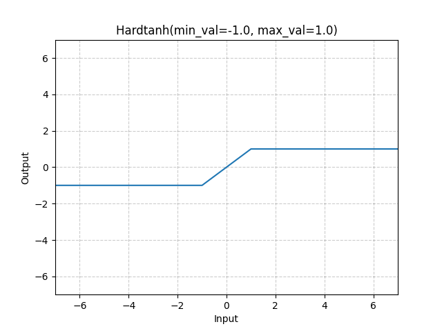

# Hardtanh

*class*torch.nn.modules.activation.Hardtanh(*min_val=-1.0*, *max_val=1.0*, *inplace=False*, *min_value=None*, *max_value=None*)[[source]](https://github.com/pytorch/pytorch/blob/6468763e46fe7b5527a52dfbb151d63938d7288a/torch/nn/modules/activation.py#L219)

Applies the HardTanh function element-wise.

HardTanh is defined as:

HardTanh(x)={max_val if x> max_val min_val if x< min_val x otherwise \text{HardTanh}(x) = \begin{cases}
 \text{max\_val} & \text{ if } x > \text{ max\_val } \\
 \text{min\_val} & \text{ if } x < \text{ min\_val } \\
 x & \text{ otherwise } \\
\end{cases}

HardTanh(x)=⎩⎨⎧​max_valmin_valx​ if x> max_val if x< min_val otherwise ​
Parameters:

- **min_val** ([*float*](https://docs.python.org/3/library/functions.html#float)) - minimum value of the linear region range. Default: -1
- **max_val** ([*float*](https://docs.python.org/3/library/functions.html#float)) - maximum value of the linear region range. Default: 1
- **inplace** ([*bool*](https://docs.python.org/3/library/functions.html#bool)) - can optionally do the operation in-place. Default: `False`

Keyword arguments `min_value` and `max_value`
have been deprecated in favor of `min_val` and `max_val`.

Shape:

- Input: (∗)(*)(∗), where ∗*∗ means any number of dimensions.
- Output: (∗)(*)(∗), same shape as the input.



Examples:

```
>>> m = nn.Hardtanh(-2, 2)
>>> input = torch.randn(2)
>>> output = m(input)
```

extra_repr()[[source]](https://github.com/pytorch/pytorch/blob/6468763e46fe7b5527a52dfbb151d63938d7288a/torch/nn/modules/activation.py#L296)

Return the extra representation of the module.

Return type:

[str](https://docs.python.org/3/library/stdtypes.html#str)

forward(*input*)[[source]](https://github.com/pytorch/pytorch/blob/6468763e46fe7b5527a52dfbb151d63938d7288a/torch/nn/modules/activation.py#L290)

Runs the forward pass.

Return type:

[*Tensor*](../tensors.html#torch.Tensor)