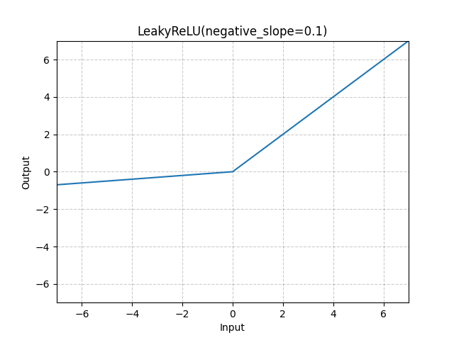

# LeakyReLU

*class*torch.nn.modules.activation.LeakyReLU(*negative_slope=0.01*, *inplace=False*)[[source]](https://github.com/pytorch/pytorch/blob/8e57bf150e06e0d3c3fa0bd28964c572270d2c4c/torch/nn/modules/activation.py#L874)

Applies the LeakyReLU function element-wise.

LeakyReLU(x)=max⁡(0,x)+negative_slope∗min⁡(0,x)\text{LeakyReLU}(x) = \max(0, x) + \text{negative\_slope} * \min(0, x)

LeakyReLU(x)=max(0,x)+negative_slope∗min(0,x)

or

LeakyReLU(x)={x, if x≥0negative_slope×x, otherwise \text{LeakyReLU}(x) =
\begin{cases}
x, & \text{ if } x \geq 0 \\
\text{negative\_slope} \times x, & \text{ otherwise }
\end{cases}

LeakyReLU(x)={x,negative_slope×x,​ if x≥0 otherwise ​
Parameters:

- **negative_slope** ([*float*](https://docs.python.org/3/library/functions.html#float)) - Controls the angle of the negative slope (which is used for
negative input values). Default: 1e-2
- **inplace** ([*bool*](https://docs.python.org/3/library/functions.html#bool)) - can optionally do the operation in-place. Default: `False`

Shape:

- Input: (∗)(*)(∗) where * means, any number of additional
dimensions
- Output: (∗)(*)(∗), same shape as the input



Examples:

```
>>> m = nn.LeakyReLU(0.1)
>>> input = torch.randn(2)
>>> output = m(input)
```

extra_repr()[[source]](https://github.com/pytorch/pytorch/blob/8e57bf150e06e0d3c3fa0bd28964c572270d2c4c/torch/nn/modules/activation.py#L924)

Return the extra representation of the module.

Return type:

[str](https://docs.python.org/3/library/stdtypes.html#str)

forward(*input*)[[source]](https://github.com/pytorch/pytorch/blob/8e57bf150e06e0d3c3fa0bd28964c572270d2c4c/torch/nn/modules/activation.py#L918)

Run forward pass.

Return type:

[*Tensor*](../tensors.html#torch.Tensor)