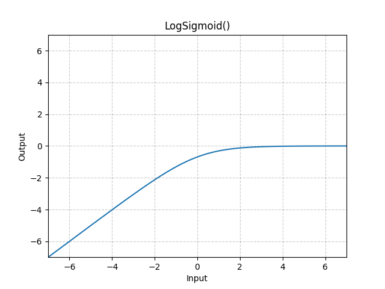

# LogSigmoid

*class*torch.nn.modules.activation.LogSigmoid(**args*, ***kwargs*)[[source]](https://github.com/pytorch/pytorch/blob/63f903c3d6b04c7cb1433d1d67e2b8e21c055bc7/torch/nn/modules/activation.py#L932)

Applies the Logsigmoid function element-wise.

LogSigmoid(x)=log⁡(11+exp⁡(−x))\text{LogSigmoid}(x) = \log\left(\frac{ 1 }{ 1 + \exp(-x)}\right)

LogSigmoid(x)=log(1+exp(−x)1​)
Shape:

- Input: (∗)(*)(∗), where ∗*∗ means any number of dimensions.
- Output: (∗)(*)(∗), same shape as the input.



Examples:

```
>>> m = nn.LogSigmoid()
>>> input = torch.randn(2)
>>> output = m(input)
```

forward(*input*)[[source]](https://github.com/pytorch/pytorch/blob/63f903c3d6b04c7cb1433d1d67e2b8e21c055bc7/torch/nn/modules/activation.py#L951)

Run forward pass.

Return type:

[*Tensor*](../tensors.html#torch.Tensor)