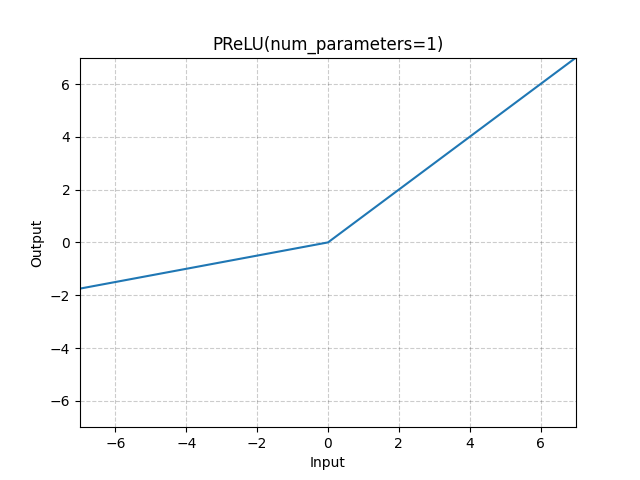

# PReLU

*class*torch.nn.modules.activation.PReLU(*num_parameters=1*, *init=0.25*, *device=None*, *dtype=None*)[[source]](https://github.com/pytorch/pytorch/blob/e7003ce301964b7a4ef5d2d4777331489745a93c/torch/nn/modules/activation.py#L1576)

Applies the element-wise PReLU function.

PReLU(x)=max⁡(0,x)+a∗min⁡(0,x)\text{PReLU}(x) = \max(0,x) + a * \min(0,x)

PReLU(x)=max(0,x)+a∗min(0,x)

or

PReLU(x)={x, if x≥0ax, otherwise \text{PReLU}(x) =
\begin{cases}
x, & \text{ if } x \ge 0 \\
ax, & \text{ otherwise }
\end{cases}

PReLU(x)={x,ax,​ if x≥0 otherwise ​

Here aaa is a learnable parameter. When called without arguments, nn.PReLU() uses a single
parameter aaa across all input channels. If called with nn.PReLU(nChannels),
a separate aaa is used for each input channel.

Note

weight decay should not be used when learning aaa for good performance.

Note

Channel dim is the 2nd dim of input. When input has dims < 2, then there is
no channel dim and the number of channels = 1.

Parameters:

- **num_parameters** ([*int*](https://docs.python.org/3/library/functions.html#int)) - number of aaa to learn.
Although it takes an int as input, there is only two values are legitimate:
1, or the number of channels at input. Default: 1
- **init** ([*float*](https://docs.python.org/3/library/functions.html#float)) - the initial value of aaa. Default: 0.25

Shape:

- Input: (∗)( *)(∗) where * means, any number of additional
dimensions.
- Output: (∗)(*)(∗), same shape as the input.

Variables:

**weight** ([*Tensor*](../tensors.html#torch.Tensor)) - the learnable weights of shape (`num_parameters`).



Examples:

```
>>> m = nn.PReLU()
>>> input = torch.randn(2)
>>> output = m(input)
```

extra_repr()[[source]](https://github.com/pytorch/pytorch/blob/e7003ce301964b7a4ef5d2d4777331489745a93c/torch/nn/modules/activation.py#L1651)

Return the extra representation of the module.

Return type:

[str](https://docs.python.org/3/library/stdtypes.html#str)

forward(*input*)[[source]](https://github.com/pytorch/pytorch/blob/e7003ce301964b7a4ef5d2d4777331489745a93c/torch/nn/modules/activation.py#L1645)

Runs the forward pass.

Return type:

[*Tensor*](../tensors.html#torch.Tensor)

reset_parameters()[[source]](https://github.com/pytorch/pytorch/blob/e7003ce301964b7a4ef5d2d4777331489745a93c/torch/nn/modules/activation.py#L1639)

Resets parameters based on their initialization used in `__init__`.