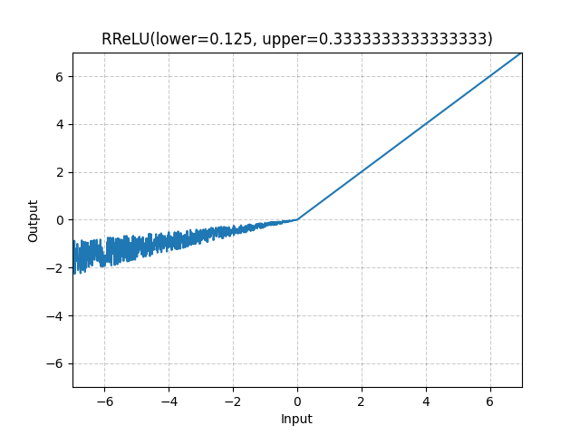

# RReLU

*class*torch.nn.modules.activation.RReLU(*lower=0.125*, *upper=0.3333333333333333*, *inplace=False*)[[source]](https://github.com/pytorch/pytorch/blob/d4258aa05fc98e7852a6c78350d44e3fa7bdb2ab/torch/nn/modules/activation.py#L153)

Applies the randomized leaky rectified linear unit function, element-wise.

Method described in the paper:
[Empirical Evaluation of Rectified Activations in Convolutional Network](https://arxiv.org/abs/1505.00853).

The function is defined as:

RReLU(x)={xif x≥0ax otherwise \text{RReLU}(x) =
\begin{cases}
 x & \text{if } x \geq 0 \\
 ax & \text{ otherwise }
\end{cases}

RReLU(x)={xax​if x≥0 otherwise ​

where aaa is randomly sampled from uniform distribution
U(lower,upper)\mathcal{U}(\text{lower}, \text{upper})U(lower,upper) during training while during
evaluation aaa is fixed with a=lower+upper2a = \frac{\text{lower} + \text{upper}}{2}a=2lower+upper​.

Parameters:

- **lower** ([*float*](https://docs.python.org/3/library/functions.html#float)) - lower bound of the uniform distribution. Default: 18\frac{1}{8}81​
- **upper** ([*float*](https://docs.python.org/3/library/functions.html#float)) - upper bound of the uniform distribution. Default: 13\frac{1}{3}31​
- **inplace** ([*bool*](https://docs.python.org/3/library/functions.html#bool)) - can optionally do the operation in-place. Default: `False`

Shape:

- Input: (∗)(*)(∗), where ∗*∗ means any number of dimensions.
- Output: (∗)(*)(∗), same shape as the input.



Examples:

```
>>> m = nn.RReLU(0.1, 0.3)
>>> input = torch.randn(2)
>>> output = m(input)
```

extra_repr()[[source]](https://github.com/pytorch/pytorch/blob/d4258aa05fc98e7852a6c78350d44e3fa7bdb2ab/torch/nn/modules/activation.py#L211)

Return the extra representation of the module.

Return type:

[str](https://docs.python.org/3/library/stdtypes.html#str)

forward(*input*)[[source]](https://github.com/pytorch/pytorch/blob/d4258aa05fc98e7852a6c78350d44e3fa7bdb2ab/torch/nn/modules/activation.py#L205)

Runs the forward pass.

Return type:

[*Tensor*](../tensors.html#torch.Tensor)