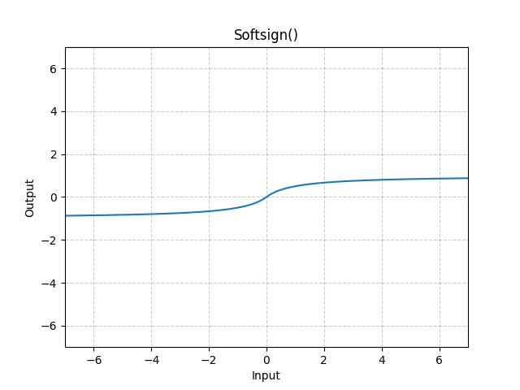

# Softsign

*class*torch.nn.modules.activation.Softsign(**args*, ***kwargs*)[[source]](https://github.com/pytorch/pytorch/blob/0c8b4a78ffbbce776adc0823e790158b26435f40/torch/nn/modules/activation.py#L1658)

Applies the element-wise Softsign function.

SoftSign(x)=x1+∣x∣\text{SoftSign}(x) = \frac{x}{ 1 + |x|}

SoftSign(x)=1+∣x∣x​
Shape:

- Input: (∗)(*)(∗), where ∗*∗ means any number of dimensions.
- Output: (∗)(*)(∗), same shape as the input.



Examples:

```
>>> m = nn.Softsign()
>>> input = torch.randn(2)
>>> output = m(input)
```

forward(*input*)[[source]](https://github.com/pytorch/pytorch/blob/0c8b4a78ffbbce776adc0823e790158b26435f40/torch/nn/modules/activation.py#L1677)

Runs the forward pass.

Return type:

[*Tensor*](../tensors.html#torch.Tensor)