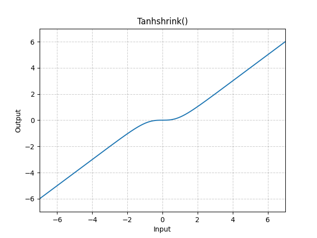

# Tanhshrink

*class*torch.nn.modules.activation.Tanhshrink(**args*, ***kwargs*)[[source]](https://github.com/pytorch/pytorch/blob/99fcf9fd884002c14d4c19cce5dfe2469ba5a7fc/torch/nn/modules/activation.py#L1684)

Applies the element-wise Tanhshrink function.

Tanhshrink(x)=x−tanh⁡(x)\text{Tanhshrink}(x) = x - \tanh(x)

Tanhshrink(x)=x−tanh(x)
Shape:

- Input: (∗)(*)(∗), where ∗*∗ means any number of dimensions.
- Output: (∗)(*)(∗), same shape as the input.



Examples:

```
>>> m = nn.Tanhshrink()
>>> input = torch.randn(2)
>>> output = m(input)
```

forward(*input*)[[source]](https://github.com/pytorch/pytorch/blob/99fcf9fd884002c14d4c19cce5dfe2469ba5a7fc/torch/nn/modules/activation.py#L1703)

Runs the forward pass.

Return type:

[*Tensor*](../tensors.html#torch.Tensor)