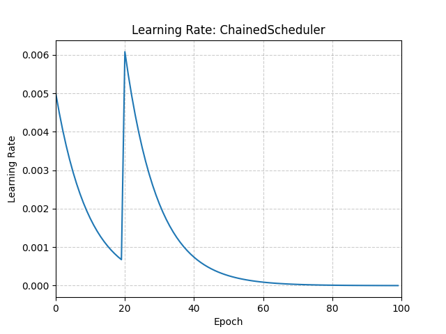

# ChainedScheduler

*class*torch.optim.lr_scheduler.ChainedScheduler(*schedulers*, *optimizer=None*)[[source]](https://github.com/pytorch/pytorch/blob/08fea85059e6f8092daa38319f7ea5bd7603d5e9/torch/optim/lr_scheduler.py#L1478)

Chains a list of learning rate schedulers.

Takes in a sequence of chainable learning rate schedulers and calls their
step() functions consecutively in just one call to step().

Parameters:

- **schedulers** (*sequence*) - sequence of chained schedulers.
- **optimizer** ([*Optimizer*](../optim.html#torch.optim.Optimizer)*,**optional*) - Wrapped optimizer. Default: None.

Example

```
>>> # Assuming optimizer uses lr = 0.05 for all groups
>>> # lr = 0.05 if epoch == 0
>>> # lr = 0.0450 if epoch == 1
>>> # lr = 0.0405 if epoch == 2
>>> # ...
>>> # lr = 0.00675 if epoch == 19
>>> # lr = 0.06078 if epoch == 20
>>> # lr = 0.05470 if epoch == 21
>>> scheduler1 = ConstantLR(optimizer, factor=0.1, total_iters=20)
>>> scheduler2 = ExponentialLR(optimizer, gamma=0.9)
>>> scheduler = ChainedScheduler([scheduler1, scheduler2], optimizer=optimizer)
>>> for epoch in range(100):
>>> train(...)
>>> validate(...)
>>> scheduler.step()
```



get_last_lr()[[source]](https://github.com/pytorch/pytorch/blob/08fea85059e6f8092daa38319f7ea5bd7603d5e9/torch/optim/lr_scheduler.py#L201)

Get the most recent learning rates computed by this scheduler.

Returns:

A [`list`](https://docs.python.org/3/library/stdtypes.html#list) of learning rates with entries
for each of the optimizer's
`param_groups`, with the same types as
their `group["lr"]`s.

Return type:

[list](https://docs.python.org/3/library/stdtypes.html#list)[[float](https://docs.python.org/3/library/functions.html#float) | [Tensor](../tensors.html#torch.Tensor)]

Note

The returned [`Tensor`](../tensors.html#torch.Tensor)s are copies, and never alias
the optimizer's `group["lr"]`s.

get_lr()[[source]](https://github.com/pytorch/pytorch/blob/08fea85059e6f8092daa38319f7ea5bd7603d5e9/torch/optim/lr_scheduler.py#L219)

Compute the next learning rate for each of the optimizer's
`param_groups`.

Returns:

A [`list`](https://docs.python.org/3/library/stdtypes.html#list) of learning rates for each of
the optimizer's `param_groups` with the
same types as their current `group["lr"]`s.

Return type:

[list](https://docs.python.org/3/library/stdtypes.html#list)[[float](https://docs.python.org/3/library/functions.html#float) | [Tensor](../tensors.html#torch.Tensor)]

Note

If you're trying to inspect the most recent learning rate, use
`get_last_lr()` instead.

Note

The returned [`Tensor`](../tensors.html#torch.Tensor)s are copies, and never alias
the optimizer's `group["lr"]`s.

load_state_dict(*state_dict*)[[source]](https://github.com/pytorch/pytorch/blob/08fea85059e6f8092daa38319f7ea5bd7603d5e9/torch/optim/lr_scheduler.py#L1566)

Load the scheduler's state.

Parameters:

**state_dict** ([*dict*](https://docs.python.org/3/library/stdtypes.html#dict)) - scheduler state. Should be an object returned
from a call to `state_dict()`.

state_dict()[[source]](https://github.com/pytorch/pytorch/blob/08fea85059e6f8092daa38319f7ea5bd7603d5e9/torch/optim/lr_scheduler.py#L1545)

Return the state of the scheduler as a [`dict`](https://docs.python.org/3/library/stdtypes.html#dict).

It contains an entry for every variable in `self.__dict__` which
is not the optimizer.
The wrapped scheduler states will also be saved.

Return type:

[dict](https://docs.python.org/3/library/stdtypes.html#dict)[[str](https://docs.python.org/3/library/stdtypes.html#str), [*Any*](https://docs.python.org/3/library/typing.html#typing.Any)]

step()[[source]](https://github.com/pytorch/pytorch/blob/08fea85059e6f8092daa38319f7ea5bd7603d5e9/torch/optim/lr_scheduler.py#L1539)

Perform a step.