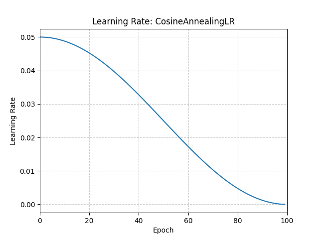

# CosineAnnealingLR

*class*torch.optim.lr_scheduler.CosineAnnealingLR(*optimizer*, *T_max*, *eta_min=0.0*, *last_epoch=-1*)[[source]](https://github.com/pytorch/pytorch/blob/b7ee7397ead012835c2d80ee53f64800630b1ab9/torch/optim/lr_scheduler.py#L1338)

Set the learning rate of each parameter group using a cosine annealing schedule.

The learning rate is updated recursively using:

ηt+1=ηmin⁡+(ηt−ηmin⁡)⋅1+cos⁡((Tcur+1)πTmax)1+cos⁡(TcurπTmax)\eta_{t+1} = \eta_{\min} + (\eta_t - \eta_{\min}) \cdot
\frac{1 + \cos\left(\frac{(T_{cur}+1) \pi}{T_{max}}\right)}
 {1 + \cos\left(\frac{T_{cur} \pi}{T_{max}}\right)}

ηt+1​=ηmin​+(ηt​−ηmin​)⋅1+cos(Tmax​Tcur​π​)1+cos(Tmax​(Tcur​+1)π​)​

This implements a recursive approximation of the closed-form schedule proposed in
[SGDR: Stochastic Gradient Descent with Warm Restarts](https://arxiv.org/abs/1608.03983):

ηt=ηmin⁡+12(ηmax⁡−ηmin⁡)(1+cos⁡(TcurπTmax))\eta_t = \eta_{\min} + \frac{1}{2}(\eta_{\max} - \eta_{\min}) \left(
 1 + \cos\left(\frac{T_{cur} \pi}{T_{max}}\right) \right)

ηt​=ηmin​+21​(ηmax​−ηmin​)(1+cos(Tmax​Tcur​π​))

where:

- ηt\eta_tηt​ is the learning rate at step ttt
- TcurT_{cur}Tcur​ is the number of epochs since the last restart
- TmaxT_{max}Tmax​ is the maximum number of epochs in a cycle

Note

Although SGDR includes periodic restarts, this implementation performs cosine annealing
**without restarts**, so Tcur=tT_{cur} = tTcur​=t and increases monotonically with each call
to `step()`.

Parameters:

- **optimizer** ([*Optimizer*](../optim.html#torch.optim.Optimizer)) - Wrapped optimizer.
- **T_max** ([*int*](https://docs.python.org/3/library/functions.html#int)) - Maximum number of iterations.
- **eta_min** ([*float*](https://docs.python.org/3/library/functions.html#float)) - Minimum learning rate. Default: 0.
- **last_epoch** ([*int*](https://docs.python.org/3/library/functions.html#int)) - The index of the last epoch. Default: -1.

Example

```
>>> num_epochs = 100
>>> scheduler = CosineAnnealingLR(optimizer, T_max=num_epochs)
>>> for epoch in range(num_epochs):
>>> train(...)
>>> validate(...)
>>> scheduler.step()
```



get_last_lr()[[source]](https://github.com/pytorch/pytorch/blob/b7ee7397ead012835c2d80ee53f64800630b1ab9/torch/optim/lr_scheduler.py#L201)

Get the most recent learning rates computed by this scheduler.

Returns:

A [`list`](https://docs.python.org/3/library/stdtypes.html#list) of learning rates with entries
for each of the optimizer's
`param_groups`, with the same types as
their `group["lr"]`s.

Return type:

[list](https://docs.python.org/3/library/stdtypes.html#list)[[float](https://docs.python.org/3/library/functions.html#float) | [Tensor](../tensors.html#torch.Tensor)]

Note

The returned [`Tensor`](../tensors.html#torch.Tensor)s are copies, and never alias
the optimizer's `group["lr"]`s.

get_lr()[[source]](https://github.com/pytorch/pytorch/blob/b7ee7397ead012835c2d80ee53f64800630b1ab9/torch/optim/lr_scheduler.py#L1399)

Compute the next learning rate for each of the optimizer's
`param_groups`.

Scales the `group["lr"]`s in the optimizer's
`param_groups` such that their learning
rates approximate

eta_min+12(base_lr−eta_min)(1+cos⁡(π⋅last_epochT_max))\texttt{eta\_min} + \frac{1}{2} (\texttt{base\_lr} -
\texttt{eta\_min}) \left(1 + \cos\left(\pi \cdot
\frac{\texttt{last\_epoch}}{\texttt{T\_max}}\right) \right)

eta_min+21​(base_lr−eta_min)(1+cos(π⋅T_maxlast_epoch​))
Returns:

A [`list`](https://docs.python.org/3/library/stdtypes.html#list) of learning rates for each of
the optimizer's `param_groups` with the
same types as their current `group["lr"]`s.

Return type:

[list](https://docs.python.org/3/library/stdtypes.html#list)[[float](https://docs.python.org/3/library/functions.html#float) | [Tensor](../tensors.html#torch.Tensor)]

Note

If you're trying to inspect the most recent learning rate, use
`get_last_lr()` instead.

Note

The returned [`Tensor`](../tensors.html#torch.Tensor)s are copies, and never alias
the optimizer's `group["lr"]`s.

load_state_dict(*state_dict*)[[source]](https://github.com/pytorch/pytorch/blob/b7ee7397ead012835c2d80ee53f64800630b1ab9/torch/optim/lr_scheduler.py#L192)

Load the scheduler's state.

Parameters:

**state_dict** ([*dict*](https://docs.python.org/3/library/stdtypes.html#dict)) - scheduler state. Should be an object returned
from a call to `state_dict()`.

state_dict()[[source]](https://github.com/pytorch/pytorch/blob/b7ee7397ead012835c2d80ee53f64800630b1ab9/torch/optim/lr_scheduler.py#L182)

Return the state of the scheduler as a [`dict`](https://docs.python.org/3/library/stdtypes.html#dict).

It contains an entry for every variable in `self.__dict__` which
is not the optimizer.

Return type:

[dict](https://docs.python.org/3/library/stdtypes.html#dict)[[str](https://docs.python.org/3/library/stdtypes.html#str), [*Any*](https://docs.python.org/3/library/typing.html#typing.Any)]

step(*epoch=None*)[[source]](https://github.com/pytorch/pytorch/blob/b7ee7397ead012835c2d80ee53f64800630b1ab9/torch/optim/lr_scheduler.py#L238)

Step the scheduler.

Parameters:

**epoch** ([*int*](https://docs.python.org/3/library/functions.html#int)*,**optional*) -

Deprecated since version 1.4: If provided, sets `last_epoch` to `epoch` and uses
`_get_closed_form_lr()` if it is available. This is not
universally supported. Use `step()` without arguments
instead.

Note

Call this method after calling the optimizer's
[`step()`](torch.optim.Optimizer.step.html#torch.optim.Optimizer.step).