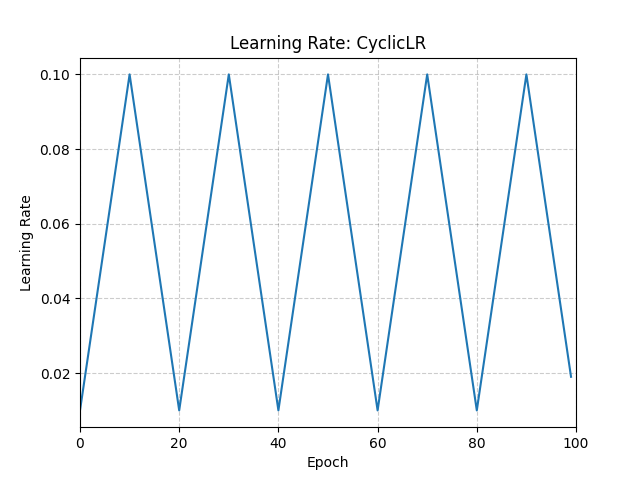

# CyclicLR

*class*torch.optim.lr_scheduler.CyclicLR(*optimizer*, *base_lr*, *max_lr*, *step_size_up=2000*, *step_size_down=None*, *mode='triangular'*, *gamma=1.0*, *scale_fn=None*, *scale_mode='cycle'*, *cycle_momentum=True*, *base_momentum=0.8*, *max_momentum=0.9*, *last_epoch=-1*)[[source]](https://github.com/pytorch/pytorch/blob/8e57bf150e06e0d3c3fa0bd28964c572270d2c4c/torch/optim/lr_scheduler.py#L1787)

Sets the learning rate of each parameter group according to cyclical learning rate policy (CLR).

The policy cycles the learning rate between two boundaries with a constant frequency,
as detailed in the paper [Cyclical Learning Rates for Training Neural Networks](https://arxiv.org/abs/1506.01186).
The distance between the two boundaries can be scaled on a per-iteration
or per-cycle basis.

Cyclical learning rate policy changes the learning rate after every batch.
step should be called after a batch has been used for training.

This class has three built-in policies, as put forth in the paper:

- "triangular": A basic triangular cycle without amplitude scaling.
- "triangular2": A basic triangular cycle that scales initial amplitude by half each cycle.
- "exp_range": A cycle that scales initial amplitude by gammacycle iterations\text{gamma}^{\text{cycle iterations}}gammacycle iterations
at each cycle iteration.

This implementation was adapted from the github repo: [bckenstler/CLR](https://github.com/bckenstler/CLR)

Parameters:

- **optimizer** ([*Optimizer*](../optim.html#torch.optim.Optimizer)) - Wrapped optimizer.
- **base_lr** ([*float*](https://docs.python.org/3/library/functions.html#float)*or*[*list*](https://docs.python.org/3/library/stdtypes.html#list)) - Initial learning rate which is the
lower boundary in the cycle for each parameter group.
- **max_lr** ([*float*](https://docs.python.org/3/library/functions.html#float)*or*[*list*](https://docs.python.org/3/library/stdtypes.html#list)) - Upper learning rate boundaries in the cycle
for each parameter group. Functionally,
it defines the cycle amplitude (max_lr - base_lr).
The lr at any cycle is the sum of base_lr
and some scaling of the amplitude; therefore
max_lr may not actually be reached depending on
scaling function.
- **step_size_up** ([*int*](https://docs.python.org/3/library/functions.html#int)) - Number of training iterations in the
increasing half of a cycle. Default: 2000
- **step_size_down** ([*int*](https://docs.python.org/3/library/functions.html#int)) - Number of training iterations in the
decreasing half of a cycle. If step_size_down is None,
it is set to step_size_up. Default: None
- **mode** ([*str*](https://docs.python.org/3/library/stdtypes.html#str)) - One of {triangular, triangular2, exp_range}.
Values correspond to policies detailed above.
If scale_fn is not None, this argument is ignored.
Default: 'triangular'
- **gamma** ([*float*](https://docs.python.org/3/library/functions.html#float)) - Constant in 'exp_range' scaling function:
gamma**(cycle iterations)
Default: 1.0
- **scale_fn** (*function*) - Custom scaling policy defined by a single
argument lambda function, where
0 <= scale_fn(x) <= 1 for all x >= 0.
If specified, then 'mode' is ignored.
Default: None
- **scale_mode** ([*str*](https://docs.python.org/3/library/stdtypes.html#str)) - {'cycle', 'iterations'}.
Defines whether scale_fn is evaluated on
cycle number or cycle iterations (training
iterations since start of cycle).
Default: 'cycle'
- **cycle_momentum** ([*bool*](https://docs.python.org/3/library/functions.html#bool)) - If `True`, momentum is cycled inversely
to learning rate between 'base_momentum' and 'max_momentum'.
Default: True
- **base_momentum** ([*float*](https://docs.python.org/3/library/functions.html#float)*or*[*list*](https://docs.python.org/3/library/stdtypes.html#list)) - Lower momentum boundaries in the cycle
for each parameter group. Note that momentum is cycled inversely
to learning rate; at the peak of a cycle, momentum is
'base_momentum' and learning rate is 'max_lr'.
Default: 0.8
- **max_momentum** ([*float*](https://docs.python.org/3/library/functions.html#float)*or*[*list*](https://docs.python.org/3/library/stdtypes.html#list)) - Upper momentum boundaries in the cycle
for each parameter group. Functionally,
it defines the cycle amplitude (max_momentum - base_momentum).
The momentum at any cycle is the difference of max_momentum
and some scaling of the amplitude; therefore
base_momentum may not actually be reached depending on
scaling function. Note that momentum is cycled inversely
to learning rate; at the start of a cycle, momentum is 'max_momentum'
and learning rate is 'base_lr'
Default: 0.9
- **last_epoch** ([*int*](https://docs.python.org/3/library/functions.html#int)) - The index of the last batch. This parameter is used when
resuming a training job. Since step() should be invoked after each
batch instead of after each epoch, this number represents the total
number of *batches* computed, not the total number of epochs computed.
When last_epoch=-1, the schedule is started from the beginning.
Default: -1

Example

```
>>> optimizer = torch.optim.SGD(model.parameters(), lr=0.1, momentum=0.9)
>>> scheduler = torch.optim.lr_scheduler.CyclicLR(
... optimizer,
... base_lr=0.01,
... max_lr=0.1,
... step_size_up=10,
... )
>>> data_loader = torch.utils.data.DataLoader(...)
>>> for epoch in range(10):
>>> for batch in data_loader:
>>> train_batch(...)
>>> scheduler.step()
```



get_last_lr()[[source]](https://github.com/pytorch/pytorch/blob/8e57bf150e06e0d3c3fa0bd28964c572270d2c4c/torch/optim/lr_scheduler.py#L201)

Get the most recent learning rates computed by this scheduler.

Returns:

A [`list`](https://docs.python.org/3/library/stdtypes.html#list) of learning rates with entries
for each of the optimizer's
`param_groups`, with the same types as
their `group["lr"]`s.

Return type:

[list](https://docs.python.org/3/library/stdtypes.html#list)[[float](https://docs.python.org/3/library/functions.html#float) | [Tensor](../tensors.html#torch.Tensor)]

Note

The returned [`Tensor`](../tensors.html#torch.Tensor)s are copies, and never alias
the optimizer's `group["lr"]`s.

get_lr()[[source]](https://github.com/pytorch/pytorch/blob/8e57bf150e06e0d3c3fa0bd28964c572270d2c4c/torch/optim/lr_scheduler.py#L1999)

Compute the next learning rate for each of the optimizer's
`param_groups`.

Advances each `group["lr"]` in the optimizer's
`param_groups` along a cycle between the
group's `base_lr` and `max_lr` using `scale_fn()`.

Returns:

A [`list`](https://docs.python.org/3/library/stdtypes.html#list) of learning rates for each of
the optimizer's `param_groups` with the
same types as their current `group["lr"]`s.

Return type:

[list](https://docs.python.org/3/library/stdtypes.html#list)[[float](https://docs.python.org/3/library/functions.html#float) | [Tensor](../tensors.html#torch.Tensor)]

Note

If you're trying to inspect the most recent learning rate, use
`get_last_lr()` instead.

Note

The returned [`Tensor`](../tensors.html#torch.Tensor)s are copies, and never alias
the optimizer's `group["lr"]`s.

Note

This method treats `last_epoch` as the index of the previous
batch.

Note

When `cycle_momentum` is `True`, this method has a side
effect of updating the optimizer's momentum.

load_state_dict(*state_dict*)[[source]](https://github.com/pytorch/pytorch/blob/8e57bf150e06e0d3c3fa0bd28964c572270d2c4c/torch/optim/lr_scheduler.py#L2094)

Load the scheduler's state.

scale_fn(*x*)[[source]](https://github.com/pytorch/pytorch/blob/8e57bf150e06e0d3c3fa0bd28964c572270d2c4c/torch/optim/lr_scheduler.py#L1980)

Get the scaling policy.

Return type:

[float](https://docs.python.org/3/library/functions.html#float)

state_dict()[[source]](https://github.com/pytorch/pytorch/blob/8e57bf150e06e0d3c3fa0bd28964c572270d2c4c/torch/optim/lr_scheduler.py#L2070)

Return the state of the scheduler as a [`dict`](https://docs.python.org/3/library/stdtypes.html#dict).

It contains an entry for every variable in `self.__dict__` which
is not the optimizer.
The learning rate lambda functions will only be saved if they are callable objects
and not if they are functions or lambdas.

When saving or loading the scheduler, please make sure to also save or load the state of the optimizer.

Return type:

[dict](https://docs.python.org/3/library/stdtypes.html#dict)[[str](https://docs.python.org/3/library/stdtypes.html#str), [*Any*](https://docs.python.org/3/library/typing.html#typing.Any)]

step(*epoch=None*)[[source]](https://github.com/pytorch/pytorch/blob/8e57bf150e06e0d3c3fa0bd28964c572270d2c4c/torch/optim/lr_scheduler.py#L238)

Step the scheduler.

Parameters:

**epoch** ([*int*](https://docs.python.org/3/library/functions.html#int)*,**optional*) -

Deprecated since version 1.4: If provided, sets `last_epoch` to `epoch` and uses
`_get_closed_form_lr()` if it is available. This is not
universally supported. Use `step()` without arguments
instead.

Note

Call this method after calling the optimizer's
[`step()`](torch.optim.Optimizer.step.html#torch.optim.Optimizer.step).