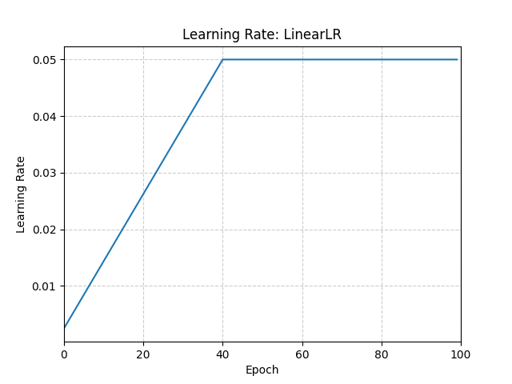

# LinearLR

*class*torch.optim.lr_scheduler.LinearLR(*optimizer*, *start_factor=0.3333333333333333*, *end_factor=1.0*, *total_iters=5*, *last_epoch=-1*)[[source]](https://github.com/pytorch/pytorch/blob/053a82e9f95b79ebe852f2372f1452e4c8537230/torch/optim/lr_scheduler.py#L877)

Decays the learning rate of each parameter group by linearly changing small multiplicative factor.

The multiplication is done until the number of epoch reaches a pre-defined milestone: total_iters.
Notice that such decay can happen simultaneously with other changes to the learning rate
from outside this scheduler. When last_epoch=-1, sets initial lr as lr.

Parameters:

- **optimizer** ([*Optimizer*](../optim.html#torch.optim.Optimizer)) - Wrapped optimizer.
- **start_factor** ([*float*](https://docs.python.org/3/library/functions.html#float)) - The number we multiply learning rate in the first epoch.
The multiplication factor changes towards end_factor in the following epochs.
Default: 1./3.
- **end_factor** ([*float*](https://docs.python.org/3/library/functions.html#float)) - The number we multiply learning rate at the end of linear changing
process. Default: 1.0.
- **total_iters** ([*int*](https://docs.python.org/3/library/functions.html#int)) - The number of iterations that multiplicative factor reaches to 1.
Default: 5.
- **last_epoch** ([*int*](https://docs.python.org/3/library/functions.html#int)) - The index of the last epoch. Default: -1.

Example

```
>>> # Assuming optimizer uses lr = 0.05 for all groups
>>> # lr = 0.003687 if epoch == 0
>>> # lr = 0.004875 if epoch == 1
>>> # lr = 0.006062 if epoch == 2
>>> # lr = 0.00725 if epoch == 3
>>> # ...
>>> # lr = 0.05 if epoch >= 40
>>> scheduler = LinearLR(optimizer, start_factor=0.05, total_iters=40)
>>> for epoch in range(100):
>>> train(...)
>>> validate(...)
>>> scheduler.step()
```



get_last_lr()[[source]](https://github.com/pytorch/pytorch/blob/053a82e9f95b79ebe852f2372f1452e4c8537230/torch/optim/lr_scheduler.py#L201)

Get the most recent learning rates computed by this scheduler.

Returns:

A [`list`](https://docs.python.org/3/library/stdtypes.html#list) of learning rates with entries
for each of the optimizer's
`param_groups`, with the same types as
their `group["lr"]`s.

Return type:

[list](https://docs.python.org/3/library/stdtypes.html#list)[[float](https://docs.python.org/3/library/functions.html#float) | [Tensor](../tensors.html#torch.Tensor)]

Note

The returned [`Tensor`](../tensors.html#torch.Tensor)s are copies, and never alias
the optimizer's `group["lr"]`s.

get_lr()[[source]](https://github.com/pytorch/pytorch/blob/053a82e9f95b79ebe852f2372f1452e4c8537230/torch/optim/lr_scheduler.py#L936)

Compute the next learning rate for each of the optimizer's
`param_groups`.

Scales the `group["lr"]`s in the optimizer's
`param_groups` such that successive steps
interpolate linearly from `start_factor` up to `end_factor`
across `total_iters` steps.

Returns:

A [`list`](https://docs.python.org/3/library/stdtypes.html#list) of learning rates for each of
the optimizer's `param_groups` with the
same types as their current `group["lr"]`s.

Return type:

[list](https://docs.python.org/3/library/stdtypes.html#list)[[float](https://docs.python.org/3/library/functions.html#float) | [Tensor](../tensors.html#torch.Tensor)]

Note

If you're trying to inspect the most recent learning rate, use
`get_last_lr()` instead.

Note

The returned [`Tensor`](../tensors.html#torch.Tensor)s are copies, and never alias
the optimizer's `group["lr"]`s.

load_state_dict(*state_dict*)[[source]](https://github.com/pytorch/pytorch/blob/053a82e9f95b79ebe852f2372f1452e4c8537230/torch/optim/lr_scheduler.py#L192)

Load the scheduler's state.

Parameters:

**state_dict** ([*dict*](https://docs.python.org/3/library/stdtypes.html#dict)) - scheduler state. Should be an object returned
from a call to `state_dict()`.

state_dict()[[source]](https://github.com/pytorch/pytorch/blob/053a82e9f95b79ebe852f2372f1452e4c8537230/torch/optim/lr_scheduler.py#L182)

Return the state of the scheduler as a [`dict`](https://docs.python.org/3/library/stdtypes.html#dict).

It contains an entry for every variable in `self.__dict__` which
is not the optimizer.

Return type:

[dict](https://docs.python.org/3/library/stdtypes.html#dict)[[str](https://docs.python.org/3/library/stdtypes.html#str), [*Any*](https://docs.python.org/3/library/typing.html#typing.Any)]

step(*epoch=None*)[[source]](https://github.com/pytorch/pytorch/blob/053a82e9f95b79ebe852f2372f1452e4c8537230/torch/optim/lr_scheduler.py#L238)

Step the scheduler.

Parameters:

**epoch** ([*int*](https://docs.python.org/3/library/functions.html#int)*,**optional*) -

Deprecated since version 1.4: If provided, sets `last_epoch` to `epoch` and uses
`_get_closed_form_lr()` if it is available. This is not
universally supported. Use `step()` without arguments
instead.

Note

Call this method after calling the optimizer's
[`step()`](torch.optim.Optimizer.step.html#torch.optim.Optimizer.step).