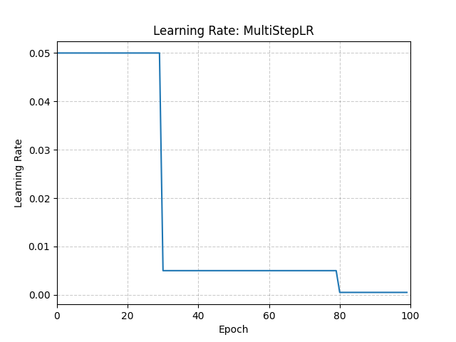

# MultiStepLR

*class*torch.optim.lr_scheduler.MultiStepLR(*optimizer*, *milestones*, *gamma=0.1*, *last_epoch=-1*)[[source]](https://github.com/pytorch/pytorch/blob/071dd4d98ee0ca692fbe0cb3e9f3b95955d73329/torch/optim/lr_scheduler.py#L679)

Decays the learning rate of each parameter group by gamma once the number of epoch reaches one of the milestones.

Notice that such decay can happen simultaneously with other changes to the learning rate
from outside this scheduler. When last_epoch=-1, sets initial lr as lr.

Parameters:

- **optimizer** ([*Optimizer*](../optim.html#torch.optim.Optimizer)) - Wrapped optimizer.
- **milestones** ([*list*](https://docs.python.org/3/library/stdtypes.html#list)) - List of epoch indices. Must be increasing.
- **gamma** ([*float*](https://docs.python.org/3/library/functions.html#float)) - Multiplicative factor of learning rate decay.
Default: 0.1.
- **last_epoch** ([*int*](https://docs.python.org/3/library/functions.html#int)) - The index of last epoch. Default: -1.

Example

```
>>> # Assuming optimizer uses lr = 0.05 for all groups
>>> # lr = 0.05 if epoch < 30
>>> # lr = 0.005 if 30 <= epoch < 80
>>> # lr = 0.0005 if epoch >= 80
>>> scheduler = MultiStepLR(optimizer, milestones=[30, 80], gamma=0.1)
>>> for epoch in range(100):
>>> train(...)
>>> validate(...)
>>> scheduler.step()
```



get_last_lr()[[source]](https://github.com/pytorch/pytorch/blob/071dd4d98ee0ca692fbe0cb3e9f3b95955d73329/torch/optim/lr_scheduler.py#L201)

Get the most recent learning rates computed by this scheduler.

Returns:

A [`list`](https://docs.python.org/3/library/stdtypes.html#list) of learning rates with entries
for each of the optimizer's
`param_groups`, with the same types as
their `group["lr"]`s.

Return type:

[list](https://docs.python.org/3/library/stdtypes.html#list)[[float](https://docs.python.org/3/library/functions.html#float) | [Tensor](../tensors.html#torch.Tensor)]

Note

The returned [`Tensor`](../tensors.html#torch.Tensor)s are copies, and never alias
the optimizer's `group["lr"]`s.

get_lr()[[source]](https://github.com/pytorch/pytorch/blob/071dd4d98ee0ca692fbe0cb3e9f3b95955d73329/torch/optim/lr_scheduler.py#L718)

Compute the next learning rate for each of the optimizer's
`param_groups`.

If the current epoch is in `milestones`, decays the
`group["lr"]`s in the optimizer's
`param_groups` by `gamma`.

Returns:

A [`list`](https://docs.python.org/3/library/stdtypes.html#list) of learning rates for each of
the optimizer's `param_groups` with the
same types as their current `group["lr"]`s.

Return type:

[list](https://docs.python.org/3/library/stdtypes.html#list)[[float](https://docs.python.org/3/library/functions.html#float) | [Tensor](../tensors.html#torch.Tensor)]

Note

If you're trying to inspect the most recent learning rate, use
`get_last_lr()` instead.

Note

The returned [`Tensor`](../tensors.html#torch.Tensor)s are copies, and never alias
the optimizer's `group["lr"]`s.

Note

If the current epoch appears in `milestones` `n` times, we
scale by `gamma` to the power of `n`

load_state_dict(*state_dict*)[[source]](https://github.com/pytorch/pytorch/blob/071dd4d98ee0ca692fbe0cb3e9f3b95955d73329/torch/optim/lr_scheduler.py#L192)

Load the scheduler's state.

Parameters:

**state_dict** ([*dict*](https://docs.python.org/3/library/stdtypes.html#dict)) - scheduler state. Should be an object returned
from a call to `state_dict()`.

state_dict()[[source]](https://github.com/pytorch/pytorch/blob/071dd4d98ee0ca692fbe0cb3e9f3b95955d73329/torch/optim/lr_scheduler.py#L182)

Return the state of the scheduler as a [`dict`](https://docs.python.org/3/library/stdtypes.html#dict).

It contains an entry for every variable in `self.__dict__` which
is not the optimizer.

Return type:

[dict](https://docs.python.org/3/library/stdtypes.html#dict)[[str](https://docs.python.org/3/library/stdtypes.html#str), [*Any*](https://docs.python.org/3/library/typing.html#typing.Any)]

step(*epoch=None*)[[source]](https://github.com/pytorch/pytorch/blob/071dd4d98ee0ca692fbe0cb3e9f3b95955d73329/torch/optim/lr_scheduler.py#L238)

Step the scheduler.

Parameters:

**epoch** ([*int*](https://docs.python.org/3/library/functions.html#int)*,**optional*) -

Deprecated since version 1.4: If provided, sets `last_epoch` to `epoch` and uses
`_get_closed_form_lr()` if it is available. This is not
universally supported. Use `step()` without arguments
instead.

Note

Call this method after calling the optimizer's
[`step()`](torch.optim.Optimizer.step.html#torch.optim.Optimizer.step).