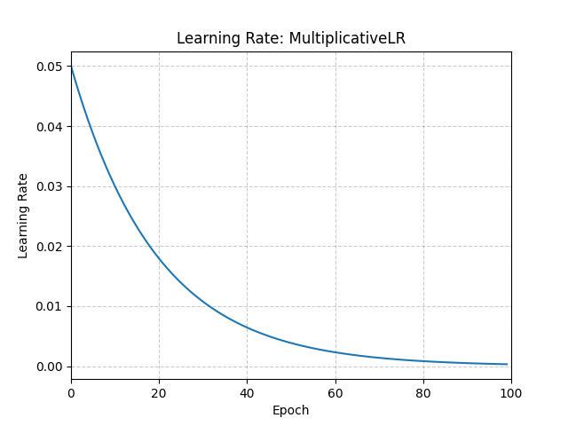

# MultiplicativeLR

*class*torch.optim.lr_scheduler.MultiplicativeLR(*optimizer*, *lr_lambda*, *last_epoch=-1*)[[source]](https://github.com/pytorch/pytorch/blob/7a37a01092627acd59ddfcb9cefe5a578f5f6996/torch/optim/lr_scheduler.py#L469)

Multiply the learning rate of each parameter group by the factor given in the specified function.

When last_epoch=-1, set initial lr as lr.

Parameters:

- **optimizer** ([*Optimizer*](../optim.html#torch.optim.Optimizer)) - Wrapped optimizer.
- **lr_lambda** (*function**or*[*list*](https://docs.python.org/3/library/stdtypes.html#list)) - A function which computes a multiplicative
factor given an integer parameter epoch, or a list of such
functions, one for each group in optimizer.param_groups.
- **last_epoch** ([*int*](https://docs.python.org/3/library/functions.html#int)) - The index of last epoch. Default: -1.

Example

```
>>> lmbda = lambda epoch: 0.95
>>> scheduler = MultiplicativeLR(optimizer, lr_lambda=lmbda)
>>> for epoch in range(100):
>>> train(...)
>>> validate(...)
>>> scheduler.step()
```



get_last_lr()[[source]](https://github.com/pytorch/pytorch/blob/7a37a01092627acd59ddfcb9cefe5a578f5f6996/torch/optim/lr_scheduler.py#L201)

Get the most recent learning rates computed by this scheduler.

Returns:

A [`list`](https://docs.python.org/3/library/stdtypes.html#list) of learning rates with entries
for each of the optimizer's
`param_groups`, with the same types as
their `group["lr"]`s.

Return type:

[list](https://docs.python.org/3/library/stdtypes.html#list)[[float](https://docs.python.org/3/library/functions.html#float) | [Tensor](../tensors.html#torch.Tensor)]

Note

The returned [`Tensor`](../tensors.html#torch.Tensor)s are copies, and never alias
the optimizer's `group["lr"]`s.

get_lr()[[source]](https://github.com/pytorch/pytorch/blob/7a37a01092627acd59ddfcb9cefe5a578f5f6996/torch/optim/lr_scheduler.py#L557)

Compute the next learning rate for each of the optimizer's
`param_groups`.

Scales the current `group["lr"]`s in each of the optimizer's
`param_groups` by the outputs of the
`lr_lambdas` at `last_epoch`.

Returns:

A [`list`](https://docs.python.org/3/library/stdtypes.html#list) of learning rates for each of
the optimizer's `param_groups` with the
same types as their current `group["lr"]`s.

Return type:

[list](https://docs.python.org/3/library/stdtypes.html#list)[[float](https://docs.python.org/3/library/functions.html#float) | [Tensor](../tensors.html#torch.Tensor)]

Note

If you're trying to inspect the most recent learning rate, use
`get_last_lr()` instead.

Note

The returned [`Tensor`](../tensors.html#torch.Tensor)s are copies, and never alias
the optimizer's `group["lr"]`s.

load_state_dict(*state_dict*)[[source]](https://github.com/pytorch/pytorch/blob/7a37a01092627acd59ddfcb9cefe5a578f5f6996/torch/optim/lr_scheduler.py#L539)

Load the scheduler's state.

Parameters:

**state_dict** ([*dict*](https://docs.python.org/3/library/stdtypes.html#dict)) - scheduler state. Should be an object returned
from a call to `state_dict()`.

state_dict()[[source]](https://github.com/pytorch/pytorch/blob/7a37a01092627acd59ddfcb9cefe5a578f5f6996/torch/optim/lr_scheduler.py#L517)

Return the state of the scheduler as a [`dict`](https://docs.python.org/3/library/stdtypes.html#dict).

It contains an entry for every variable in `self.__dict__` which
is not the optimizer.
The learning rate lambda functions will only be saved if they are callable objects
and not if they are functions or lambdas.

Return type:

[dict](https://docs.python.org/3/library/stdtypes.html#dict)[[str](https://docs.python.org/3/library/stdtypes.html#str), [*Any*](https://docs.python.org/3/library/typing.html#typing.Any)]

step(*epoch=None*)[[source]](https://github.com/pytorch/pytorch/blob/7a37a01092627acd59ddfcb9cefe5a578f5f6996/torch/optim/lr_scheduler.py#L238)

Step the scheduler.

Parameters:

**epoch** ([*int*](https://docs.python.org/3/library/functions.html#int)*,**optional*) -

Deprecated since version 1.4: If provided, sets `last_epoch` to `epoch` and uses
`_get_closed_form_lr()` if it is available. This is not
universally supported. Use `step()` without arguments
instead.

Note

Call this method after calling the optimizer's
[`step()`](torch.optim.Optimizer.step.html#torch.optim.Optimizer.step).