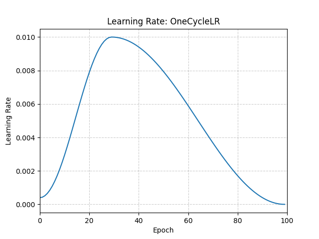

# OneCycleLR

*class*torch.optim.lr_scheduler.OneCycleLR(*optimizer*, *max_lr*, *total_steps=None*, *epochs=None*, *steps_per_epoch=None*, *pct_start=0.3*, *anneal_strategy='cos'*, *cycle_momentum=True*, *base_momentum=0.85*, *max_momentum=0.95*, *div_factor=25.0*, *final_div_factor=10000.0*, *three_phase=False*, *last_epoch=-1*)[[source]](https://github.com/pytorch/pytorch/blob/c9fded8194d3b089ed610b586eb746a6e74c6616/torch/optim/lr_scheduler.py#L2285)

Sets the learning rate of each parameter group according to the 1cycle learning rate policy.

The 1cycle policy anneals the learning rate from an initial learning rate to some maximum
learning rate and then from that maximum learning rate to some minimum learning rate much
lower than the initial learning rate.
This policy was initially described in the paper [Super-Convergence:
Very Fast Training of Neural Networks Using Large Learning Rates](https://arxiv.org/abs/1708.07120).

The 1cycle learning rate policy changes the learning rate after every batch.
step should be called after a batch has been used for training.

This scheduler is not chainable.

Note also that the total number of steps in the cycle can be determined in one
of two ways (listed in order of precedence):

1. A value for total_steps is explicitly provided.
2. A number of epochs (epochs) and a number of steps per epoch
(steps_per_epoch) are provided.
In this case, the number of total steps is inferred by
total_steps = epochs * steps_per_epoch

You must either provide a value for total_steps or provide a value for both
epochs and steps_per_epoch.

The default behaviour of this scheduler follows the fastai implementation of 1cycle, which
claims that "unpublished work has shown even better results by using only two phases". To
mimic the behaviour of the original paper instead, set `three_phase=True`.

Parameters:

- **optimizer** ([*Optimizer*](../optim.html#torch.optim.Optimizer)) - Wrapped optimizer.
- **max_lr** ([*float*](https://docs.python.org/3/library/functions.html#float)*or*[*list*](https://docs.python.org/3/library/stdtypes.html#list)) - Upper learning rate boundaries in the cycle
for each parameter group.
- **total_steps** ([*int*](https://docs.python.org/3/library/functions.html#int)) - The total number of steps in the cycle. Note that
if a value is not provided here, then it must be inferred by providing
a value for epochs and steps_per_epoch.
Default: None
- **epochs** ([*int*](https://docs.python.org/3/library/functions.html#int)) - The number of epochs to train for. This is used along
with steps_per_epoch in order to infer the total number of steps in the cycle
if a value for total_steps is not provided.
Default: None
- **steps_per_epoch** ([*int*](https://docs.python.org/3/library/functions.html#int)) - The number of steps per epoch to train for. This is
used along with epochs in order to infer the total number of steps in the
cycle if a value for total_steps is not provided.
Default: None
- **pct_start** ([*float*](https://docs.python.org/3/library/functions.html#float)) - The percentage of the cycle (in number of steps) spent
increasing the learning rate.
Default: 0.3
- **anneal_strategy** ([*str*](https://docs.python.org/3/library/stdtypes.html#str)) - {'cos', 'linear'}
Specifies the annealing strategy: "cos" for cosine annealing, "linear" for
linear annealing.
Default: 'cos'
- **cycle_momentum** ([*bool*](https://docs.python.org/3/library/functions.html#bool)) - If `True`, momentum is cycled inversely
to learning rate between 'base_momentum' and 'max_momentum'.
Default: True
- **base_momentum** ([*float*](https://docs.python.org/3/library/functions.html#float)*or*[*list*](https://docs.python.org/3/library/stdtypes.html#list)) - Lower momentum boundaries in the cycle
for each parameter group. Note that momentum is cycled inversely
to learning rate; at the peak of a cycle, momentum is
'base_momentum' and learning rate is 'max_lr'.
Default: 0.85
- **max_momentum** ([*float*](https://docs.python.org/3/library/functions.html#float)*or*[*list*](https://docs.python.org/3/library/stdtypes.html#list)) - Upper momentum boundaries in the cycle
for each parameter group. Functionally,
it defines the cycle amplitude (max_momentum - base_momentum).
Note that momentum is cycled inversely
to learning rate; at the start of a cycle, momentum is 'max_momentum'
and learning rate is 'base_lr'
Default: 0.95
- **div_factor** ([*float*](https://docs.python.org/3/library/functions.html#float)) - Determines the initial learning rate via
initial_lr = max_lr/div_factor
Default: 25
- **final_div_factor** ([*float*](https://docs.python.org/3/library/functions.html#float)) - Determines the minimum learning rate via
min_lr = initial_lr/final_div_factor
Default: 1e4
- **three_phase** ([*bool*](https://docs.python.org/3/library/functions.html#bool)) - If `True`, use a third phase of the schedule to annihilate the
learning rate according to 'final_div_factor' instead of modifying the second
phase (the first two phases will be symmetrical about the step indicated by
'pct_start').
- **last_epoch** ([*int*](https://docs.python.org/3/library/functions.html#int)) - The index of the last batch. This parameter is used when
resuming a training job. Since step() should be invoked after each
batch instead of after each epoch, this number represents the total
number of *batches* computed, not the total number of epochs computed.
When last_epoch=-1, the schedule is started from the beginning.
Default: -1

Example

```
>>> data_loader = torch.utils.data.DataLoader(...)
>>> optimizer = torch.optim.SGD(model.parameters(), lr=1e-4, momentum=0.9)
>>> scheduler = torch.optim.lr_scheduler.OneCycleLR(
... optimizer, max_lr=0.01, steps_per_epoch=len(data_loader), epochs=10
... )
>>> for epoch in range(10):
>>> for batch in data_loader:
>>> train_batch(...)
>>> optimizer.step()
>>> scheduler.step()
```



get_last_lr()[[source]](https://github.com/pytorch/pytorch/blob/c9fded8194d3b089ed610b586eb746a6e74c6616/torch/optim/lr_scheduler.py#L201)

Get the most recent learning rates computed by this scheduler.

Returns:

A [`list`](https://docs.python.org/3/library/stdtypes.html#list) of learning rates with entries
for each of the optimizer's
`param_groups`, with the same types as
their `group["lr"]`s.

Return type:

[list](https://docs.python.org/3/library/stdtypes.html#list)[[float](https://docs.python.org/3/library/functions.html#float) | [Tensor](../tensors.html#torch.Tensor)]

Note

The returned [`Tensor`](../tensors.html#torch.Tensor)s are copies, and never alias
the optimizer's `group["lr"]`s.

get_lr()[[source]](https://github.com/pytorch/pytorch/blob/c9fded8194d3b089ed610b586eb746a6e74c6616/torch/optim/lr_scheduler.py#L2545)

Compute the next learning rate for each of the optimizer's
`param_groups`.

Finds the appropriate `_schedule_phases` entry for the current
step and interpolates between its `start_lr` and `end_lr` using
`_anneal_func()`.

Returns:

A [`list`](https://docs.python.org/3/library/stdtypes.html#list) of learning rates for each of
the optimizer's `param_groups` with the
same types as their current `group["lr"]`s.

Return type:

[list](https://docs.python.org/3/library/stdtypes.html#list)[[float](https://docs.python.org/3/library/functions.html#float) | [Tensor](../tensors.html#torch.Tensor)]

Note

If you're trying to inspect the most recent learning rate, use
`get_last_lr()` instead.

Note

The returned [`Tensor`](../tensors.html#torch.Tensor)s are copies, and never alias
the optimizer's `group["lr"]`s.

Note

When `cycle_momentum` is `True`, this method has a side
effect of updating the optimizer's momentum.

load_state_dict(*state_dict*)[[source]](https://github.com/pytorch/pytorch/blob/c9fded8194d3b089ed610b586eb746a6e74c6616/torch/optim/lr_scheduler.py#L192)

Load the scheduler's state.

Parameters:

**state_dict** ([*dict*](https://docs.python.org/3/library/stdtypes.html#dict)) - scheduler state. Should be an object returned
from a call to `state_dict()`.

state_dict()[[source]](https://github.com/pytorch/pytorch/blob/c9fded8194d3b089ed610b586eb746a6e74c6616/torch/optim/lr_scheduler.py#L182)

Return the state of the scheduler as a [`dict`](https://docs.python.org/3/library/stdtypes.html#dict).

It contains an entry for every variable in `self.__dict__` which
is not the optimizer.

Return type:

[dict](https://docs.python.org/3/library/stdtypes.html#dict)[[str](https://docs.python.org/3/library/stdtypes.html#str), [*Any*](https://docs.python.org/3/library/typing.html#typing.Any)]

step(*epoch=None*)[[source]](https://github.com/pytorch/pytorch/blob/c9fded8194d3b089ed610b586eb746a6e74c6616/torch/optim/lr_scheduler.py#L238)

Step the scheduler.

Parameters:

**epoch** ([*int*](https://docs.python.org/3/library/functions.html#int)*,**optional*) -

Deprecated since version 1.4: If provided, sets `last_epoch` to `epoch` and uses
`_get_closed_form_lr()` if it is available. This is not
universally supported. Use `step()` without arguments
instead.

Note

Call this method after calling the optimizer's
[`step()`](torch.optim.Optimizer.step.html#torch.optim.Optimizer.step).