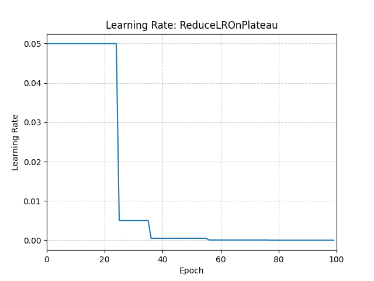

# ReduceLROnPlateau

*class*torch.optim.lr_scheduler.ReduceLROnPlateau(*optimizer*, *mode='min'*, *factor=0.1*, *patience=10*, *threshold=0.0001*, *threshold_mode='rel'*, *cooldown=0*, *min_lr=0*, *eps=1e-08*)[[source]](https://github.com/pytorch/pytorch/blob/3af07571b9d7402fd74352d079e6ff5fa307ec5f/torch/optim/lr_scheduler.py#L1584)

Reduce learning rate when a metric has stopped improving.

Models often benefit from reducing the learning rate by a factor
of 2-10 once learning stagnates. This scheduler reads a metrics
quantity and if no improvement is seen for a 'patience' number
of epochs, the learning rate is reduced.

Parameters:

- **optimizer** ([*Optimizer*](../optim.html#torch.optim.Optimizer)) - Wrapped optimizer.
- **mode** ([*str*](https://docs.python.org/3/library/stdtypes.html#str)) - One of min, max. In min mode, lr will
be reduced when the quantity monitored has stopped
decreasing; in max mode it will be reduced when the
quantity monitored has stopped increasing. Default: 'min'.
- **factor** ([*float*](https://docs.python.org/3/library/functions.html#float)) - Factor by which the learning rate will be
reduced. new_lr = lr * factor. Default: 0.1.
- **patience** ([*int*](https://docs.python.org/3/library/functions.html#int)) - The number of allowed epochs with no improvement after
which the learning rate will be reduced.
For example, consider the case of having no patience (patience = 0).
In the first epoch, a baseline is established and is always considered good as there's no previous baseline.
In the second epoch, if the performance is worse than the baseline,
we have what is considered an intolerable epoch.
Since the count of intolerable epochs (1) is greater than the patience level (0),
the learning rate is reduced at the end of this epoch.
From the third epoch onwards, the learning rate continues to be reduced at the end of each epoch
if the performance is worse than the baseline. If the performance improves or remains the same,
the learning rate is not adjusted.
Default: 10.
- **threshold** ([*float*](https://docs.python.org/3/library/functions.html#float)) - Threshold for measuring the new optimum,
to only focus on significant changes. Default: 1e-4.
- **threshold_mode** ([*str*](https://docs.python.org/3/library/stdtypes.html#str)) -

One of rel, abs.
In rel mode, the dynamic threshold is computed as:

- best * (1 + threshold) if mode == 'max'
- best * (1 - threshold) if mode == 'min'

In abs mode, the dynamic threshold is computed as:

- best + threshold if mode == 'max'
- best - threshold if mode == 'min'

Default: 'rel'.
- **cooldown** ([*int*](https://docs.python.org/3/library/functions.html#int)) - Number of epochs to wait before resuming
normal operation after lr has been reduced. Default: 0.
- **min_lr** ([*float*](https://docs.python.org/3/library/functions.html#float)*or*[*list*](https://docs.python.org/3/library/stdtypes.html#list)) - A scalar or a list of scalars. A
lower bound on the learning rate of all param groups
or each group respectively. Default: 0.
- **eps** ([*float*](https://docs.python.org/3/library/functions.html#float)) - Minimal decay applied to lr. If the difference
between new and old lr is smaller than eps, the update is
ignored. Default: 1e-8.

Example

```
>>> optimizer = torch.optim.SGD(model.parameters(), lr=0.1, momentum=0.9)
>>> scheduler = ReduceLROnPlateau(optimizer, "min")
>>> for epoch in range(10):
>>> train(...)
>>> val_loss = validate(...)
>>> # Note that step should be called after validate()
>>> scheduler.step(val_loss)
```



get_last_lr()[[source]](https://github.com/pytorch/pytorch/blob/3af07571b9d7402fd74352d079e6ff5fa307ec5f/torch/optim/lr_scheduler.py#L201)

Get the most recent learning rates computed by this scheduler.

Returns:

A [`list`](https://docs.python.org/3/library/stdtypes.html#list) of learning rates with entries
for each of the optimizer's
`param_groups`, with the same types as
their `group["lr"]`s.

Return type:

[list](https://docs.python.org/3/library/stdtypes.html#list)[[float](https://docs.python.org/3/library/functions.html#float) | [Tensor](../tensors.html#torch.Tensor)]

Note

The returned [`Tensor`](../tensors.html#torch.Tensor)s are copies, and never alias
the optimizer's `group["lr"]`s.

get_lr()[[source]](https://github.com/pytorch/pytorch/blob/3af07571b9d7402fd74352d079e6ff5fa307ec5f/torch/optim/lr_scheduler.py#L219)

Compute the next learning rate for each of the optimizer's
`param_groups`.

Returns:

A [`list`](https://docs.python.org/3/library/stdtypes.html#list) of learning rates for each of
the optimizer's `param_groups` with the
same types as their current `group["lr"]`s.

Return type:

[list](https://docs.python.org/3/library/stdtypes.html#list)[[float](https://docs.python.org/3/library/functions.html#float) | [Tensor](../tensors.html#torch.Tensor)]

Note

If you're trying to inspect the most recent learning rate, use
`get_last_lr()` instead.

Note

The returned [`Tensor`](../tensors.html#torch.Tensor)s are copies, and never alias
the optimizer's `group["lr"]`s.

load_state_dict(*state_dict*)[[source]](https://github.com/pytorch/pytorch/blob/3af07571b9d7402fd74352d079e6ff5fa307ec5f/torch/optim/lr_scheduler.py#L1779)

Load the scheduler's state.

state_dict()[[source]](https://github.com/pytorch/pytorch/blob/3af07571b9d7402fd74352d079e6ff5fa307ec5f/torch/optim/lr_scheduler.py#L182)

Return the state of the scheduler as a [`dict`](https://docs.python.org/3/library/stdtypes.html#dict).

It contains an entry for every variable in `self.__dict__` which
is not the optimizer.

Return type:

[dict](https://docs.python.org/3/library/stdtypes.html#dict)[[str](https://docs.python.org/3/library/stdtypes.html#str), [*Any*](https://docs.python.org/3/library/typing.html#typing.Any)]

step(*metrics*, *epoch=None*)[[source]](https://github.com/pytorch/pytorch/blob/3af07571b9d7402fd74352d079e6ff5fa307ec5f/torch/optim/lr_scheduler.py#L1696)

Perform a step.