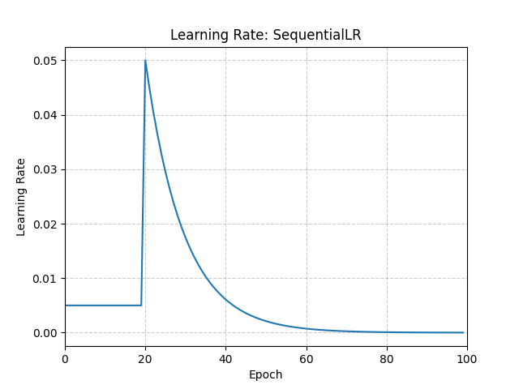

# SequentialLR

*class*torch.optim.lr_scheduler.SequentialLR(*optimizer*, *schedulers*, *milestones*, *last_epoch=-1*)[[source]](https://github.com/pytorch/pytorch/blob/c15e9774278597951aa402693c1bbcb6c8c7b9e8/torch/optim/lr_scheduler.py#L1082)

Contains a list of schedulers expected to be called sequentially during the optimization process.

Specifically, the schedulers will be called according to the milestone points, which should provide exact
intervals by which each scheduler should be called at a given epoch.

Parameters:

- **optimizer** ([*Optimizer*](../optim.html#torch.optim.Optimizer)) - Wrapped optimizer.
- **schedulers** ([*list*](https://docs.python.org/3/library/stdtypes.html#list)) - List of chained schedulers.
- **milestones** ([*list*](https://docs.python.org/3/library/stdtypes.html#list)) - List of integers that reflects milestone points.
- **last_epoch** ([*int*](https://docs.python.org/3/library/functions.html#int)) - The index of last epoch. Default: -1.

Example

```
>>> # Assuming optimizer uses lr = 0.05 for all groups
>>> # lr = 0.005 if epoch == 0
>>> # lr = 0.005 if epoch == 1
>>> # lr = 0.005 if epoch == 2
>>> # ...
>>> # lr = 0.05 if epoch == 20
>>> # lr = 0.045 if epoch == 21
>>> # lr = 0.0405 if epoch == 22
>>> scheduler1 = ConstantLR(optimizer, factor=0.1, total_iters=20)
>>> scheduler2 = ExponentialLR(optimizer, gamma=0.9)
>>> scheduler = SequentialLR(
... optimizer,
... schedulers=[scheduler1, scheduler2],
... milestones=[20],
... )
>>> for epoch in range(100):
>>> train(...)
>>> validate(...)
>>> scheduler.step()
```



get_last_lr()[[source]](https://github.com/pytorch/pytorch/blob/c15e9774278597951aa402693c1bbcb6c8c7b9e8/torch/optim/lr_scheduler.py#L201)

Get the most recent learning rates computed by this scheduler.

Returns:

A [`list`](https://docs.python.org/3/library/stdtypes.html#list) of learning rates with entries
for each of the optimizer's
`param_groups`, with the same types as
their `group["lr"]`s.

Return type:

[list](https://docs.python.org/3/library/stdtypes.html#list)[[float](https://docs.python.org/3/library/functions.html#float) | [Tensor](../tensors.html#torch.Tensor)]

Note

The returned [`Tensor`](../tensors.html#torch.Tensor)s are copies, and never alias
the optimizer's `group["lr"]`s.

get_lr()[[source]](https://github.com/pytorch/pytorch/blob/c15e9774278597951aa402693c1bbcb6c8c7b9e8/torch/optim/lr_scheduler.py#L219)

Compute the next learning rate for each of the optimizer's
`param_groups`.

Returns:

A [`list`](https://docs.python.org/3/library/stdtypes.html#list) of learning rates for each of
the optimizer's `param_groups` with the
same types as their current `group["lr"]`s.

Return type:

[list](https://docs.python.org/3/library/stdtypes.html#list)[[float](https://docs.python.org/3/library/functions.html#float) | [Tensor](../tensors.html#torch.Tensor)]

Note

If you're trying to inspect the most recent learning rate, use
`get_last_lr()` instead.

Note

The returned [`Tensor`](../tensors.html#torch.Tensor)s are copies, and never alias
the optimizer's `group["lr"]`s.

load_state_dict(*state_dict*)[[source]](https://github.com/pytorch/pytorch/blob/c15e9774278597951aa402693c1bbcb6c8c7b9e8/torch/optim/lr_scheduler.py#L1218)

Load the scheduler's state.

Parameters:

**state_dict** ([*dict*](https://docs.python.org/3/library/stdtypes.html#dict)) - scheduler state. Should be an object returned
from a call to `state_dict()`.

recursive_undo(*sched=None*)[[source]](https://github.com/pytorch/pytorch/blob/c15e9774278597951aa402693c1bbcb6c8c7b9e8/torch/optim/lr_scheduler.py#L1172)

Recursively undo any step performed by the initialisation of
schedulers.

state_dict()[[source]](https://github.com/pytorch/pytorch/blob/c15e9774278597951aa402693c1bbcb6c8c7b9e8/torch/optim/lr_scheduler.py#L1197)

Return the state of the scheduler as a [`dict`](https://docs.python.org/3/library/stdtypes.html#dict).

It contains an entry for every variable in `self.__dict__` which
is not the optimizer.
The wrapped scheduler states will also be saved.

Return type:

[dict](https://docs.python.org/3/library/stdtypes.html#dict)[[str](https://docs.python.org/3/library/stdtypes.html#str), [*Any*](https://docs.python.org/3/library/typing.html#typing.Any)]

step()[[source]](https://github.com/pytorch/pytorch/blob/c15e9774278597951aa402693c1bbcb6c8c7b9e8/torch/optim/lr_scheduler.py#L1185)

Perform a step.