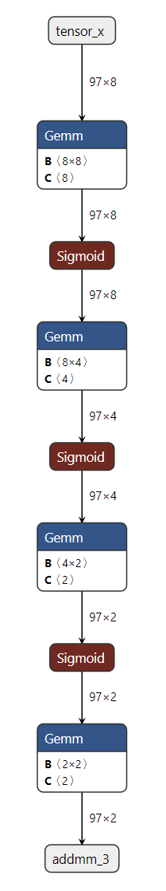

# torch.export-based ONNX Exporter

## Overview

[torch.export](user_guide/torch_compiler/export.html#torch-export) engine is leveraged to produce a traced graph representing only the Tensor computation of the function in an
Ahead-of-Time (AOT) fashion. The resulting traced graph (1) produces normalized operators in the functional
ATen operator set (as well as any user-specified custom operators), (2) has eliminated all Python control
flow and data structures (with certain exceptions), and (3) records the set of shape constraints needed to
show that this normalization and control-flow elimination is sound for future inputs, before it is finally
translated into an ONNX graph.

In addition, during the export process, memory usage is significantly reduced.

## Dependencies

The ONNX exporter depends on extra Python packages:

- [ONNX](https://onnx.ai)
- [ONNX Script](https://microsoft.github.io/onnxscript)

They can be installed through [pip](https://pypi.org/project/pip/):

```
pip install --upgrade onnx onnxscript
```

[onnxruntime](https://onnxruntime.ai) can then be used to execute the model
on a large variety of processors.

## A simple example

See below a demonstration of exporter API in action with a simple Multilayer Perceptron (MLP) as example:

```
import torch
import torch.nn as nn

class MLPModel(nn.Module):
 def __init__(self):
 super().__init__()
 self.fc0 = nn.Linear(8, 8, bias=True)
 self.fc1 = nn.Linear(8, 4, bias=True)
 self.fc2 = nn.Linear(4, 2, bias=True)
 self.fc3 = nn.Linear(2, 2, bias=True)
 self.fc_combined = nn.Linear(8 + 8 + 8, 8, bias=True) # Combine all inputs

 def forward(self, tensor_x: torch.Tensor, input_dict: dict, input_list: list):
 """
 Forward method that requires all inputs:
 - tensor_x: A direct tensor input.
 - input_dict: A dictionary containing the tensor under the key 'tensor_x'.
 - input_list: A list where the first element is the tensor.
 """
 # Extract tensors from inputs
 dict_tensor = input_dict['tensor_x']
 list_tensor = input_list[0]

 # Combine all inputs into a single tensor
 combined_tensor = torch.cat([tensor_x, dict_tensor, list_tensor], dim=1)

 # Process the combined tensor through the layers
 combined_tensor = self.fc_combined(combined_tensor)
 combined_tensor = torch.sigmoid(combined_tensor)
 combined_tensor = self.fc0(combined_tensor)
 combined_tensor = torch.sigmoid(combined_tensor)
 combined_tensor = self.fc1(combined_tensor)
 combined_tensor = torch.sigmoid(combined_tensor)
 combined_tensor = self.fc2(combined_tensor)
 combined_tensor = torch.sigmoid(combined_tensor)
 output = self.fc3(combined_tensor)
 return output

model = MLPModel()

# Example inputs
tensor_input = torch.rand((97, 8), dtype=torch.float32)
dict_input = {'tensor_x': torch.rand((97, 8), dtype=torch.float32)}
list_input = [torch.rand((97, 8), dtype=torch.float32)]

# The input_names and output_names are used to identify the inputs and outputs of the ONNX model
input_names = ['tensor_input', 'tensor_x', 'list_input_index_0']
output_names = ['output']

# Exporting the model with all required inputs
onnx_program = torch.onnx.export(model,(tensor_input, dict_input, list_input), dynamic_shapes=({0: "batch_size"},{"tensor_x": {0: "batch_size"}},[{0: "batch_size"}]), input_names=input_names, output_names=output_names, dynamo=True,)

# Check the exported ONNX model is dynamic
assert onnx_program.model.graph.inputs[0].shape == ("batch_size", 8)
assert onnx_program.model.graph.inputs[1].shape == ("batch_size", 8)
assert onnx_program.model.graph.inputs[2].shape == ("batch_size", 8)
```

As the code above shows, all you need is to provide `torch.onnx.export()` with an instance of the model and its input.
The exporter will then return an instance of `torch.onnx.ONNXProgram` that contains the exported ONNX graph along with extra information.

The in-memory model available through `onnx_program.model_proto` is an `onnx.ModelProto` object in compliance with the [ONNX IR spec](https://github.com/onnx/onnx/blob/main/docs/IR.md).
The ONNX model may then be serialized into a [Protobuf file](https://protobuf.dev/) using the `torch.onnx.ONNXProgram.save()` API.

```
onnx_program.save("mlp.onnx")
```

## Inspecting the ONNX model using GUI

You can view the exported model using [Netron](https://netron.app/).

[](_images/onnx_dynamo_mlp_model.png)

## When the conversion fails

Function `torch.onnx.export()` should be called a second time with
parameter `report=True`. A markdown report is generated to help the user
to resolve the issue.

## Metadata

During ONNX export, each ONNX node is annotated with metadata that helps trace its origin and context from the original PyTorch model. This metadata is useful for debugging, model inspection, and understanding the mapping between PyTorch and ONNX graphs.

The following metadata fields are added to each ONNX node:

- **namespace**

A string representing the hierarchical namespace of the node, consisting of a stack trace of modules/methods.

*Example:*
`__main__.SimpleAddModel/add: aten.add.Tensor`
- **pkg.torch.onnx.class_hierarchy**

A list of class names representing the hierarchy of modules leading to this node.

*Example:*
`['__main__.SimpleAddModel', 'aten.add.Tensor']`
- **pkg.torch.onnx.fx_node**

The string representation of the original FX node, including its name, number of consumers, the targeted torch op, arguments, and keyword arguments.

*Example:*
`%cat : [num_users=1] = call_function[target=torch.ops.aten.cat.default](args = ([%tensor_x, %input_dict_tensor_x, %input_list_0], 1), kwargs = {})`
- **pkg.torch.onnx.name_scopes**

A list of name scopes (methods) representing the path to this node in the PyTorch model.

*Example:*
`['', 'add']`
- **pkg.torch.onnx.stack_trace**

The stack trace from the original code where this node was created, if available.

*Example:*

```
File "simpleadd.py", line 7, in forward
 return torch.add(x, y)
```

These metadata fields are stored in the metadata_props attribute of each ONNX node and can be inspected using Netron or programmatically.

The overall ONNX graph has the following `metadata_props`:

- **pkg.torch.export.ExportedProgram.graph_signature**

This property contains a string representation of the graph_signature from the original PyTorch ExportedProgram. The graph signature describes the structure of the model's inputs and outputs and how they map to the ONNX graph. The inputs are defined as `InputSpec` objects, which include the kind of input (e.g., `InputKind.PARAMETER` for parameters, `InputKind.USER_INPUT` for user-defined inputs), the argument name, the target (which can be a specific node in the model), and whether the input is persistent. The outputs are defined as `OutputSpec` objects, which specify the kind of output (e.g., `OutputKind.USER_OUTPUT`) and the argument name.

To read more about the graph signature, please see the [torch.export](user_guide/torch_compiler/export.html) for more information.
- **pkg.torch.export.ExportedProgram.range_constraints**

This property contains a string representation of any range constraints that were present in the original PyTorch ExportedProgram. Range constraints specify valid ranges for symbolic shapes or values in the model, which can be important for models that use dynamic shapes or symbolic dimensions.

*Example:*
`s0: VR[2, int_oo]`, which indicates that the size of the input tensor must be at least 2.

To read more about range constraints, please see the [torch.export](user_guide/torch_compiler/export.html) for more information.

Each input value in the ONNX graph may have the following metadata property:

- **pkg.torch.export.graph_signature.InputSpec.kind**

The kind of input, as defined by PyTorch's InputKind enum.

*Example values:*

- "USER_INPUT": A user-provided input to the model.
- "PARAMETER": A model parameter (e.g., weight).
- "BUFFER": A model buffer (e.g., running mean in BatchNorm).
- "CONSTANT_TENSOR": A constant tensor argument.
- "CUSTOM_OBJ": A custom object input.
- "TOKEN": A token input.
- **pkg.torch.export.graph_signature.InputSpec.persistent**

Indicates whether the input is persistent (i.e., should be saved as part of the model's state).

*Example values:*

- "True"
- "False"

Each output value in the ONNX graph may have the following metadata property:

- **pkg.torch.export.graph_signature.OutputSpec.kind**

The kind of input, as defined by PyTorch's OutputKind enum.

*Example values:*

- "USER_OUTPUT": A user-visible output.
- "LOSS_OUTPUT": A loss value output.
- "BUFFER_MUTATION": Indicates a buffer was mutated.
- "GRADIENT_TO_PARAMETER": Gradient output for a parameter.
- "GRADIENT_TO_USER_INPUT": Gradient output for a user input.
- "USER_INPUT_MUTATION": Indicates a user input was mutated.
- "TOKEN": A token output.

Each initialized value, input, output has the following metadata:

- **pkg.torch.onnx.original_node_name**

The original name of the node in the PyTorch FX graph that produced this value in the case where the value was renamed. This helps trace initializers back to their source in the original model.

*Example:*
`fc1.weight`

## API Reference

torch.onnx.export(*model*, *args=()*, *f=None*, ***, *kwargs=None*, *verbose=None*, *input_names=None*, *output_names=None*, *opset_version=None*, *dynamo=True*, *external_data=True*, *dynamic_shapes=None*, *custom_translation_table=None*, *report=False*, *optimize=True*, *verify=False*, *profile=False*, *dump_exported_program=False*, *artifacts_dir='.'*, *export_params=True*, *keep_initializers_as_inputs=False*, *dynamic_axes=None*, *training=<TrainingMode.EVAL: 0>*, *operator_export_type=<OperatorExportTypes.ONNX: 0>*, *do_constant_folding=True*, *custom_opsets=None*, *export_modules_as_functions=False*, *autograd_inlining=True*)[[source]](https://github.com/pytorch/pytorch/blob/c8f2d26abd0de59995af555e80c82ca1221bc21b/torch/onnx/__init__.py#L65)

Exports a model into ONNX format.

Setting `dynamo=True` enables the new ONNX export logic
which is based on [`torch.export.ExportedProgram`](user_guide/torch_compiler/export/api_reference.html#torch.export.ExportedProgram) and a more modern
set of translation logic. This is the recommended and default way to export models
to ONNX.

When `dynamo=True`:

The exporter tries the following strategies to get an ExportedProgram for conversion to ONNX.

1. If the model is already an ExportedProgram, it will be used as-is.
2. Use [`torch.export.export()`](user_guide/torch_compiler/export/api_reference.html#torch.export.export) and set `strict=False`.
3. Use [`torch.export.export()`](user_guide/torch_compiler/export/api_reference.html#torch.export.export) and set `strict=True`.

Parameters:

- **model** ([*torch.nn.Module*](generated/torch.nn.Module.html#torch.nn.Module)*|*[*torch.export.ExportedProgram*](user_guide/torch_compiler/export/api_reference.html#torch.export.ExportedProgram)*|**torch.jit.ScriptModule**|**torch.jit.ScriptFunction*) - The model to be exported.
- **args** ([*tuple*](https://docs.python.org/3/library/stdtypes.html#tuple)*[**Any**,**...**]*) - Example positional inputs. Any non-Tensor arguments will be hard-coded into the
exported model; any Tensor arguments will become inputs of the exported model,
in the order they occur in the tuple.
- **f** ([*str*](https://docs.python.org/3/library/stdtypes.html#str)*|*[*os.PathLike*](https://docs.python.org/3/library/os.html#os.PathLike)*|**None*) - Path to the output ONNX model file. E.g. "model.onnx". This argument is kept for
backward compatibility. It is recommended to leave unspecified (None)
and use the returned `torch.onnx.ONNXProgram` to serialize the model
to a file instead.
- **kwargs** ([*dict*](https://docs.python.org/3/library/stdtypes.html#dict)*[*[*str*](https://docs.python.org/3/library/stdtypes.html#str)*,**Any**]**|**None*) - Optional example keyword inputs.
- **verbose** ([*bool*](https://docs.python.org/3/library/functions.html#bool)*|**None*) - Whether to enable verbose logging.
- **input_names** (*Sequence**[*[*str*](https://docs.python.org/3/library/stdtypes.html#str)*]**|**None*) - names to assign to the input nodes of the graph, in order.
- **output_names** (*Sequence**[*[*str*](https://docs.python.org/3/library/stdtypes.html#str)*]**|**None*) - names to assign to the output nodes of the graph, in order.
- **opset_version** ([*int*](https://docs.python.org/3/library/functions.html#int)*|**None*) - The version of the
[default (ai.onnx) opset](https://github.com/onnx/onnx/blob/master/docs/Operators.md)
to target. You should set `opset_version` according to the supported opset versions
of the runtime backend or compiler you want to run the exported model with.
Leave as default (`None`) to use the recommended version, or refer to
the ONNX operators documentation for more information.
- **dynamo** ([*bool*](https://docs.python.org/3/library/functions.html#bool)) - Whether to export the model with `torch.export` ExportedProgram instead of TorchScript.
- **external_data** ([*bool*](https://docs.python.org/3/library/functions.html#bool)) - Whether to save the model weights as an external data file.
This is required for models with large weights that exceed the ONNX file size limit (2GB).
When False, the weights are saved in the ONNX file with the model architecture.
- **dynamic_shapes** ([*dict*](https://docs.python.org/3/library/stdtypes.html#dict)*[*[*str*](https://docs.python.org/3/library/stdtypes.html#str)*,**Any**]**|*[*tuple*](https://docs.python.org/3/library/stdtypes.html#tuple)*[**Any**,**...**]**|*[*list*](https://docs.python.org/3/library/stdtypes.html#list)*[**Any**]**|**None*) - A dictionary or a tuple of dynamic shapes for the model inputs. Refer to
[`torch.export.export()`](user_guide/torch_compiler/export/api_reference.html#torch.export.export) for more details. This is only used (and preferred) when dynamo is True.
Note that dynamic_shapes is designed to be used when the model is exported with dynamo=True, while
dynamic_axes is used when dynamo=False.
- **custom_translation_table** ([*dict*](https://docs.python.org/3/library/stdtypes.html#dict)*[**Callable**,**Callable**]**|**None*) - A dictionary of custom decompositions for operators in the model.
The dictionary should have the callable target in the fx Node as the key (e.g. `torch.ops.aten.stft.default`),
and the value should be a function that builds that graph using ONNX Script. This option
is only valid when dynamo is True.
- **report** ([*bool*](https://docs.python.org/3/library/functions.html#bool)) - Whether to generate a markdown report for the export process. This option
is only valid when dynamo is True.
- **optimize** ([*bool*](https://docs.python.org/3/library/functions.html#bool)) - Whether to optimize the exported model. This option
is only valid when dynamo is True. Default is True.
- **verify** ([*bool*](https://docs.python.org/3/library/functions.html#bool)) - Whether to verify the exported model using ONNX Runtime. This option
is only valid when dynamo is True.
- **profile** ([*bool*](https://docs.python.org/3/library/functions.html#bool)) - Whether to profile the export process. This option
is only valid when dynamo is True.
- **dump_exported_program** ([*bool*](https://docs.python.org/3/library/functions.html#bool)) - Whether to dump the [`torch.export.ExportedProgram`](user_guide/torch_compiler/export/api_reference.html#torch.export.ExportedProgram) to a file.
This is useful for debugging the exporter. This option is only valid when dynamo is True.
- **artifacts_dir** ([*str*](https://docs.python.org/3/library/stdtypes.html#str)*|*[*os.PathLike*](https://docs.python.org/3/library/os.html#os.PathLike)) - The directory to save the debugging artifacts like the report and the serialized
exported program. This option is only valid when dynamo is True.
- **export_params** ([*bool*](https://docs.python.org/3/library/functions.html#bool)) -

**When ``f`` is specified**: If false, parameters (weights) will not be exported.

You can also leave it unspecified and use the returned `torch.onnx.ONNXProgram`
to control how initializers are treated when serializing the model.
- **keep_initializers_as_inputs** ([*bool*](https://docs.python.org/3/library/functions.html#bool)) -

**When ``f`` is specified**: If True, all the
initializers (typically corresponding to model weights) in the
exported graph will also be added as inputs to the graph. If False,
then initializers are not added as inputs to the graph, and only
the user inputs are added as inputs.

Set this to True if you intend to supply model weights at runtime.
Set it to False if the weights are static to allow for better optimizations
(e.g. constant folding) by backends/runtimes.

You can also leave it unspecified and use the returned `torch.onnx.ONNXProgram`
to control how initializers are treated when serializing the model.
- **dynamic_axes** (*Mapping**[*[*str*](https://docs.python.org/3/library/stdtypes.html#str)*,**Mapping**[*[*int*](https://docs.python.org/3/library/functions.html#int)*,*[*str*](https://docs.python.org/3/library/stdtypes.html#str)*]**]**|**Mapping**[*[*str*](https://docs.python.org/3/library/stdtypes.html#str)*,**Sequence**[*[*int*](https://docs.python.org/3/library/functions.html#int)*]**]**|**None*) -

Deprecated: Prefer specifying `dynamic_shapes` when `dynamo=True`.

By default the exported model will have the shapes of all input and output tensors
set to exactly match those given in `args`. To specify axes of tensors as
dynamic (i.e. known only at run-time), set `dynamic_axes` to a dict with schema:

- KEY (str): an input or output name. Each name must also be provided in `input_names` or

`output_names`.
- VALUE (dict or list): If a dict, keys are axis indices and values are axis names. If a

list, each element is an axis index.

For example:

```
class SumModule(torch.nn.Module):
 def forward(self, x):
 return torch.sum(x, dim=1)

torch.onnx.export(
 SumModule(),
 (torch.ones(2, 2),),
 "onnx.pb",
 input_names=["x"],
 output_names=["sum"],
)
```

Produces:

```
input {
 name: "x"
 ...
 shape {
 dim {
 dim_value: 2 # axis 0
 }
 dim {
 dim_value: 2 # axis 1
...
output {
 name: "sum"
 ...
 shape {
 dim {
 dim_value: 2 # axis 0
...
```

While:

```
torch.onnx.export(
 SumModule(),
 (torch.ones(2, 2),),
 "onnx.pb",
 input_names=["x"],
 output_names=["sum"],
 dynamic_axes={
 # dict value: manually named axes
 "x": {0: "my_custom_axis_name"},
 # list value: automatic names
 "sum": [0],
 },
)
```

Produces:

```
input {
 name: "x"
 ...
 shape {
 dim {
 dim_param: "my_custom_axis_name" # axis 0
 }
 dim {
 dim_value: 2 # axis 1
...
output {
 name: "sum"
 ...
 shape {
 dim {
 dim_param: "sum_dynamic_axes_1" # axis 0
...
```
- **training** (*_C_onnx.TrainingMode*) - Deprecated option. Instead, set the training mode of the model before exporting.
- **operator_export_type** (*_C_onnx.OperatorExportTypes*) - Deprecated option. Only ONNX is supported.
- **do_constant_folding** ([*bool*](https://docs.python.org/3/library/functions.html#bool)) - Deprecated option.
- **custom_opsets** (*Mapping**[*[*str*](https://docs.python.org/3/library/stdtypes.html#str)*,*[*int*](https://docs.python.org/3/library/functions.html#int)*]**|**None*) - Deprecated option.
- **export_modules_as_functions** ([*bool*](https://docs.python.org/3/library/functions.html#bool)*|**Collection**[*[*type*](https://docs.python.org/3/library/functions.html#type)*[*[*torch.nn.Module*](generated/torch.nn.Module.html#torch.nn.Module)*]**]*) - Deprecated option.
- **autograd_inlining** ([*bool*](https://docs.python.org/3/library/functions.html#bool)) - Deprecated option.

Returns:

`torch.onnx.ONNXProgram` if dynamo is True, otherwise None.

Return type:

ONNXProgram | None

Changed in version 2.6: `training` is now deprecated. Instead, set the training mode of the model before exporting.
`operator_export_type` is now deprecated. Only ONNX is supported.
`do_constant_folding` is now deprecated. It is always enabled.
`export_modules_as_functions` is now deprecated.
`autograd_inlining` is now deprecated.

Changed in version 2.7: `optimize` is now True by default.

Changed in version 2.9: `dynamo` is now True by default.

Changed in version 2.11: `fallback` option has been removed.

*class*torch.onnx.ONNXProgram(*model*, *exported_program*)

A class to represent an ONNX program that is callable with torch tensors.

Variables:

- **model** - The ONNX model as an ONNX IR model object.
- **exported_program** - The exported program that produced the ONNX model.

apply_weights(*state_dict*)[[source]](https://github.com/pytorch/pytorch/blob/c8f2d26abd0de59995af555e80c82ca1221bc21b/torch/onnx/_internal/exporter/_onnx_program.py#L391)

Apply the weights from the specified state dict to the ONNX model.

Use this method to replace FakeTensors or other weights.

Parameters:

**state_dict** ([*dict*](https://docs.python.org/3/library/stdtypes.html#dict)*[*[*str*](https://docs.python.org/3/library/stdtypes.html#str)*,*[*Tensor*](tensors.html#torch.Tensor)*]*) - The state dict containing the weights to apply to the ONNX model.

call_reference(**args*, ***kwargs*)[[source]](https://github.com/pytorch/pytorch/blob/c8f2d26abd0de59995af555e80c82ca1221bc21b/torch/onnx/_internal/exporter/_onnx_program.py#L263)

Run the ONNX model using the reference backend.

Return type:

[*Sequence*](https://docs.python.org/3/library/collections.abc.html#collections.abc.Sequence)[[*Tensor*](tensors.html#torch.Tensor)]

compute_values(*value_names*, *args=()*, *kwargs=None*)[[source]](https://github.com/pytorch/pytorch/blob/c8f2d26abd0de59995af555e80c82ca1221bc21b/torch/onnx/_internal/exporter/_onnx_program.py#L279)

Compute the values of the specified names in the ONNX model.

This method is used to compute the values of the specified names in the ONNX model.
The values are returned as a dictionary mapping names to tensors.

Parameters:

**value_names** ([*Sequence*](https://docs.python.org/3/library/collections.abc.html#collections.abc.Sequence)*[*[*str*](https://docs.python.org/3/library/stdtypes.html#str)*]*) - The names of the values to compute.

Returns:

A dictionary mapping names to tensors.

Return type:

[*Sequence*](https://docs.python.org/3/library/collections.abc.html#collections.abc.Sequence)[[*Tensor*](tensors.html#torch.Tensor)]

initialize_inference_session(*initializer=<function _ort_session_initializer>*)[[source]](https://github.com/pytorch/pytorch/blob/c8f2d26abd0de59995af555e80c82ca1221bc21b/torch/onnx/_internal/exporter/_onnx_program.py#L413)

Initialize the ONNX Runtime inference session.

Parameters:

**initializer** (*Callable**[**[*[*str*](https://docs.python.org/3/library/stdtypes.html#str)*|*[*bytes*](https://docs.python.org/3/library/stdtypes.html#bytes)*]**,**ort.InferenceSession**]*) - The function to initialize the ONNX Runtime inference
session with the specified model. By default, it uses the
`_ort_session_initializer()` function.

*property*model_proto*: ModelProto*

Return the ONNX `ModelProto` object.

optimize()[[source]](https://github.com/pytorch/pytorch/blob/c8f2d26abd0de59995af555e80c82ca1221bc21b/torch/onnx/_internal/exporter/_onnx_program.py#L316)

Optimize the ONNX model.

This method optimizes the ONNX model by performing constant folding and
eliminating redundancies in the graph. The optimization is done in-place.

release()[[source]](https://github.com/pytorch/pytorch/blob/c8f2d26abd0de59995af555e80c82ca1221bc21b/torch/onnx/_internal/exporter/_onnx_program.py#L443)

Release the inference session.

You may call this method to release the resources used by the inference session.

rename_axes(*rename_mapping*)[[source]](https://github.com/pytorch/pytorch/blob/c8f2d26abd0de59995af555e80c82ca1221bc21b/torch/onnx/_internal/exporter/_onnx_program.py#L456)

Rename axes in a model according to the specified rename mapping.

Example:

```
batch = onnx_program.model.graph.inputs[0].shape[0]
seq_len = onnx_program.model.graph.inputs[0].shape[2]
rename_mapping = {
 batch: "batch",
 seq_len: "seq_len",
}
onnx_program.rename_axes(rename_mapping)
```

Parameters:

**rename_mapping** ([*dict*](https://docs.python.org/3/library/stdtypes.html#dict)*[*[*str*](https://docs.python.org/3/library/stdtypes.html#str)*|**SymbolicDim**,*[*str*](https://docs.python.org/3/library/stdtypes.html#str)*]*) -

A dictionary mapping old axes to new axis names.
Keys can be either:

- String axis names (e.g., "s1", "s2")
- SymbolicDim objects obtained from the model
(e.g., onnx_program.model.graph.inputs[0].shape[0])

Values must be strings representing the new axis names.

save(*destination*, ***, *include_initializers=True*, *keep_initializers_as_inputs=False*, *external_data=None*)[[source]](https://github.com/pytorch/pytorch/blob/c8f2d26abd0de59995af555e80c82ca1221bc21b/torch/onnx/_internal/exporter/_onnx_program.py#L324)

Save the ONNX model to the specified destination.

When `external_data` is `True` or the model is larger than 2GB,
the weights are saved as external data in a separate file.

Initializer (model weights) serialization behaviors:

- `include_initializers=True`, `keep_initializers_as_inputs=False` (default):
The initializers are included in the saved model.
- `include_initializers=True`, `keep_initializers_as_inputs=True`:
The initializers are included in the saved model and kept as model inputs.
Choose this option if you want the ability to override the model weights
during inference.
- `include_initializers=False`, `keep_initializers_as_inputs=False`:
The initializers are not included in the saved model and are not listed
as model inputs. Choose this option if you want to attach the initializers
to the ONNX model in a separate, post-processing, step.
- `include_initializers=False`, `keep_initializers_as_inputs=True`:
The initializers are not included in the saved model but are listed as model
inputs. Choose this option if you want to supply the initializers during
inference and want to minimize the size of the saved model.

Parameters:

- **destination** ([*str*](https://docs.python.org/3/library/stdtypes.html#str)*|*[*PathLike*](https://docs.python.org/3/library/os.html#os.PathLike)) - The path to save the ONNX model to.
- **include_initializers** ([*bool*](https://docs.python.org/3/library/functions.html#bool)) - Whether to include the initializers in the saved model.
- **keep_initializers_as_inputs** ([*bool*](https://docs.python.org/3/library/functions.html#bool)) - Whether to keep the initializers as inputs in the saved model.
If True, the initializers are added as inputs to the model which means they can be overwritten.
by providing the initializers as model inputs.
- **external_data** ([*bool*](https://docs.python.org/3/library/functions.html#bool)*|**None*) - Whether to save the weights as external data in a separate file.

Raises:

[**TypeError**](https://docs.python.org/3/library/exceptions.html#TypeError) - If `external_data` is `True` and `destination` is not a file path.

*class*torch.onnx.ExportableModule(**args*, ***kwargs*)

Abstract interface for ONNX exportable modules.

Inherit from this class and implement the defined abstract methods
to create a module that can be exported to ONNX format.

Example:

```
class Model(torch.nn.Module):
 def forward(self, x):
 return x * 2

class MyExportableModule(torch.onnx.ExportableModule):
 def __init__(self):
 super().__init__()
 self.model = Model()

 def forward(self, x):
 return self.model(x)

 def example_arguments(self):
 return (torch.randn(2, 3, 224, 224),), None

 def input_names(self):
 return ("input",)

 def output_names(self):
 return ("output",)

 def dynamic_shapes(self):
 return ({0: "batch_size"},)

exportable_module = MyExportableModule()
onnx_program = exportable_module.to_onnx()
# The model can also be supplied directly to torch.onnx.export
onnx_program = torch.onnx.export(exportable_module)
```

dynamic_shapes()[[source]](https://github.com/pytorch/pytorch/blob/c8f2d26abd0de59995af555e80c82ca1221bc21b/torch/onnx/_internal/exporter/_exportable_module.py#L85)

Return dynamic shape specifications for the model's inputs.

Override this method to specify which dimensions of the input tensors
should be treated as dynamic during ONNX export. This allows the exported
model to accept inputs with varying sizes along the specified dimensions.

Example:

```
def dynamic_shapes(self):
 # Specify batch dimension as dynamic for input named 'x'
 return {"x": {0: "batch_size"}}

def dynamic_shapes(self):
 # Multiple dynamic dimensions
 return {
 "input": {0: "batch_size", 2: "height", 3: "width"},
 "mask": {0: "batch_size"},
 }
```

Note

The default implementation returns None, indicating all dimensions are static.

Returns:

Dynamic shape specification compatible with `torch.export.export`.
Return None if all input dimensions should be static. The format can be:

- A dictionary mapping input names to dimension specifications
- A tuple/list of dimension specifications corresponding to inputs
- Any format accepted by the `dynamic_shapes` parameter of `torch.export.export`

Return type:

[*Any*](https://docs.python.org/3/library/typing.html#typing.Any)

*abstract*example_arguments()[[source]](https://github.com/pytorch/pytorch/blob/c8f2d26abd0de59995af555e80c82ca1221bc21b/torch/onnx/_internal/exporter/_exportable_module.py#L55)

Return example arguments for the model's forward method.

This method must be implemented by subclasses to provide sample inputs
that can be used for tracing, testing, and ONNX export. The returned
arguments should be representative of the expected input shapes and types
during inference.

Example:

```
def example_arguments(self):
 # For a model expecting a single tensor input
 return (torch.randn(1, 3, 224, 224),), None

def example_arguments(self):
 # For a model with multiple inputs and keyword arguments
 return (torch.randn(1, 3, 224, 224), torch.randn(1, 512)), {
 "temperature": 1.0
 }
```

Returns:

- A tuple of positional arguments to pass to the forward method
- A dictionary of keyword arguments (or None if no kwargs are needed)

Return type:

A tuple containing

input_names()[[source]](https://github.com/pytorch/pytorch/blob/c8f2d26abd0de59995af555e80c82ca1221bc21b/torch/onnx/_internal/exporter/_exportable_module.py#L119)

Return names for the model's input tensors.

Override this method to provide custom names for the input tensors in the
exported ONNX model. These names will be used as identifiers in the ONNX
graph and can be useful for debugging and model inspection.

Example:

```
def input_names(self):
 return ["image", "mask"]

def input_names(self):
 # For a single input
 return ["input_tensor"]
```

Note

The default implementation returns None, which results in auto-generated names.

Returns:

A sequence of strings representing input names, or None to use default names.
The number of names should match the number of positional arguments in the
forward method.

Return type:

Sequence[[str](https://docs.python.org/3/library/stdtypes.html#str)] | None

output_names()[[source]](https://github.com/pytorch/pytorch/blob/c8f2d26abd0de59995af555e80c82ca1221bc21b/torch/onnx/_internal/exporter/_exportable_module.py#L146)

Return names for the model's output tensors.

Override this method to provide custom names for the output tensors in the
exported ONNX model. These names will be used as identifiers in the ONNX
graph and can be useful for debugging and model inspection.

Example:

```
def output_names(self):
 return ["logits", "probabilities"]

def output_names(self):
 # For a single output
 return ["prediction"]
```

Note

The default implementation returns None, which results in auto-generated names.

Returns:

A sequence of strings representing output names, or None to use default names.
The number of names should match the number of outputs from the forward method.
For models returning multiple outputs, provide a name for each output.

Return type:

Sequence[[str](https://docs.python.org/3/library/stdtypes.html#str)] | None

to_onnx(***kwargs*)[[source]](https://github.com/pytorch/pytorch/blob/c8f2d26abd0de59995af555e80c82ca1221bc21b/torch/onnx/_internal/exporter/_exportable_module.py#L173)

Export the module to ONNX format.

This method provides a convenient wrapper around `torch.onnx.export` that
automatically uses the example arguments, dynamic shapes, and input/output
names defined by the module. Additional export options can be specified via
keyword arguments.

See Also: `torch.onnx.export` for complete documentation of export options.

Parameters:

****kwargs** ([*Any*](https://docs.python.org/3/library/typing.html#typing.Any)) -

Additional keyword arguments to pass to `torch.onnx.export`.
Common options include:

- `opset_version` (int): The ONNX opset version to target
- `optimize` (bool): Whether to apply optimizations to the exported model

Returns:

An ONNXProgram object containing the exported model and metadata.

Return type:

*ONNXProgram*

torch.onnx.is_in_onnx_export()[[source]](https://github.com/pytorch/pytorch/blob/c8f2d26abd0de59995af555e80c82ca1221bc21b/torch/onnx/__init__.py#L356)

Returns whether it is in the middle of ONNX export.

Return type:

[bool](https://docs.python.org/3/library/functions.html#bool)

*class*torch.onnx.OnnxExporterError

Errors raised by the ONNX exporter. This is the base class for all exporter errors.

*class*torch.onnx.InputObserver(*value_if_missing=None*)

Steals forward method to collect inputs and outputs.
This information is used to infer dynamic shapes and
export arguments.

Parameters:

**value_if_missing** ([*dict*](https://docs.python.org/3/library/stdtypes.html#dict)*[*[*str*](https://docs.python.org/3/library/stdtypes.html#str)*|*[*int*](https://docs.python.org/3/library/functions.html#int)*,**Any**]**|**None*) - If an argument is missing,
a default value will be taken in this dictionary,
this is used when after the prefill step, an argument
disappears (such as pixel_values) and another one
is added (such as past_key_values).
The values are only to infer dynamic shapes and arguments,
not to run the model.

Examples

```
>>> input_observer = InputObserver()
>>> with input_observer(model):
>>> model(x1, y1)
>>> model(x2, y2)
>>> ep = torch.export.export( # or torch.onnx.export
>>> model,
>>> input_observer.infer_arguments(),
>>> dynamic_shapes.input_observer.infer_dynamic_shapes(),
>>> )
```

With LLM:

```
>>> input_observer = InputObserver()
>>> with input_observer(model):
>>> model.generate(input_ids)
>>> ep = torch.export.export( # or torch.onnx.export
>>> model,
>>> (),
>>> kwargs=input_observer.infer_arguments(),
>>> dynamic_shapes.input_observer.infer_dynamic_shapes(),
>>> )
```

The last example considers an LLM taking images and text as inputs.
The first call to the forward method which we try to export has pixel_values
but no past_key_values. The next calls do not have pixel_values but
past_key_values. The observer understands pixel_values and past_key_values
are needed but they may not be both specified at the same time.
Since pixel_values only appears in the first call, the observer cannot
tell how to infer an empty tensor for this argument. That's what the argument
value_if_missing is for. The following example is more than a dummy example
but shows how to use it with `transformers`.

```
from transformers import pipeline

model_id = "tiny-random/gemma-3"
pipe = pipeline(
 "image-text-to-text",
 model=model_id,
 device="cpu",
 trust_remote_code=True,
 max_new_tokens=3,
 dtype=torch.float16,
)
messages = [
 {
 "role": "system",
 "content": [{"type": "text", "text": "You are a helpful assistant."}],
 },
 {
 "role": "user",
 "content": [
 {
 "type": "image",
 "url": "https://huggingface.co/datasets/huggingface/documentation-images/resolve/main/p-blog/candy.JPG",
 },
 {"type": "text", "text": "What animal is on the candy?"},
 ],
 },
]
observer = InputObserver(
 value_if_missing=dict(
 pixel_values=torch.empty((0, 3, 896, 896), dtype=torch.float16)
 )
)
with observer(pipe.model):
 pipe(text=messages, max_new_tokens=4)
```

New in version 2.11.0.

check_discrepancies(*onnx_program*, *atol=0.0001*, *rtol=0.1*, *progress_bar=False*, *initializer=<function _ort_session_initializer>*, *skip_none=True*)[[source]](https://github.com/pytorch/pytorch/blob/c8f2d26abd0de59995af555e80c82ca1221bc21b/torch/onnx/_internal/exporter/_input_observer.py#L1102)

Computes the discrepancies between the saved inputs and outputs
with the saved onnx model.

Parameters:

- **onnx_program** (*torch.onnx.ONNXProgram*) - Exported Model to verify.
- **atol** ([*float*](https://docs.python.org/3/library/functions.html#float)) - Absolute tolerance, recommended values, 1e-4 for float, 1e-2 for float16.
- **rtol** ([*float*](https://docs.python.org/3/library/functions.html#float)) - Relative tolerance.
- **progress_bar** ([*bool*](https://docs.python.org/3/library/functions.html#bool)) - Shows a progress bar (requires tqdm).
- **initializer** (*Callable**[**[*[*str*](https://docs.python.org/3/library/stdtypes.html#str)*|*[*bytes*](https://docs.python.org/3/library/stdtypes.html#bytes)*]**,**ort.InferenceSession**]*) - The function called to initialize the ONNX Runtime inference
session with the specified model. By default, it uses the
_ort_session_initializer function.
- **skip_none** ([*bool*](https://docs.python.org/3/library/functions.html#bool)) - Does not check discrepancies when an output is None.

Returns:

A list of dictionaries, ready to be consumed by a dataframe.

Return type:

[list](https://docs.python.org/3/library/stdtypes.html#list)[[dict](https://docs.python.org/3/library/stdtypes.html#dict)[[str](https://docs.python.org/3/library/stdtypes.html#str), [str](https://docs.python.org/3/library/stdtypes.html#str) | [int](https://docs.python.org/3/library/functions.html#int) | [float](https://docs.python.org/3/library/functions.html#float) | [bool](https://docs.python.org/3/library/functions.html#bool)]]

The function catches exceptions, it shows the error in the returned
summary.

infer_arguments(*index_or_args_or_kwargs=None*, *flat=False*, *as_args_kwargs=False*)[[source]](https://github.com/pytorch/pytorch/blob/c8f2d26abd0de59995af555e80c82ca1221bc21b/torch/onnx/_internal/exporter/_input_observer.py#L1024)

Infers arguments based on the collected tensors.

Parameters:

- **index_or_args_or_kwargs** ([*tuple*](https://docs.python.org/3/library/stdtypes.html#tuple)*[*[*Any*](https://docs.python.org/3/library/typing.html#typing.Any)*]**|*[*dict*](https://docs.python.org/3/library/stdtypes.html#dict)*[*[*str*](https://docs.python.org/3/library/stdtypes.html#str)*,*[*Any*](https://docs.python.org/3/library/typing.html#typing.Any)*]**|*[*int*](https://docs.python.org/3/library/functions.html#int)*|**None*) - If missing, the method selects one set of inputs
among the available ones, usually the set of inputs containing
with the highest number of tensors.
It then replaces None values and missing tensors with empty tensors.
If not missing, it can be an integer to fetch one of the stored set
or some inputs.
- **flat** ([*bool*](https://docs.python.org/3/library/functions.html#bool)) - If True, it returns a flattened list of tensors,
if False, it returns a tuple or a dictionary preserving
the nested structures. The flat version is used internally.
It produces a single list of tensors easier to process or modify
rather than a nested structure holding the same tensors.
The original structure can be restored with
`torch.utils._pytree.tree_unflatten(flat_list, self.aligned_spec)`.
This mechanism is used to replace None values by empty tensors.
- **as_args_kwargs** ([*bool*](https://docs.python.org/3/library/functions.html#bool)) - If True, the method always returns (args, kwargs),
otherwise, it returns either a tuple (only args) or a dictionary
(only kwargs) or raises an exception if it cannot do so.

Returns:

Inferred arguments, every optional tensor is replaced by an empty tensor.

Return type:

[list](https://docs.python.org/3/library/stdtypes.html#list)[[*Tensor*](tensors.html#torch.Tensor) | None] | [tuple](https://docs.python.org/3/library/stdtypes.html#tuple)[[*Tensor*](tensors.html#torch.Tensor), ...] | [dict](https://docs.python.org/3/library/stdtypes.html#dict)[[str](https://docs.python.org/3/library/stdtypes.html#str), [*Tensor*](tensors.html#torch.Tensor)] | [tuple](https://docs.python.org/3/library/stdtypes.html#tuple)[[list](https://docs.python.org/3/library/stdtypes.html#list)[[*Tensor*](tensors.html#torch.Tensor)] | [tuple](https://docs.python.org/3/library/stdtypes.html#tuple)[[*Tensor*](tensors.html#torch.Tensor), ...], [dict](https://docs.python.org/3/library/stdtypes.html#dict)[[str](https://docs.python.org/3/library/stdtypes.html#str), [*Tensor*](tensors.html#torch.Tensor)]]

infer_dynamic_shapes(*set_batch_dimension_for=None*)[[source]](https://github.com/pytorch/pytorch/blob/c8f2d26abd0de59995af555e80c82ca1221bc21b/torch/onnx/_internal/exporter/_input_observer.py#L1000)

Infers dynamic shapes. Most of the time, models do support a batch dimension
but this batch dimension has the same value for every input sample.
Instead of running inference on new samples, argument set_batch_dimension_for
can be used to tell the first dimension is a dynamic dimension for a particular
set of inputs referenced by their name (str) or their position (int).

Parameters:

**set_batch_dimension_for** ([*set*](https://docs.python.org/3/library/stdtypes.html#set)*[*[*int*](https://docs.python.org/3/library/functions.html#int)*|*[*str*](https://docs.python.org/3/library/stdtypes.html#str)*]**|*[*bool*](https://docs.python.org/3/library/functions.html#bool)*|**None*) - A set of input
identifiers (by position as `int` or by name as `str`) for
which the first dimension should be treated as a dynamic batch
dimension. If `None`, no dimensions are explicitly marked as
dynamic.

Return type:

[tuple](https://docs.python.org/3/library/stdtypes.html#tuple)[[dict](https://docs.python.org/3/library/stdtypes.html#dict)[[int](https://docs.python.org/3/library/functions.html#int), [*Any*](https://docs.python.org/3/library/typing.html#typing.Any)] | None, ...] | [dict](https://docs.python.org/3/library/stdtypes.html#dict)[[str](https://docs.python.org/3/library/stdtypes.html#str), [dict](https://docs.python.org/3/library/stdtypes.html#dict)[[int](https://docs.python.org/3/library/functions.html#int), [*Any*](https://docs.python.org/3/library/typing.html#typing.Any)] | None]

num_obs()[[source]](https://github.com/pytorch/pytorch/blob/c8f2d26abd0de59995af555e80c82ca1221bc21b/torch/onnx/_internal/exporter/_input_observer.py#L925)

Returns the number of stored set of inputs.

Return type:

[int](https://docs.python.org/3/library/functions.html#int)