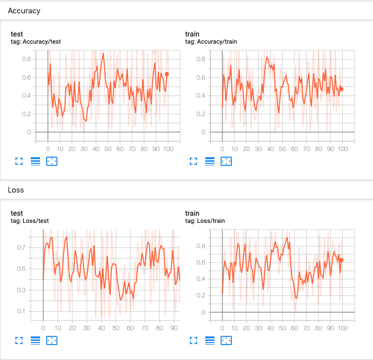
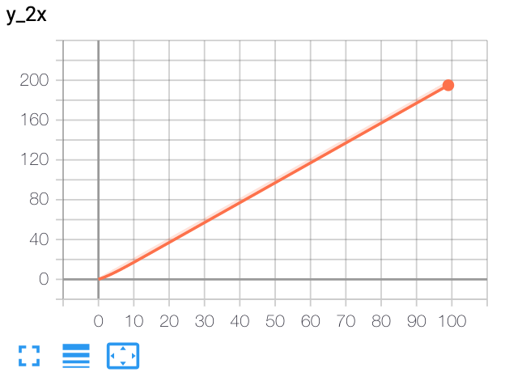
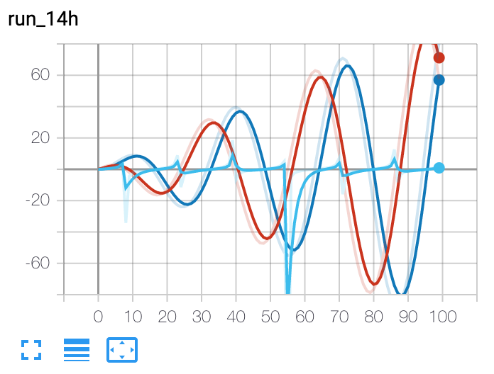
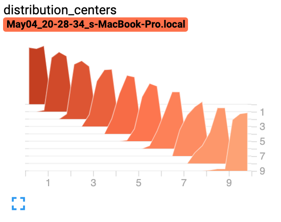
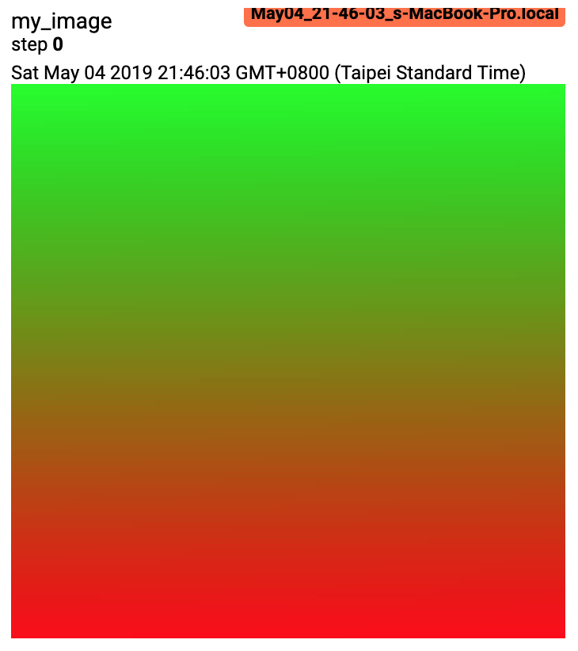
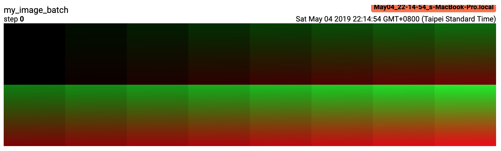
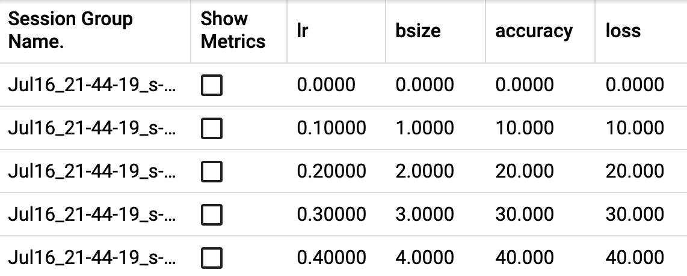

# torch.utils.tensorboard

Before going further, more details on TensorBoard can be found at
[https://www.tensorflow.org/tensorboard/](https://www.tensorflow.org/tensorboard/)

Once you've installed TensorBoard, these utilities let you log PyTorch models
and metrics into a directory for visualization within the TensorBoard UI.
Scalars, images, histograms, graphs, and embedding visualizations are all
supported for PyTorch models and tensors as well as Caffe2 nets and blobs.

The SummaryWriter class is your main entry to log data for consumption
and visualization by TensorBoard. For example:

```
import torch
import torchvision
from torch.utils.tensorboard import SummaryWriter
from torchvision import datasets, transforms

# Writer will output to ./runs/ directory by default
writer = SummaryWriter()

transform = transforms.Compose([transforms.ToTensor(), transforms.Normalize((0.5,), (0.5,))])
trainset = datasets.MNIST('mnist_train', train=True, download=True, transform=transform)
trainloader = torch.utils.data.DataLoader(trainset, batch_size=64, shuffle=True)
model = torchvision.models.resnet50(False)
# Have ResNet model take in grayscale rather than RGB
model.conv1 = torch.nn.Conv2d(1, 64, kernel_size=7, stride=2, padding=3, bias=False)
images, labels = next(iter(trainloader))

grid = torchvision.utils.make_grid(images)
writer.add_image('images', grid, 0)
writer.add_graph(model, images)
writer.close()
```

This can then be visualized with TensorBoard, which should be installable
and runnable with:

```
pip install tensorboard
tensorboard --logdir=runs
```

Lots of information can be logged for one experiment. To avoid cluttering
the UI and have better result clustering, we can group plots by naming them
hierarchically. For example, "Loss/train" and "Loss/test" will be grouped
together, while "Accuracy/train" and "Accuracy/test" will be grouped separately
in the TensorBoard interface.

```
from torch.utils.tensorboard import SummaryWriter
import numpy as np

writer = SummaryWriter()

for n_iter in range(100):
 writer.add_scalar('Loss/train', np.random.random(), n_iter)
 writer.add_scalar('Loss/test', np.random.random(), n_iter)
 writer.add_scalar('Accuracy/train', np.random.random(), n_iter)
 writer.add_scalar('Accuracy/test', np.random.random(), n_iter)
```

Expected result:

[](_images/hier_tags.png)

*class*torch.utils.tensorboard.writer.SummaryWriter(*log_dir=None*, *comment=''*, *purge_step=None*, *max_queue=10*, *flush_secs=120*, *filename_suffix=''*)[[source]](https://github.com/pytorch/pytorch/blob/c42e39b73c4b6bab2e78f982765bd2029abc2a2a/torch/utils/tensorboard/writer.py#L173)

Writes entries directly to event files in the log_dir to be consumed by TensorBoard.

The SummaryWriter class provides a high-level API to create an event file
in a given directory and add summaries and events to it. The class updates the
file contents asynchronously. This allows a training program to call methods
to add data to the file directly from the training loop, without slowing down
training.

__init__(*log_dir=None*, *comment=''*, *purge_step=None*, *max_queue=10*, *flush_secs=120*, *filename_suffix=''*)[[source]](https://github.com/pytorch/pytorch/blob/c42e39b73c4b6bab2e78f982765bd2029abc2a2a/torch/utils/tensorboard/writer.py#L183)

Create a SummaryWriter that will write out events and summaries to the event file.

Parameters:

- **log_dir** ([*str*](https://docs.python.org/3/library/stdtypes.html#str)) - Save directory location. Default is
runs/**CURRENT_DATETIME_HOSTNAME**, which changes after each run.
Use hierarchical folder structure to compare
between runs easily. e.g. pass in 'runs/exp1', 'runs/exp2', etc.
for each new experiment to compare across them.
- **comment** ([*str*](https://docs.python.org/3/library/stdtypes.html#str)) - Comment log_dir suffix appended to the default
`log_dir`. If `log_dir` is assigned, this argument has no effect.
- **purge_step** ([*int*](https://docs.python.org/3/library/functions.html#int)) - When logging crashes at step T+XT+XT+X and restarts at step TTT,
any events whose global_step larger or equal to TTT will be
purged and hidden from TensorBoard.
Note that crashed and resumed experiments should have the same `log_dir`.
- **max_queue** ([*int*](https://docs.python.org/3/library/functions.html#int)) - Size of the queue for pending events and
summaries before one of the 'add' calls forces a flush to disk.
Default is ten items.
- **flush_secs** ([*int*](https://docs.python.org/3/library/functions.html#int)) - How often, in seconds, to flush the
pending events and summaries to disk. Default is every two minutes.
- **filename_suffix** ([*str*](https://docs.python.org/3/library/stdtypes.html#str)) - Suffix added to all event filenames in
the log_dir directory. More details on filename construction in
tensorboard.summary.writer.event_file_writer.EventFileWriter.

Examples:

```
from torch.utils.tensorboard import SummaryWriter

# create a summary writer with automatically generated folder name.
writer = SummaryWriter()
# folder location: runs/May04_22-14-54_s-MacBook-Pro.local/

# create a summary writer using the specified folder name.
writer = SummaryWriter("my_experiment")
# folder location: my_experiment

# create a summary writer with comment appended.
writer = SummaryWriter(comment="LR_0.1_BATCH_16")
# folder location: runs/May04_22-14-54_s-MacBook-Pro.localLR_0.1_BATCH_16/
```

add_scalar(*tag*, *scalar_value*, *global_step=None*, *walltime=None*, *new_style=False*, *double_precision=False*)[[source]](https://github.com/pytorch/pytorch/blob/c42e39b73c4b6bab2e78f982765bd2029abc2a2a/torch/utils/tensorboard/writer.py#L347)

Add scalar data to summary.

Parameters:

- **tag** ([*str*](https://docs.python.org/3/library/stdtypes.html#str)) - Data identifier
- **scalar_value** ([*float*](https://docs.python.org/3/library/functions.html#float)*or**string/blobname*) - Value to save
- **global_step** ([*int*](https://docs.python.org/3/library/functions.html#int)) - Global step value to record
- **walltime** ([*float*](https://docs.python.org/3/library/functions.html#float)) - Optional override default walltime (time.time())
with seconds after epoch of event
- **new_style** (*boolean*) - Whether to use new style (tensor field) or old
style (simple_value field). New style could lead to faster data loading.

Examples:

```
from torch.utils.tensorboard import SummaryWriter
writer = SummaryWriter()
x = range(100)
for i in x:
 writer.add_scalar('y=2x', i * 2, i)
writer.close()
```

Expected result:

[](_images/add_scalar.png)

add_scalars(*main_tag*, *tag_scalar_dict*, *global_step=None*, *walltime=None*)[[source]](https://github.com/pytorch/pytorch/blob/c42e39b73c4b6bab2e78f982765bd2029abc2a2a/torch/utils/tensorboard/writer.py#L388)

Add many scalar data to summary.

Parameters:

- **main_tag** ([*str*](https://docs.python.org/3/library/stdtypes.html#str)) - The parent name for the tags
- **tag_scalar_dict** ([*dict*](https://docs.python.org/3/library/stdtypes.html#dict)) - Key-value pair storing the tag and corresponding values
- **global_step** ([*int*](https://docs.python.org/3/library/functions.html#int)) - Global step value to record
- **walltime** ([*float*](https://docs.python.org/3/library/functions.html#float)) - Optional override default walltime (time.time())
seconds after epoch of event

Examples:

```
from torch.utils.tensorboard import SummaryWriter
writer = SummaryWriter()
r = 5
for i in range(100):
 writer.add_scalars('run_14h', {'xsinx':i*np.sin(i/r),
 'xcosx':i*np.cos(i/r),
 'tanx': np.tan(i/r)}, i)
writer.close()
# This call adds three values to the same scalar plot with the tag
# 'run_14h' in TensorBoard's scalar section.
```

Expected result:

[](_images/add_scalars.png)

add_histogram(*tag*, *values*, *global_step=None*, *bins='tensorflow'*, *walltime=None*, *max_bins=None*)[[source]](https://github.com/pytorch/pytorch/blob/c42e39b73c4b6bab2e78f982765bd2029abc2a2a/torch/utils/tensorboard/writer.py#L465)

Add histogram to summary.

Parameters:

- **tag** ([*str*](https://docs.python.org/3/library/stdtypes.html#str)) - Data identifier
- **values** ([*torch.Tensor*](tensors.html#torch.Tensor)*,*[*numpy.ndarray*](https://numpy.org/doc/stable/reference/generated/numpy.ndarray.html#numpy.ndarray)*, or**string/blobname*) - Values to build histogram
- **global_step** ([*int*](https://docs.python.org/3/library/functions.html#int)) - Global step value to record
- **bins** ([*str*](https://docs.python.org/3/library/stdtypes.html#str)) - One of {'tensorflow','auto', 'fd', ...}. This determines how the bins are made. You can find
other options in: [https://numpy.org/doc/stable/reference/generated/numpy.histogram.html](https://numpy.org/doc/stable/reference/generated/numpy.histogram.html)
- **walltime** ([*float*](https://docs.python.org/3/library/functions.html#float)) - Optional override default walltime (time.time())
seconds after epoch of event

Examples:

```
from torch.utils.tensorboard import SummaryWriter
import numpy as np
writer = SummaryWriter()
for i in range(10):
 x = np.random.random(1000)
 writer.add_histogram('distribution centers', x + i, i)
writer.close()
```

Expected result:

[](_images/add_histogram.png)

add_image(*tag*, *img_tensor*, *global_step=None*, *walltime=None*, *dataformats='CHW'*)[[source]](https://github.com/pytorch/pytorch/blob/c42e39b73c4b6bab2e78f982765bd2029abc2a2a/torch/utils/tensorboard/writer.py#L583)

Add image data to summary.

Note that this requires the `pillow` package.

Parameters:

- **tag** ([*str*](https://docs.python.org/3/library/stdtypes.html#str)) - Data identifier
- **img_tensor** ([*torch.Tensor*](tensors.html#torch.Tensor)*,*[*numpy.ndarray*](https://numpy.org/doc/stable/reference/generated/numpy.ndarray.html#numpy.ndarray)*, or**string/blobname*) - Image data
- **global_step** ([*int*](https://docs.python.org/3/library/functions.html#int)) - Global step value to record
- **walltime** ([*float*](https://docs.python.org/3/library/functions.html#float)) - Optional override default walltime (time.time())
seconds after epoch of event
- **dataformats** ([*str*](https://docs.python.org/3/library/stdtypes.html#str)) - Image data format specification of the form
CHW, HWC, HW, WH, etc.

Shape:

img_tensor: Default is (3,H,W)(3, H, W)(3,H,W). You can use `torchvision.utils.make_grid()` to
convert a batch of tensor into 3xHxW format or call `add_images` and let us do the job.
Tensor with (1,H,W)(1, H, W)(1,H,W), (H,W)(H, W)(H,W), (H,W,3)(H, W, 3)(H,W,3) is also suitable as long as
corresponding `dataformats` argument is passed, e.g. `CHW`, `HWC`, `HW`.

Examples:

```
from torch.utils.tensorboard import SummaryWriter
import numpy as np
img = np.zeros((3, 100, 100))
img[0] = np.arange(0, 10000).reshape(100, 100) / 10000
img[1] = 1 - np.arange(0, 10000).reshape(100, 100) / 10000

img_HWC = np.zeros((100, 100, 3))
img_HWC[:, :, 0] = np.arange(0, 10000).reshape(100, 100) / 10000
img_HWC[:, :, 1] = 1 - np.arange(0, 10000).reshape(100, 100) / 10000

writer = SummaryWriter()
writer.add_image('my_image', img, 0)

# If you have non-default dimension setting, set the dataformats argument.
writer.add_image('my_image_HWC', img_HWC, 0, dataformats='HWC')
writer.close()
```

Expected result:

[](_images/add_image.png)

add_images(*tag*, *img_tensor*, *global_step=None*, *walltime=None*, *dataformats='NCHW'*)[[source]](https://github.com/pytorch/pytorch/blob/c42e39b73c4b6bab2e78f982765bd2029abc2a2a/torch/utils/tensorboard/writer.py#L634)

Add batched image data to summary.

Note that this requires the `pillow` package.

Parameters:

- **tag** ([*str*](https://docs.python.org/3/library/stdtypes.html#str)) - Data identifier
- **img_tensor** ([*torch.Tensor*](tensors.html#torch.Tensor)*,*[*numpy.ndarray*](https://numpy.org/doc/stable/reference/generated/numpy.ndarray.html#numpy.ndarray)*, or**string/blobname*) - Image data
- **global_step** ([*int*](https://docs.python.org/3/library/functions.html#int)) - Global step value to record
- **walltime** ([*float*](https://docs.python.org/3/library/functions.html#float)) - Optional override default walltime (time.time())
seconds after epoch of event
- **dataformats** ([*str*](https://docs.python.org/3/library/stdtypes.html#str)) - Image data format specification of the form
NCHW, NHWC, CHW, HWC, HW, WH, etc.

Shape:

img_tensor: Default is (N,3,H,W)(N, 3, H, W)(N,3,H,W). If `dataformats` is specified, other shape will be
accepted. e.g. NCHW or NHWC.

Examples:

```
from torch.utils.tensorboard import SummaryWriter
import numpy as np

img_batch = np.zeros((16, 3, 100, 100))
for i in range(16):
 img_batch[i, 0] = np.arange(0, 10000).reshape(100, 100) / 10000 / 16 * i
 img_batch[i, 1] = (1 - np.arange(0, 10000).reshape(100, 100) / 10000) / 16 * i

writer = SummaryWriter()
writer.add_images('my_image_batch', img_batch, 0)
writer.close()
```

Expected result:

[](_images/add_images.png)

add_figure(*tag*, *figure*, *global_step=None*, *close=True*, *walltime=None*)[[source]](https://github.com/pytorch/pytorch/blob/c42e39b73c4b6bab2e78f982765bd2029abc2a2a/torch/utils/tensorboard/writer.py#L729)

Render matplotlib figure into an image and add it to summary.

Note that this requires the `matplotlib` package.

Parameters:

- **tag** ([*str*](https://docs.python.org/3/library/stdtypes.html#str)) - Data identifier
- **figure** (*Figure**|*[*list*](https://docs.python.org/3/library/stdtypes.html#list)*[**Figure**]*) - Figure or a list of figures
- **global_step** ([*int*](https://docs.python.org/3/library/functions.html#int)*|**None*) - Global step value to record
- **close** ([*bool*](https://docs.python.org/3/library/functions.html#bool)) - Flag to automatically close the figure
- **walltime** ([*float*](https://docs.python.org/3/library/functions.html#float)*|**None*) - Optional override default walltime (time.time())
seconds after epoch of event

add_video(*tag*, *vid_tensor*, *global_step=None*, *fps=4*, *walltime=None*)[[source]](https://github.com/pytorch/pytorch/blob/c42e39b73c4b6bab2e78f982765bd2029abc2a2a/torch/utils/tensorboard/writer.py#L767)

Add video data to summary.

Note that this requires the `moviepy` package.

Parameters:

- **tag** ([*str*](https://docs.python.org/3/library/stdtypes.html#str)) - Data identifier
- **vid_tensor** ([*torch.Tensor*](tensors.html#torch.Tensor)) - Video data
- **global_step** ([*int*](https://docs.python.org/3/library/functions.html#int)) - Global step value to record
- **fps** ([*float*](https://docs.python.org/3/library/functions.html#float)*or*[*int*](https://docs.python.org/3/library/functions.html#int)) - Frames per second
- **walltime** ([*float*](https://docs.python.org/3/library/functions.html#float)) - Optional override default walltime (time.time())
seconds after epoch of event

Shape:

vid_tensor: (N,T,C,H,W)(N, T, C, H, W)(N,T,C,H,W). The values should lie in [0, 255] for type uint8 or [0, 1] for type float.

add_audio(*tag*, *snd_tensor*, *global_step=None*, *sample_rate=44100*, *walltime=None*)[[source]](https://github.com/pytorch/pytorch/blob/c42e39b73c4b6bab2e78f982765bd2029abc2a2a/torch/utils/tensorboard/writer.py#L787)

Add audio data to summary.

Parameters:

- **tag** ([*str*](https://docs.python.org/3/library/stdtypes.html#str)) - Data identifier
- **snd_tensor** ([*torch.Tensor*](tensors.html#torch.Tensor)) - Sound data
- **global_step** ([*int*](https://docs.python.org/3/library/functions.html#int)) - Global step value to record
- **sample_rate** ([*int*](https://docs.python.org/3/library/functions.html#int)) - sample rate in Hz
- **walltime** ([*float*](https://docs.python.org/3/library/functions.html#float)) - Optional override default walltime (time.time())
seconds after epoch of event

Shape:

snd_tensor: (1,L)(1, L)(1,L). The values should lie between [-1, 1].

add_text(*tag*, *text_string*, *global_step=None*, *walltime=None*)[[source]](https://github.com/pytorch/pytorch/blob/c42e39b73c4b6bab2e78f982765bd2029abc2a2a/torch/utils/tensorboard/writer.py#L807)

Add text data to summary.

Parameters:

- **tag** ([*str*](https://docs.python.org/3/library/stdtypes.html#str)) - Data identifier
- **text_string** ([*str*](https://docs.python.org/3/library/stdtypes.html#str)) - String to save
- **global_step** ([*int*](https://docs.python.org/3/library/functions.html#int)) - Global step value to record
- **walltime** ([*float*](https://docs.python.org/3/library/functions.html#float)) - Optional override default walltime (time.time())
seconds after epoch of event

Examples:

```
writer.add_text('lstm', 'This is an lstm', 0)
writer.add_text('rnn', 'This is an rnn', 10)
```

add_graph(*model*, *input_to_model=None*, *verbose=False*, *use_strict_trace=True*)[[source]](https://github.com/pytorch/pytorch/blob/c42e39b73c4b6bab2e78f982765bd2029abc2a2a/torch/utils/tensorboard/writer.py#L830)

Add graph data to summary.

Parameters:

- **model** ([*torch.nn.Module*](generated/torch.nn.Module.html#torch.nn.Module)) - Model to draw.
- **input_to_model** ([*torch.Tensor*](tensors.html#torch.Tensor)*or*[*list*](https://docs.python.org/3/library/stdtypes.html#list)*of*[*torch.Tensor*](tensors.html#torch.Tensor)) - A variable or a tuple of
variables to be fed.
- **verbose** ([*bool*](https://docs.python.org/3/library/functions.html#bool)) - Whether to print graph structure in console.
- **use_strict_trace** ([*bool*](https://docs.python.org/3/library/functions.html#bool)) - Whether to pass keyword argument strict to
torch.jit.trace. Pass False when you want the tracer to
record your mutable container types (list, dict)

add_embedding(*mat*, *metadata=None*, *label_img=None*, *global_step=None*, *tag='default'*, *metadata_header=None*)[[source]](https://github.com/pytorch/pytorch/blob/c42e39b73c4b6bab2e78f982765bd2029abc2a2a/torch/utils/tensorboard/writer.py#L859)

Add embedding projector data to summary.

Parameters:

- **mat** ([*torch.Tensor*](tensors.html#torch.Tensor)*or*[*numpy.ndarray*](https://numpy.org/doc/stable/reference/generated/numpy.ndarray.html#numpy.ndarray)) - A matrix which each row is the feature vector of the data point
- **metadata** ([*list*](https://docs.python.org/3/library/stdtypes.html#list)) - A list of labels, each element will be converted to string
- **label_img** ([*torch.Tensor*](tensors.html#torch.Tensor)) - Images correspond to each data point
- **global_step** ([*int*](https://docs.python.org/3/library/functions.html#int)) - Global step value to record
- **tag** ([*str*](https://docs.python.org/3/library/stdtypes.html#str)) - Name for the embedding
- **metadata_header** ([*list*](https://docs.python.org/3/library/stdtypes.html#list)) - A list of headers for multi-column metadata. If given, each metadata must be
a list with values corresponding to headers.

Shape:

mat: (N,D)(N, D)(N,D), where N is number of data and D is feature dimension

label_img: (N,C,H,W)(N, C, H, W)(N,C,H,W)

Examples:

```
import keyword
import torch
meta = []
while len(meta)<100:
 meta = meta+keyword.kwlist # get some strings
meta = meta[:100]

for i, v in enumerate(meta):
 meta[i] = v+str(i)

label_img = torch.rand(100, 3, 10, 32)
for i in range(100):
 label_img[i]*=i/100.0

writer.add_embedding(torch.randn(100, 5), metadata=meta, label_img=label_img)
writer.add_embedding(torch.randn(100, 5), label_img=label_img)
writer.add_embedding(torch.randn(100, 5), metadata=meta)
```

Note

Categorical (i.e. non-numeric) metadata cannot have more than 50 unique values if they are to be used for
coloring in the embedding projector.

add_pr_curve(*tag*, *labels*, *predictions*, *global_step=None*, *num_thresholds=127*, *weights=None*, *walltime=None*)[[source]](https://github.com/pytorch/pytorch/blob/c42e39b73c4b6bab2e78f982765bd2029abc2a2a/torch/utils/tensorboard/writer.py#L964)

Add precision recall curve.

Plotting a precision-recall curve lets you understand your model's
performance under different threshold settings. With this function,
you provide the ground truth labeling (T/F) and prediction confidence
(usually the output of your model) for each target. The TensorBoard UI
will let you choose the threshold interactively.

Parameters:

- **tag** ([*str*](https://docs.python.org/3/library/stdtypes.html#str)) - Data identifier
- **labels** ([*torch.Tensor*](tensors.html#torch.Tensor)*,*[*numpy.ndarray*](https://numpy.org/doc/stable/reference/generated/numpy.ndarray.html#numpy.ndarray)*, or**string/blobname*) - Ground truth data. Binary label for each element.
- **predictions** ([*torch.Tensor*](tensors.html#torch.Tensor)*,*[*numpy.ndarray*](https://numpy.org/doc/stable/reference/generated/numpy.ndarray.html#numpy.ndarray)*, or**string/blobname*) - The probability that an element be classified as true.
Value should be in [0, 1]
- **global_step** ([*int*](https://docs.python.org/3/library/functions.html#int)) - Global step value to record
- **num_thresholds** ([*int*](https://docs.python.org/3/library/functions.html#int)) - Number of thresholds used to draw the curve.
- **walltime** ([*float*](https://docs.python.org/3/library/functions.html#float)) - Optional override default walltime (time.time())
seconds after epoch of event

Examples:

```
from torch.utils.tensorboard import SummaryWriter
import numpy as np
labels = np.random.randint(2, size=100) # binary label
predictions = np.random.rand(100)
writer = SummaryWriter()
writer.add_pr_curve('pr_curve', labels, predictions, 0)
writer.close()
```

add_custom_scalars(*layout*)[[source]](https://github.com/pytorch/pytorch/blob/c42e39b73c4b6bab2e78f982765bd2029abc2a2a/torch/utils/tensorboard/writer.py#L1101)

Create special chart by collecting charts tags in 'scalars'.

NOTE: This function can only be called once for each SummaryWriter() object.

Because it only provides metadata to tensorboard, the function can be called before or after the training loop.

Parameters:

**layout** ([*dict*](https://docs.python.org/3/library/stdtypes.html#dict)) - {categoryName: *charts*}, where *charts* is also a dictionary
{chartName: *ListOfProperties*}. The first element in *ListOfProperties* is the chart's type
(one of **Multiline** or **Margin**) and the second element should be a list containing the tags
you have used in add_scalar function, which will be collected into the new chart.

Examples:

```
layout = {'Taiwan':{'twse':['Multiline',['twse/0050', 'twse/2330']]},
 'USA':{ 'dow':['Margin', ['dow/aaa', 'dow/bbb', 'dow/ccc']],
 'nasdaq':['Margin', ['nasdaq/aaa', 'nasdaq/bbb', 'nasdaq/ccc']]}}

writer.add_custom_scalars(layout)
```

add_mesh(*tag*, *vertices*, *colors=None*, *faces=None*, *config_dict=None*, *global_step=None*, *walltime=None*)[[source]](https://github.com/pytorch/pytorch/blob/c42e39b73c4b6bab2e78f982765bd2029abc2a2a/torch/utils/tensorboard/writer.py#L1125)

Add meshes or 3D point clouds to TensorBoard.

The visualization is based on Three.js,
so it allows users to interact with the rendered object. Besides the basic definitions
such as vertices, faces, users can further provide camera parameter, lighting condition, etc.
Please check [https://threejs.org/docs/index.html#manual/en/introduction/Creating-a-scene](https://threejs.org/docs/index.html#manual/en/introduction/Creating-a-scene) for
advanced usage.

Parameters:

- **tag** ([*str*](https://docs.python.org/3/library/stdtypes.html#str)) - Data identifier
- **vertices** ([*torch.Tensor*](tensors.html#torch.Tensor)) - List of the 3D coordinates of vertices.
- **colors** ([*torch.Tensor*](tensors.html#torch.Tensor)) - Colors for each vertex
- **faces** ([*torch.Tensor*](tensors.html#torch.Tensor)) - Indices of vertices within each triangle. (Optional)
- **config_dict** - Dictionary with ThreeJS classes names and configuration.
- **global_step** ([*int*](https://docs.python.org/3/library/functions.html#int)) - Global step value to record
- **walltime** ([*float*](https://docs.python.org/3/library/functions.html#float)) - Optional override default walltime (time.time())
seconds after epoch of event

Shape:

vertices: (B,N,3)(B, N, 3)(B,N,3). (batch, number_of_vertices, channels)

colors: (B,N,3)(B, N, 3)(B,N,3). The values should lie in [0, 255] for type uint8 or [0, 1] for type float.

faces: (B,N,3)(B, N, 3)(B,N,3). The values should lie in [0, number_of_vertices] for type uint8.

Examples:

```
from torch.utils.tensorboard import SummaryWriter
vertices_tensor = torch.as_tensor([
 [1, 1, 1],
 [-1, -1, 1],
 [1, -1, -1],
 [-1, 1, -1],
], dtype=torch.float).unsqueeze(0)
colors_tensor = torch.as_tensor([
 [255, 0, 0],
 [0, 255, 0],
 [0, 0, 255],
 [255, 0, 255],
], dtype=torch.int).unsqueeze(0)
faces_tensor = torch.as_tensor([
 [0, 2, 3],
 [0, 3, 1],
 [0, 1, 2],
 [1, 3, 2],
], dtype=torch.int).unsqueeze(0)

writer = SummaryWriter()
writer.add_mesh('my_mesh', vertices=vertices_tensor, colors=colors_tensor, faces=faces_tensor)

writer.close()
```

add_hparams(*hparam_dict*, *metric_dict*, *hparam_domain_discrete=None*, *run_name=None*, *global_step=None*)[[source]](https://github.com/pytorch/pytorch/blob/c42e39b73c4b6bab2e78f982765bd2029abc2a2a/torch/utils/tensorboard/writer.py#L292)

Add a set of hyperparameters to be compared in TensorBoard.

Parameters:

- **hparam_dict** ([*dict*](https://docs.python.org/3/library/stdtypes.html#dict)) - Each key-value pair in the dictionary is the
name of the hyper parameter and its corresponding value.
The type of the value can be one of bool, string, float,
int, or None.
- **metric_dict** ([*dict*](https://docs.python.org/3/library/stdtypes.html#dict)) - Each key-value pair in the dictionary is the
name of the metric and its corresponding value. Note that the key used
here should be unique in the tensorboard record. Otherwise the value
you added by `add_scalar` will be displayed in hparam plugin. In most
cases, this is unwanted.
- **hparam_domain_discrete** - (Optional[Dict[str, List[Any]]]) A dictionary that
contains names of the hyperparameters and all discrete values they can hold
- **run_name** ([*str*](https://docs.python.org/3/library/stdtypes.html#str)) - Name of the run, to be included as part of the logdir.
If unspecified, will use current timestamp.
- **global_step** ([*int*](https://docs.python.org/3/library/functions.html#int)) - Global step value to record

Examples:

```
from torch.utils.tensorboard import SummaryWriter
with SummaryWriter() as w:
 for i in range(5):
 w.add_hparams({'lr': 0.1*i, 'bsize': i},
 {'hparam/accuracy': 10*i, 'hparam/loss': 10*i})
```

Expected result:

[](_images/add_hparam.png)

flush()[[source]](https://github.com/pytorch/pytorch/blob/c42e39b73c4b6bab2e78f982765bd2029abc2a2a/torch/utils/tensorboard/writer.py#L1192)

Flushes the event file to disk.

Call this method to make sure that all pending events have been written to
disk.

close()[[source]](https://github.com/pytorch/pytorch/blob/c42e39b73c4b6bab2e78f982765bd2029abc2a2a/torch/utils/tensorboard/writer.py#L1203)